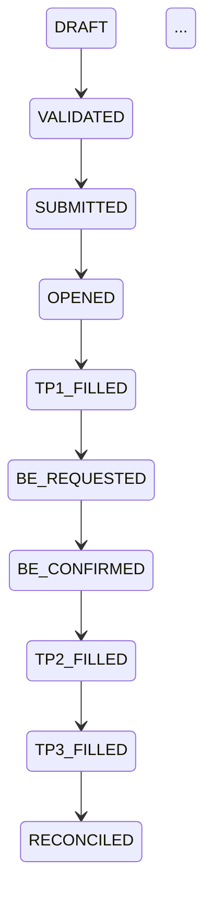

# ТЗ: Полный аудит и план модернизации `xauusd-alert-system`

**Версия:** 1.0
**Дата:** на основе аудита от текущей даты
**Статус:** Черновик → к утверждению

---

## Содержание

- [Часть 1. Критические баги (P0)](#p0)
- [Часть 2. Серьёзные проблемы (P1)](#p1)
- [Часть 3. Архитектурный долг и рефакторинг (P2)](#p2)
- [Часть 4. Тестовое покрытие — что потестить](#tests)
- [Часть 5. Стратегия и ML — пересмотр](#ml)
- [Часть 6. Инфраструктура, деплой, наблюдаемость](#infra)
- [Часть 7. Что убрать / упростить](#remove)
- [Часть 8. Что вынести в отдельный сервис / модуль](#extract)
- [Часть 9. Миграции и версионирование](#migration)
- [Часть 10. Безопасность](#security)
- [Часть 11. Документация](#docs)
- [Часть 12. Сводная таблица приоритетов](#summary)

---

<a name="p0"></a>
## Часть 1. Критические баги (P0) — фиксить немедленно

Каждый пункт содержит: описание → где → почему → что делать → критерий готовности → оценка трудозатрат.

---

### P0-1. Hardcoded 24-часовой TTL для сигналов

**Где:** `execution/trade_geometry.py`, функция `build_trade_group_from_signal`
```python
expires_at or (now + 24 * 3600 * 1000)
```

**Проблема:**
Сигнал на таймфрейме M5 живёт 288 баров. За это время рынок может сменить режим несколько раз. Сигнал формально «свежий» по TTL, но рыночный контекст уже другой. Система попытается исполнить протухший сигнал, потому что `check_group_not_expired()` пропустит его.

**Что делать:**
1. Добавить маппинг TTL по таймфрейму в `config.yaml`:
```yaml
execution:
  signal_ttl_ms:
    M1: 1800000      # 30 мин
    M5: 7200000      # 2 часа
    M15: 21600000    # 6 часов
    H1: 86400000     # 24 часа
```
2. В `build_trade_group_from_signal` читать TTL из конфига по `asset.timeframe`.
3. Если `expires_at` не указан в сигнале и нет конфига → дефолт 2 часа (не 24).
4. Добавить тест: сигнал без `expires_at` на M5 получает TTL 2 часа, на H1 — 24 часа.

**Критерий готовности:**
- Тест `test_signal_ttl_by_timeframe` проходит
- В логах `signal_validated` виден расчётный `expires_at`
- Нет сигналов старше 2 часов на M5 в продакшене

**Трудозатраты:** 2–4 часа

---

### P0-2. Нет валидации разумности ATR

**Где:** `execution/trade_geometry.py`, функция `build_trade_group_from_signal`
```python
atr = float(signal.get("atr") or 0.0)
if atr <= 0.0:
    raise GeometryRejected(TP1_TOO_CLOSE_TO_COST, "signal has no positive ATR")
```

**Проблема:**
Проверяется только `> 0`. Если фича ATR сломана и возвращает `0.0001` для XAUUSD (цена ~2400), то `step = atr * atr_mult` будет микроскопическим. TP/SL окажутся в 0.01–0.05 пунктах от entry. Спред съест всю потенциальную прибыль. Система не отклонит такой сигнал — она исполнит его и гарантированно получит убыток.

Обратная проблема: если ATR аномально большой (например, `500` для золота из-за бага в данных), `step * stop_mult` даст SL в 1000 пунктов от цены — геометрия пройдёт валидацию, но `estimated_loss` превысит любой лимит и сигнал будет отклонён на этапе `check_group_risk`. Это безопасно, но диагностика будет неочевидной.

**Что делать:**
1. Добавить sanity check в `calculate_geometry`:
```python
price = reference_price
atr_pct = atr / price if price > 0 else 0.0
min_atr_pct = 0.0005  # 0.05% от цены
max_atr_pct = 0.03  # 3% от цены
if atr_pct < min_atr_pct:
    raise GeometryRejected(
        TP1_TOO_CLOSE_TO_COST, f"ATR {atr:.6g} = {atr_pct:.4%} of price, below min {min_atr_pct:.4%}"
    )
if atr_pct > max_atr_pct:
    raise GeometryRejected(
        TP1_TOO_CLOSE_TO_COST, f"ATR {atr:.6g} = {atr_pct:.4%} of price, above max {max_atr_pct:.4%}"
    )
```
2. Пороги вынести в конфиг (`trade_profiles.<id>.atr_sanity`), чтобы для BTC и форекса были разные.
3. Добавить тесты:
   - `test_atr_too_small_rejected`
   - `test_atr_too_large_rejected`
   - `test_atr_normal_accepted`
   - `test_atr_sanity_per_asset_config`

**Критерий готовности:**
- Все 4 теста проходят
- В логах `group_rejected` виден reason `TP1_TOO_CLOSE_TO_COST` с пояснением про ATR

**Трудозатраты:** 2–3 часа

---

### P0-3. `estimated_loss_at_sl` исключён из `geometry_hash`

**Где:** `execution/trade_group.py`, метод `TradeGroupSpec.geometry_hash()`
```python
"risk": {k: v for k, v in self.risk.model_dump().items()
         if k not in {"estimated_loss_at_sl"}},
```

**Проблема:**
`geometry_hash` используется в `ExecutionIntent.require_geometry_unchanged()`. Если между созданием спеки и отправкой ордера баланс счёта изменился (например, убыток по другой позиции), `estimated_loss_at_sl` должен быть пересчитан, но хеш останется прежним. Интент пройдёт проверку, хотя риск-профиль уже другой.

Конкретный сценарий:
1. Баланс $10 000, estimated_loss = $200 → проходит `max_cash=$250`
2. До отправки ордера баланс упал до $9 000 (другая позиция)
3. `estimated_loss` всё ещё $200, но теперь это 2.2% вместо 2.0%
4. `check_group_risk` на этапе `submit_group` перепроверяет с `account["balance"]` — **это спасает**, но только если `submit_group` вызывается в том же процессе
5. Если между `create_group` и `submit_group` прошёл рестарт, `require_geometry_unchanged` пропустит, а `check_group_risk` может не сработать, если баланс восстановился

**Что делать:**
1. Включить `estimated_loss_at_sl` в `geometry_hash`:
```python
"risk": self.risk.model_dump(),  # без исключений
```
2. В `with_actual_fill` убедиться, что `estimated_loss_at_sl` не пересчитывается (геометрия иммутабельна).
3. Добавить тест: изменение `estimated_loss_at_sl` → другой `geometry_hash` → `require_geometry_unchanged` бросает исключение.
4. Проверить, что все существующие тесты проходят после изменения хеша (возможно, есть захардкоженные значения).

**Критерий готовности:**
- Тест `test_geometry_hash_includes_risk` проходит
- Все существующие тесты зелёные

**Трудозатраты:** 1–2 часа + регрессия

---

### P0-4. Нет защиты от двойного `with_actual_fill` при частичных исполнениях

**Где:** `execution/trade_group.py`, метод `TradeGroupSpec.with_actual_fill()`
```python
if self.entry.actual_fill is not None and abs(self.entry.actual_fill - fill) > 1e-12:
    raise ValueError("actual_fill is already set and cannot be overwritten")
```

**Проблема:**
В `mt5_trade_group.py` метод `_open_group` вызывает `spec.with_actual_fill(fill_price)`, где `fill_price` берётся из последней позиции в `inspection.positions`. Если позиции открылись по разным ценам (что нормально для 3 лег), `fill_price` будет ценой последней позиции, а не средневзвешенной.

Для хеджинг-аккаунта: leg1 открылся по 2400.10, leg2 по 2400.15, leg3 по 2400.20. `fill_price` будет 2400.20. BE будет считаться от 2400.20, хотя средняя цена входа ~2400.15.

**Что делать:**
1. В `_open_group` считать volume-weighted average price (VWAP) по всем открытым позициям:
```python
total_volume = sum(pos["volume"] for pos in inspection.positions)
if total_volume > 0:
    fill_price = sum(pos["price_open"] * pos["volume"] for pos in inspection.positions) / total_volume
```
2. Добавить тест: 3 позиции по разным ценам → `actual_fill` = VWAP.
3. В `with_actual_fill` добавить логирование: если разница между `reference` и `actual_fill` > 0.1%, записать warning.

**Критерий готовности:**
- Тест `test_actual_fill_vwap` проходит
- В логах `group_opened` виден `actual_fill` с пометкой `vwap`

**Трудозатраты:** 2–3 часа

---

### P0-5. Circuit breaker не учитывает свопы

**Где:** `execution/risk_manager.py`, метод `can_trade()`
```python
current_daily_pnl = current_equity - self.starting_equity_today
```

**Проблема:**
`starting_equity_today` фиксируется в момент первого вызова `can_trade` за день. Но `equity` в MT5 включает плавающие свопы. Если на счёте есть позиции, которые перенеслись через ночь, свопы могут резко изменить `equity` в момент ролловера (обычно 21:00–23:00 UTC). Circuit breaker может сработать ложно или, наоборот, не сработать, если свопы компенсировали убыток.

Для парного трейдинга на металлах свопы — значимая величина. Тройная среда может дать −3× своп по обеим ногам.

**Что делать:**
1. Разделить `equity` на компоненты:
```python
account = mt5.account_info()
floating_pnl = account.equity - account.balance  # только открытые позиции
```
2. Circuit breaker считать по `balance + floating_pnl` без свопов:
```python
# Считать дневной PnL без свопов:
daily_pnl = (account.balance - self.starting_balance_today) + floating_pnl
```
3. `starting_balance_today` фиксировать отдельно от `starting_equity_today`.
4. Добавить в конфиг `risk.circuit_breaker.exclude_swaps: true`.
5. Добавить тест: симуляция свопа −$50 → circuit breaker не срабатывает, если торговый убыток < лимита.

**Критерий готовности:**
- Тест `test_circuit_breaker_ignores_swaps` проходит
- В логах `risk_state.json` видны оба значения: `starting_equity_today` и `starting_balance_today`

**Трудозатраты:** 3–4 часа

---

### P0-6. `_floor_to_step` теряет точность на больших объёмах

**Где:** `execution/mt5_trade_group.py`, метод `_floor_to_step`
```python
return round(math.floor(float(value) / step + 1e-9) * step, 8)
```

И `execution/trade_group.py`, функция `allocate_leg_volumes`:
```python
lots = int(value / step + 1e-9)
```

**Проблема:**
IEEE 754 double precision имеет ~15–16 значащих цифр. Для объёмов > 10 лотов с шагом 0.01:
- `10.07 / 0.01 = 1007.0000000000001` → `int(... + 1e-9) = 1007` ✓
- `0.03 * (1/3) = 0.009999999999999998` → `int(... / 0.01 + 1e-9) = 0` ✗

Второй случай реален: если `total_volume = 0.03` и аллокация `(1/3, 1/3, 1/3)`, leg1 и leg2 получат 0, а весь объём уйдёт в leg3. Это нарушает контракт «3 ноги».

**Что делать:**
1. Заменить на `Decimal` для критичных расчётов:
```python
from decimal import Decimal, ROUND_DOWN


def _floor_to_step(value: float, step: float) -> float:
    if step <= 0.0:
        return round(float(value), 8)
    d_val = Decimal(str(value))
    d_step = Decimal(str(step))
    lots = (d_val / d_step).to_integral_value(rounding=ROUND_DOWN)
    return float(lots * d_step)
```
2. В `allocate_leg_volumes` аналогично.
3. Добавить тесты:
   - `test_floor_to_step_dust`: `0.009999999999999998 / 0.01 = 0.0` (а не 0.01)
   - `test_floor_to_step_large`: `100.07 / 0.01 = 100.07`
   - `test_allocate_small_volume`: `0.03` с аллокацией `1/3` → `[0.01, 0.01, 0.01]`

**Критерий готовности:**
- Все тесты проходят
- Нет `INSUFFICIENT_VOLUME_FOR_THREE_LEGS` для объёмов, которые должны быть валидны

**Трудозатраты:** 3–4 часа + регрессия всех объёмных тестов

---

### P0-7. Нет валидации диапазона `actual_fill` относительно `reference`

**Где:** `execution/trade_group.py`, метод `with_actual_fill()`

**Проблема:**
`actual_fill` принимает любое положительное число. Если брокер вернул цену `0.01` (ошибка данных) или `999999` (глитч), система запишет это как факт исполнения. Все последующие расчёты (BE, gross R, PnL) будут сломаны.

**Что делать:**
1. Добавить проверку в `with_actual_fill`:
```python
max_deviation = 0.05  # 5% от reference
if abs(fill - self.entry.reference) / self.entry.reference > max_deviation:
    raise ValueError(f"actual_fill {fill} deviates more than {max_deviation:.0%} from reference {self.entry.reference}")
```
2. Порог вынести в конфиг.
3. Добавить тест: `actual_fill` на 10% выше `reference` → исключение.

**Критерий готовности:**
- Тест `test_actual_fill_deviation_rejected` проходит

**Трудозатраты:** 1 час

---

<a name="p1"></a>
## Часть 2. Серьёзные проблемы (P1) — фиксить в спринте

---

### P1-1. `compute_break_even` использует спотовый спред как буфер

**Где:** `execution/trade_geometry.py`, функция `compute_break_even`
```python
protection = broker.spread + cost.expected_exit_slippage + cost.commission_buffer
```

**Проблема:**
`broker.spread` — это текущий bid/ask diff на момент вызова. В ликвидные часы спред на XAUUSD может быть 0.10–0.20 пипса, а на открытии/закрытии сессии — 3–5 пипсов. Если BE запрашивается в момент узкого спреда, `protected_price` будет слишком близко к `raw_price`. Когда рынок расширит спред, BE может быть выбит с проскальзыванием.

Обратная проблема: если спред аномально широкий в момент запроса BE, `protected_price` будет слишком далеко, и система не сможет защитить позицию на разумном уровне.

**Что делать:**
1. Создать `SpreadTracker` в `execution/mt5_common.py`:
```python
class SpreadTracker:
    def __init__(self, window: int = 200, min_samples: int = 20):
        self._spreads: deque[float] = deque(maxlen=window)
        self._min_samples = min_samples

    def update(self, spread: float) -> None:
        if spread > 0:
            self._spreads.append(spread)

    def percentile(self, p: float) -> float:
        if len(self._spreads) < self._min_samples:
            return float(np.mean(self._spreads)) if self._spreads else 0.0
        return float(np.percentile(sorted(self._spreads), p))

    @property
    def p50(self) -> float:
        return self.percentile(50)

    @property
    def p75(self) -> float:
        return self.percentile(75)
```
2. В `MT5BrokerContext` обновлять трекер при каждом `symbol_info_tick`.
3. В `compute_break_even` использовать `spread_tracker.p75` вместо `broker.spread`.
4. Если трекер пуст (< `min_samples`), fallback на `broker.spread` с пометкой в логах.
5. Добавить тесты:
   - `test_be_uses_p75_spread`
   - `test_be_fallback_to_spot_when_no_history`

**Критерий готовности:**
- Тесты проходят
- В логах `be_requested` виден `spread_source: p75_tracker` или `spread_source: spot_fallback`

**Трудозатраты:** 4–6 часов

---

### P1-2. Нет таймаута для BE-ретраев

**Где:** `execution/mt5_trade_group.py`, метод `_be_retry`

**Проблема:**
`max_be_retries = 3` ограничивает количество попыток, но не время. Если брокер отвечает на каждый `modify_sl` за 30 секунд, 3 ретрая займут 1.5 минуты. За это время цена может уйти далеко от BE, и подтверждение потеряет смысл.

Хуже: если `poll_once()` вызывается раз в секунду, 3 ретрая пройдут за 3 секунды, но брокер может ещё не обработать предыдущий запрос. Это приводит к гонке: `query_sl` возвращает старое значение → ретрай → дублирующий `modify_sl`.

**Что делать:**
1. Добавить `be_first_request_ms` в `be_state` при первом `_request_be`.
2. В `_verify_be` проверять:
```python
elapsed = now_ms() - be_state.get("be_first_request_ms", now_ms())
max_be_duration_ms = cfg.get("max_be_duration_ms", 60_000)
if elapsed > max_be_duration_ms:
    return self._be_retry(group, be_state, f"BE duration {elapsed}ms exceeded {max_be_duration_ms}ms")
```
3. Добавить минимальный интервал между ретраями:
```python
min_be_retry_interval_ms = cfg.get("min_be_retry_interval_ms", 5_000)
last_attempt = be_state.get("last_attempt_ms", 0)
if now_ms() - last_attempt < min_be_retry_interval_ms:
    return "retry"  # подождать до следующего poll
```
4. Добавить тесты:
   - `test_be_timeout_triggers_retry`
   - `test_be_retry_interval_enforced`

**Критерий готовности:**
- Тесты проходят
- В логах `be_retry` виден `elapsed_ms`

**Трудозатраты:** 3–4 часа

---

### P1-3. `gross_r` не учитывает фактические объёмы исполнения

**Где:** `execution/trade_geometry.py`, функция `calculate_gross_r`

**Проблема:**
`gross_r` считается по аллокациям `(1/3, 1/3, 1/3)`, но если лег 1 исполнился на 0.02 вместо 0.033, реальный R группы другой. В бэктесте метрики завышены. В лайве `actual_fill` пересчитывается, но `gross_r` — нет.

**Что делать:**
1. Добавить метод `actual_gross_r(filled_volumes: dict[int, float])` в `TradeGroupSpec`:
```python
def actual_gross_r(self, filled_volumes: dict[int, float]) -> float:
    total = sum(filled_volumes.values())
    if total <= 0:
        return 0.0
    risk = abs(self.entry.reference - self.geometry.sl)
    if risk <= 0:
        return 0.0
    weighted = 0.0
    for t in self.targets:
        filled = filled_volumes.get(t.leg, 0.0)
        if filled <= 0:
            continue
        weight = filled / total
        r_mult = abs(t.price - self.entry.reference) / risk
        weighted += weight * r_mult
    return weighted
```
2. В `_tp1_filled`, `_tp2_filled`, `_tp3_filled` логировать `actual_gross_r` с фактическими объёмами.
3. В бэктесте использовать `actual_gross_r` вместо `gross_r` для метрик.
4. Добавить тест: `test_actual_gross_r_partial_fill`.

**Критерий готовности:**
- Тест проходит
- В логах `tp1_filled` виден `actual_gross_r`

**Трудозатраты:** 3–4 часа

---

### P1-4. `cluster_exposure_ok` использует захардкоженные капы

**Где:** `execution/risk_sizer.py`, функция `cluster_exposure_ok`
```python
def cluster_exposure_ok(current_risk_by_cluster, cluster, add_risk_pct,
                        cluster_cap: float = 0.004,
                        total_cap: float = 0.0075) -> dict:
```

**Проблема:**
Дефолты `0.004` и `0.0075` захардкожены в сигнатуре. Если вызывающий код не передаёт капы из конфига, система работает с дефолтами, которые могут не соответствовать текущему балансу. Кроме того, нет учёта корреляции: если в кластере 5 активов с корреляцией 0.9, капы должны быть ниже, чем для 5 активов с корреляцией 0.2.

**Что делать:**
1. Убрать дефолты из сигнатуры, сделать обязательными:
```python
def cluster_exposure_ok(current_risk_by_cluster, cluster, add_risk_pct,
                        cluster_cap: float, total_cap: float) -> dict:
```
2. Вызывающий код читает капы из `config.yaml`:
```yaml
risk:
  cluster_cap_pct: 0.40    # % of equity
  total_cap_pct: 0.75      # % of equity
```
3. Добавить `correlation_adjusted_cap`:
```python
def adjusted_cluster_cap(base_cap: float, avg_correlation: float) -> float:
    # Чем выше корреляция внутри кластера, тем ниже кап
    # При corr=0: cap = base; при corr=1: cap = base / sqrt(n)
    return base_cap / math.sqrt(1 + max(0, avg_correlation))
```
4. Добавить тесты:
   - `test_cluster_cap_from_config`
   - `test_cluster_cap_reduced_by_correlation`

**Критерий готовности:**
- Нет вызовов `cluster_exposure_ok` без явных капов
- Тесты проходят

**Трудозатраты:** 4–5 часов

---

### P1-5. `_consume_compensation_deals` может пропустить сделки

**Где:** `execution/mt5_trade_group.py`, метод `_consume_compensation_deals`

**Проблема:**
Метод ищет все OUT-сделки по тикетам позиций и помечает их как `compensation`. Но если между `_verify_compensation` и `_consume_compensation_deals` брокер обработал ещё одну сделку (например, частичное закрытие), она не будет помечена и может быть классифицирована как TP/SL на следующем `poll_once`.

**Что делать:**
1. В `_consume_compensation_deals` передавать список ожидаемых тикетов и проверять, что все найдены.
2. Если сделка не найдена → логировать warning, не помечать, оставить для следующего цикла.
3. Добавить `consumed_at_ms` в `mark_action` для аудита.
4. Добавить тест: `test_compensation_deals_all_consumed`.

**Критерий готовности:**
- Тест проходит
- Нет случаев, когда компенсационная сделка классифицируется как TP

**Трудозатраты:** 2–3 часа

---

### P1-6. Нет защиты от изменения `magic` в рантайме

**Где:** `execution/risk_manager.py`, `InstitutionalRiskManager.__init__`
```python
self.magic = magic
```

**Проблема:**
Если `magic` меняется между запусками (например, из-за бага в конфиге), `_positions()` перестанет видеть старые позиции. Они не будут учитываться в `max_concurrent_positions`, и система может открыть новые позиции поверх старых.

**Что делать:**
1. При инициализации записать `magic` в `risk_state.json`.
2. При загрузке состояния проверять: если `magic` из файла != текущий `magic` → логировать ERROR и сбросить состояние.
3. Добавить тест: `test_magic_change_resets_state`.

**Критерий готовности:**
- Тест проходит
- В логах виден `MAGIC CHANGED` при смене

**Трудозатраты:** 1–2 часа

---

### P1-7. `drawdown_throttle` не учитывает восстановление

**Где:** `execution/risk_sizer.py`, функция `drawdown_throttle`
```python
def drawdown_throttle(dd_from_hwm, levels=((-0.04, 0.75), (-0.06, 0.50), (-0.08, 0.0))) -> float:
```

**Проблема:**
Функция возвращает множитель на основе текущего drawdown. Но если drawdown был −8% (полный блок), а потом эквити восстановился до −3%, система должна разблокироваться. Однако `InstitutionalRiskManager` хранит `circuit_breaker_tripped = True` до конца дня, даже если эквити восстановился.

**Что делать:**
1. Разделить два механизма:
   - **Circuit breaker** (дневной, в `risk_manager.py`): срабатывает при `daily_loss > max_daily_loss_pct`, блокирует до конца дня. Не восстанавливается.
   - **Drawdown throttle** (сквозной, в `risk_sizer.py`): зависит от `dd_from_hwm`, восстанавливается при росте эквити.
2. В `can_trade()` вызывать оба:
```python
# Circuit breaker: дневной, не восстанавливается
if self.circuit_breaker_tripped:
    return False, "Circuit breaker: daily loss exceeded"

# Drawdown throttle: сквозной, восстанавливается
dd = (current_equity - self.high_water_mark) / self.high_water_mark
throttle = drawdown_throttle(dd)
if throttle <= 0:
    return False, "Drawdown throttle: HWM drawdown too deep"
```
3. `high_water_mark` персистить в `risk_state.json` и обновлять при каждом `equity > hwm`.
4. Добавить тесты:
   - `test_circuit_breaker_no_recovery_same_day`
   - `test_drawdown_throttle_recovers`

**Критерий готовности:**
- Тесты проходят
- В логах виден источник блокировки: `circuit_breaker` или `drawdown_throttle`

**Трудозатраты:** 4–6 часов

---

### P1-8. `CostSnapshot.__post_init__` backward compatibility хрупкий

**Где:** `execution/trade_geometry.py`, `CostSnapshot.__post_init__`

**Проблема:**
Логика определения `status` по значениям полей:
```python
if self.status is None:
    object.__setattr__(
        self,
        "status",
        "estimated"
        if self.round_trip_cost_price > 0.0 or self.expected_exit_slippage > 0.0 or self.commission_buffer > 0.0
        else "unavailable",
    )
```
Если все косты нулевые, но `status` не указан, объект становится `unavailable`. Это правильно. Но если кто-то создаст `CostSnapshot(round_trip_cost_price=0.0, status="estimated")`, объект будет `estimated` с нулевыми костами — и геометрия пройдёт валидацию с `required = 0.0`. Это эквивалентно отсутствию костов.

**Что делать:**
1. Добавить валидацию: если `status == "estimated"` и все косты нулевые → `ValueError`.
2. Добавить тест: `test_estimated_cost_zero_rejected`.
3. В документации явно указать: `estimated` требует хотя бы одно ненулевое значение.

**Критерий готовности:**
- Тест проходит
- Нет `estimated` CostSnapshot с нулевыми костами в продакшене

**Трудозатраты:** 1–2 часа

---

### P1-9. Нет валидации `entry_low`/`entry_high` в `build_trade_group_from_signal`

**Где:** `execution/trade_geometry.py`, `build_trade_group_from_signal`
```python
entry_low = float(signal["entry_zone"][0]) if signal.get("entry_zone") else reference
entry_high = float(signal["entry_zone"][1]) if signal.get("entry_zone") else reference
if entry_low > reference:
    entry_low = reference
if entry_high < reference:
    entry_high = reference
```

**Проблема:**
Если `entry_zone` содержит `[3000, 2000]` (инвертированный), код молча исправит: `entry_low = reference`, `entry_high = reference`. Зона схлопнется в точку. Это может быть сигналом бага в апстриме, но система не сообщит об этом.

**Что делать:**
1. Добавить проверку:
```python
if entry_low > entry_high:
    raise GeometryRejected("INVALID_ENTRY_ZONE", f"entry_zone inverted: low={entry_low} > high={entry_high}")
```
2. Добавить проверку ширины зоны:
```python
zone_width = entry_high - entry_low
if zone_width > 0 and zone_width / reference > 0.01:  # > 1% от цены
    raise GeometryRejected(
        "INVALID_ENTRY_ZONE", f"entry_zone too wide: {zone_width:.6g} ({zone_width / reference:.4%})"
    )
```
3. Добавить тесты.

**Критерий готовности:**
- Тесты проходят

**Трудозатраты:** 2–3 часа

---

### P1-10. `poll_once` обрабатывает все группы за один проход

**Где:** `execution/mt5_trade_group.py`, метод `poll_once`

**Проблема:**
`poll_once` итерирует все non-terminal группы и вызывает `_advance_group` для каждой. Если групп 50+, и каждая делает 3–5 запросов к брокеру (`positions_get`, `history_deals_get`, `symbol_info_tick`), один цикл `poll_once` может занять 10–30 секунд. За это время данные устаревают.

**Что делать:**
1. Добавить `max_groups_per_poll` в конфиг (дефолт 10).
2. Приоритизировать группы: `OPENED` > `TP1_FILLED` > `BE_REQUESTED` > `SUBMITTED` > остальные.
3. Добавить метрику `poll_duration_ms` в логи.
4. Если `poll_duration_ms > 5000` → warning.

**Критерий готовности:**
- `poll_duration_ms` < 5000 при 10 активных группах

**Трудозатраты:** 3–4 часа

---

### P1-11. `allocate_leg_volumes` не обрабатывает `allow_short_legs=True` корректно

**Где:** `execution/trade_group.py`, функция `allocate_leg_volumes`

**Проблема:**
При `allow_short_legs=True` (netting fallback) функция не проверяет, что `leg3 >= 0`. Отрицательный `leg3` приведёт к ошибке на этапе отправки.

**Что делать:**
1. Добавить проверку даже при `allow_short_legs=True`:
```python
if leg3 < -1e-9:
    raise ValueError(f"leg3 negative: {leg3}")
```
2. Добавить тест.

**Критерий готовности:**
- Тест проходит

**Трудозатраты:** 1 час

---

<a name="p2"></a>
## Часть 3. Архитектурный долг и рефакторинг (P2)

---

### P2-1. `mt5_trade_group.py` слишком большой (1000+ строк)

**Проблема:**
Один файл содержит:
- `MT5TradeGroupExecutor` (orchestration)
- BE flow (`_request_be`, `_verify_be`, `_be_retry`)
- Compensation flow (`_begin_compensation`, `_verify_compensation`)
- Netting close logic (`_netting_close_leg`, `_netting_close_volume`)
- Telegram message formatting
- State transitions

**Что делать:**
1. Вынести в отдельные модули:
```
execution/
  trade_group.py          # без изменений
  trade_geometry.py       # без изменений
  mt5_broker_context.py   # НОВОЕ: snapshots, constraints, spread tracker
  mt5_hedging_adapter.py  # без изменений
  mt5_netting_adapter.py  # без изменений
  mt5_be_flow.py          # НОВОЕ: _request_be, _verify_be, _be_retry
  mt5_compensation.py     # НОВОЕ: _begin/_verify_compensation
  mt5_netting_close.py    # НОВОЕ: _netting_close_leg, _netting_close_volume
  mt5_trade_group.py      # ТОЛЬКО оркестрация + state machine
  telegram_formatter.py   # НОВОЕ: все _*_message методы
```
2. Каждый новый модуль ≤ 200 строк.
3. `mt5_trade_group.py` после рефакторинга ≤ 400 строк.

**Критерий готовности:**
- Все файлы ≤ 400 строк
- Все тесты проходят
- Нет циклических импортов

**Трудозатраты:** 1–2 дня

---

### P2-2. Нет schema versioning для `TradeGroupSpec`

**Проблема:**
`schema_version = "trade-group.v1"` захардкожен. Если добавить поле или изменить тип, старые записи в `trade_group_store` сломаются при десериализации.

**Что делать:**
1. Создать `execution/schema_registry.py`:
```python
SCHEMA_VERSIONS = {
    "trade-group.v1": TradeGroupSpecV1,
    "trade-group.v2": TradeGroupSpecV2,
}


def deserialize_spec(data: dict) -> TradeGroupSpec:
    version = data.get("schema_version", "trade-group.v1")
    cls = SCHEMA_VERSIONS.get(version)
    if cls is None:
        raise ValueError(f"unknown schema version {version}")
    spec = cls.model_validate(data)
    # Apply migrations
    while spec.schema_version != CURRENT_SCHEMA_VERSION:
        spec = spec.migrate()
    return spec
```
2. Каждый класс имеет метод `migrate() -> NextVersion`.
3. В `trade_group_store.py` использовать `deserialize_spec` вместо прямого `TradeGroupSpec.model_validate`.

**Критерий готовности:**
- Тест: сохранение в формате `v1` → загрузка в `v2` → миграция → данные целы

**Трудозатраты:** 1 день

---

### P2-3. Нет bulk provenance audit

**Проблема:**
`GET /api/provenance/{group_id}` работает для одной группы. Нет способа проверить все группы за период.

**Что делать:**
1. Добавить `GET /api/provenance/bulk?from=<ts>&to=<ts>`:
```python
@app.get("/api/provenance/bulk")
def provenance_bulk(from_ts: int, to_ts: int):
    """Returns: total_groups, complete_lineage_count, missing_fields_counter, avg_time_to_execution"""
```
2. Добавить `scripts/audit_provenance.py` для CLI.

**Критерий готовности:**
- Эндпоинт возвращает агрегированные данные

**Трудозатраты:** 4–6 часов

---

### P2-4. Telegram-сообщения захардкожены в `mt5_trade_group.py`

**Проблема:**
Методы `_opened_message`, `_tp1_message`, `_stopped_message` и т.д. находятся внутри экзекутора. Это нарушает SRP.

**Что делать:**
1. Вынести в `execution/telegram_formatter.py`:
```python
def format_group_opened(spec: TradeGroupSpec) -> str: ...
def format_tp_filled(spec: TradeGroupSpec, tp: int) -> str: ...
def format_stopped(spec: TradeGroupSpec) -> str: ...
```
2. Экзекутор принимает `formatter: Callable` как зависимость.
3. Добавить тесты форматирования.

**Критерий готовности:**
- `mt5_trade_group.py` не содержит методов `_*_message`

**Трудозатраты:** 3–4 часа

---

### P2-5. `reconciliation.py` не покрывает случай «позиция закрыта вручную»

**Проблема:**
Если пользователь закрыл позицию вручную в терминале, `detect_orphan_positions` найдёт её и запишет `ORPHAN_BROKER_POSITION`. Но состояние группы не изменится. Группа останется в `OPENED` и будет пытаться управлять несуществующей позицией.

**Что делать:**
1. В `inspect_group` проверять: если ожидаемая позиция не найдена → пометить как `externally_closed`.
2. В `_advance_group` обрабатывать `externally_closed`:
   - Если закрыта одна нога → `COMPENSATION_REQUESTED` для остальных
   - Если закрыты все → `RECONCILED` с пометкой `external`
3. Добавить тест: `test_external_close_detected`.

**Критерий готовности:**
- Тест проходит
- В логах виден `external_close_detected`

**Трудозатраты:** 4–6 часов

---

### P2-6. Нет graceful shutdown для экзекутора

**Проблема:**
При `SIGTERM` (деплой, перезапуск) процесс умирает мгновенно. Открытые группы остаются без `poll_once`. При следующем запуске `recover_after_restart` восстанавливает состояние, но между остановкой и запуском позиции не управляются.

**Что делать:**
1. Добавить `shutdown()` метод в `MT5TradeGroupExecutor`:
```python
def shutdown(self):
    """Graceful shutdown: run one final poll, persist state, notify."""
    self.poll_once()  # финальный проход
    self._save_all_state()
    if self.notifier:
        self.notifier("⚠️ SYSTEM SHUTDOWN — positions may be unmanaged")
```
2. В основном цикле обрабатывать `SIGTERM`:
```python
signal.signal(signal.SIGTERM, lambda s, f: executor.shutdown())
```

**Критерий готовности:**
- При `SIGTERM` в логах виден `final_poll_completed`

**Трудозатраты:** 2–3 часа

---

### P2-7. Нет rate limiting для MT5 API

**Проблема:**
`poll_once` может делать 50+ запросов к `mt5.positions_get()` и `mt5.history_deals_get()` за один цикл. Брокер может начать троттлить или обрывать соединение.

**Что делать:**
1. Добавить `MT5RateLimiter`:
```python
class MT5RateLimiter:
    def __init__(self, max_calls_per_second: int = 10):
        self._interval = 1.0 / max_calls_per_second
        self._last_call = 0.0

    def wait(self):
        now = time.monotonic()
        elapsed = now - self._last_call
        if elapsed < self._interval:
            time.sleep(self._interval - elapsed)
        self._last_call = time.monotonic()
```
2. Оборачивать все вызовы `mt5.*` через лимитер.
3. Добавить метрику `mt5_calls_per_poll`.

**Критерий готовности:**
- `mt5_calls_per_poll` ≤ 50

**Трудозатраты:** 2–3 часа

---

### P2-8. `PaperDriver` и `MT5HedgingDriver` имеют разные интерфейсы

**Проблема:**
`PaperDriver` возвращает `{"status": "filled", ...}`, а `MT5HedgingDriver` возвращает `{"status": "filled", "deal_id": ..., "position_id": ...}`. Экзекутор обрабатывает оба случая, но это хрупко.

**Что делать:**
1. Определить `DriverResult` как Pydantic-модель:
```python
class DriverResult(BaseModel):
    status: Literal["filled", "rejected", "partially_filled", "virtual"]
    deal_id: int | None = None
    order_id: int | None = None
    position_id: int | None = None
    filled_volume: float = 0.0
    fill_price: float | None = None
    retcode: int | None = None
    comment: str = ""
```
2. Все драйверы возвращают `DriverResult`.
3. Экзекутор работает только с `DriverResult`.

**Критерий готовности:**
- Все драйверы возвращают `DriverResult`
- Тесты проходят

**Трудозатраты:** 4–6 часов

---

### P2-9. Нет health check для MT5 соединения

**Проблема:**
Если терминал теряет связь с сервером, `mt5.symbol_info_tick()` возвращает `None`, но система не знает, что соединение потеряно. Она продолжает работать с устаревшими данными.

**Что делать:**
1. Добавить `MT5HealthChecker`:
```python
class MT5HealthChecker:
    def __init__(self, mt5, max_stale_seconds: int = 30):
        self._last_tick_time: dict[str, float] = {}

    def update(self, symbol: str):
        self._last_tick_time[symbol] = time.time()

    def is_healthy(self, symbol: str) -> bool:
        last = self._last_tick_time.get(symbol)
        if last is None:
            return False
        return (time.time() - last) < self.max_stale_seconds
```
2. В `poll_once` проверять здоровье перед каждой группой.
3. Если нездорово → пропустить группу, логировать `FEED_STALE`.

**Критерий готовности:**
- В логах виден `FEED_STALE` при потере соединения

**Трудозатраты:** 3–4 часа

---

### P2-10. `trade_throttle.py` не интегрирован с `risk_manager.py`

**Проблема:**
`trade_throttle.py` существует как отдельный модуль, но `risk_manager.py` имеет свой `max_daily_trades_per_asset`. Это дублирование логики.

**Что делать:**
1. Определить один источник: `risk_manager.py` отвечает за лимиты, `trade_throttle.py` — за частоту (не более N ордеров в минуту).
2. В `trade_throttle.py` убрать дневные лимиты, оставить только rate-based throttling.
3. Документировать разделение ответственности.

**Критерий готовности:**
- Нет дублирования лимитов

**Трудозатраты:** 2–3 часа

---

### P2-11. `portfolio_allocator.py` не используется в лайв-пути

**Проблема:**
Модуль существует, но в `mt5_trade_group.py` и `mt5_trader.py` нет вызовов к нему. Он используется только в бэктесте.

**Что делать:**
1. Если `portfolio_allocator` нужен в лайве → интегрировать.
2. Если нет → пометить `@deprecated` и вынести в `backtest/portfolio_allocator.py`.
3. Убрать из `execution/` если не используется.

**Критерий готовности:**
- Модуль либо интегрирован, либо перемещён

**Трудозатраты:** 1–2 часа

---

### P2-12. Нет логирования времени исполнения каждого этапа

**Проблема:**
Невозможно понять, где система тормозит: в `inspect_group`, в `driver.submit_leg`, в `mark_action`.

**Что делать:**
1. Добавить декоратор `@timed("stage_name")`:
```python
def timed(stage: str):
    def decorator(fn):
        @wraps(fn)
        def wrapper(*args, **kwargs):
            start = time.perf_counter()
            result = fn(*args, **kwargs)
            elapsed = (time.perf_counter() - start) * 1000
            logger.info(f"[TIMING] {stage}: {elapsed:.1f}ms")
            return result

        return wrapper

    return decorator
```
2. Обернуть ключевые методы: `submit_group`, `poll_once`, `_advance_group`, `inspect_group`.
3. Добавить метрику `timing_p95_ms` в `/api/health`.

**Критерий готовности:**
- В логах видны тайминги каждого этапа

**Трудозатраты:** 2–3 часа

---

### P2-13. `fx_execution_probe.py` не имеет расписания

**Проблема:**
Файл называется `Schedule bounded demo FX execution probes`, но внутри нет планировщика.

**Что делать:**
1. Добавить `schedule` в конфиг:
```yaml
execution:
  fx_probe:
    enabled: true
    schedule_cron: "0 */4 * * *"  # каждые 4 часа
    max_probes_per_day: 6
```
2. Реализовать через `APScheduler` или `cron`.
3. Добавить тест: `test_probe_schedule_bounded`.

**Критерий готовности:**
- Пробы выполняются по расписанию

**Трудозатраты:** 4–6 часов

---

### P2-14. `bifurcation.py` синхронизируется с `prop` вручную

**Проблема:**
Коммиты говорят `bifurcation: sync итерации 2 с prop`. Это ручной процесс. Если `prop` обновится, `bifurcation` может отстать.

**Что делать:**
1. Вынести общую логику в shared package (`common/` или `shared/`).
2. `bifurcation.py` и `prop` импортируют из `common/`.
3. Добавить тест: `test_bifurcation_prop_parity` — проверяет, что ключевые функции идентичны.

**Критерий готовности:**
- Нет ручных синхронизаций

**Трудозатраты:** 1–2 дня

---

### P2-15. `simulation/` не покрывает частичные исполнения

**Проблема:**
Виртуальный LOB-симулятор (`simulation/`) используется для оффлайн-тестов, но не симулирует частичные исполнения (partial fills). В лайве это критичный сценарий.

**Что делать:**
1. Добавить в `simulation/order_book.py` поддержку `PARTIALLY_FILLED`:
```python
def submit_order(self, order) -> OrderResult:
    if order.volume > self._available_liquidity(order.price):
        filled = self._available_liquidity(order.price)
        return OrderResult(status="partially_filled", filled_volume=filled)
    return OrderResult(status="filled", filled_volume=order.volume)
```
2. Добавить тесты: `test_simulation_partial_fill`.

**Критерий готовности:**
- Тесты проходят

**Трудозатраты:** 1 день

---

### P2-16. `news/` фидер не интегрирован в `regime/`

**Проблема:**
`news/` модуль парсит календарь (ForexFactory/faireconomy), но `regime/` классификатор не использует новостные данные. Новостной фильтр работает как отдельный гейт в `ensemble`, но не влияет на определение режима.

**Что делать:**
1. Добавить в `regime/classifier.py` признак `minutes_to_tier1_event`:
```python
def classify(candles, news_calendar):
    minutes_to_event = news_calendar.minutes_to_next_tier1()
    if minutes_to_event < 30:
        return Regime.NO_TRADE  # или REVERSAL_WATCH
```
2. Добавить тест: `test_regime_no_trade_before_news`.

**Критерий готовности:**
- Тест проходит
- В логах `regime` виден `news_proximity`

**Трудозатраты:** 4–6 часов

---

### P2-17. Нет версионирования конфигов

**Проблема:**
`config/config.yaml` изменяется часто. Нет способа откатить конфиг к предыдущей версии или понять, какой конфиг был активен при конкретном трейде.

**Что делать:**
1. При загрузке конфига считать его хеш и записать в `config_hash`.
2. Каждый `TradeGroupSpec` уже хранит `config_hash`.
3. Добавить `scripts/config_history.py` — показывает изменения конфига по коммитам.
4. Добавить валидацию: если `config_hash` в спеке не совпадает с текущим → warning при бэктесте.

**Критерий готовности:**
- `config_hash` записан в каждую спеку

**Трудозатраты:** 2–3 часа

---

### P2-18. `data/` не имеет ретеншена

**Проблема:**
`market_data_mt5.sqlite` и `ledger_events` растут бесконечно. Нет автоматической очистки старых данных.

**Что делать:**
1. Добавить `data/retention.py`:
```python
def apply_retention(db_path: str, max_age_days: int = 90):
    """Delete candles and events older than max_age_days."""
```
2. Запускать через `scripts/overnight.py`.
3. Добавить конфиг `data.retention_days`.

**Критерий готовности:**
- База не растёт бесконечно

**Трудозатраты:** 2–3 часа

---

### P2-19. `mql5/SignalDeskObserver` не имеет алертов при сбое

**Проблема:**
`ObserverEA` пишет в outbox, но если диск заполнен или права доступа неверны, советник молча перестаёт писать. Нет алерта.

**Что делать:**
1. В `ObserverEA` добавить проверку `FileWrite` return value.
2. При ошибке → `Print()` в журнал терминала + `SendNotification()` (push).
3. В `run_ledger_bridge.py` проверять `watermark` — если не двигается 5 минут → алерт в Telegram.

**Критерий готовности:**
- Алерт при остановке observer

**Трудозатраты:** 3–4 часа

---

### P2-20. Нет интеграционного теста «сигнал → ордер → исполнение»

**Проблема:**
Юнит-тесты покрывают каждый модуль отдельно, но нет end-to-end теста, который проходит полный путь: `features → model → ensemble → trade_geometry → trade_group → mt5_trade_group → reconciliation`.

**Что делать:**
1. Создать `tests/test_e2e_signal_to_fill.py`:
```python
def test_e2e_long_signal_to_tp1():
    # 1. Подготовить свечи с паттерном
    # 2. Прогнать через features + model
    # 3. Получить сигнал
    # 4. build_trade_group_from_signal
    # 5. create_group + submit_group (PaperDriver)
    # 6. Симулировать тики до TP1
    # 7. Проверить: state == TP1_FILLED, leg1 == CLOSED
    # 8. Проверить: все события в леджере
```
2. Запускать в CI с пометкой `@pytest.mark.e2e`.

**Критерий готовности:**
- Тест проходит в CI

**Трудозатраты:** 1–2 дня

---

### P2-21. `alerts/formatter.py` имеет два пути форматирования

**Проблема:**
Для `trade-group.v1` используется `spec.as_geometry_payload()`, для легаси-сигналов — рекомпьютация уровней. Это два источника правды.

**Что делать:**
1. Убрать легаси-путь. Все сигналы должны проходить через `build_trade_group_from_signal`.
2. Если легаси-сигнал не может быть сконвертирован → `formatter_error`.
3. Добавить тест: `test_no_legacy_formatting`.

**Критерий готовности:**
- Нет вызовов легаси-форматирования

**Трудозатраты:** 4–6 часов

---

### P2-22. `scripts/overnight.py` не идемпотентен

**Проблема:**
Если `overnight` упадёт на середине (например, при ретрейне), повторный запуск начнёт с начала. Это может привести к дублированию данных или перезаписи модели.

**Что делать:**
1. Добавить чекпоинты:
```python
STAGES = ["backfill", "backtest", "retrain", "deploy_guard", "report"]


def overnight():
    for stage in STAGES:
        if is_completed(stage):
            continue
        run_stage(stage)
        mark_completed(stage)
```
2. Чекпоинты хранить в `logs/overnight_checkpoint.json`.

**Критерий готовности:**
- Повторный запуск после сбоя не дублирует работу

**Трудозатраты:** 4–6 часов

---

### P2-23. `requirements.txt` не пинит все транзитивные зависимости

**Проблема:**
Пинятся только прямые зависимости (`numpy==2.5.1`, `scipy==1.18.0`). Транзитивные зависимости могут обновиться и сломать совместимость.

**Что делать:**
1. Использовать `pip-compile` из `pip-tools`:
```bash
pip install pip-tools
pip-compile requirements.in -o requirements.txt
```
2. `requirements.in` содержит прямые зависимости, `requirements.txt` — полный лок.
3. Обновлять через `pip-compile --upgrade`.

**Критерий готовности:**
- `requirements.txt` содержит все транзитивные зависимости с версиями

**Трудозатраты:** 1–2 часа

---

### P2-24. `pyproject.toml` не настроен как пакет

**Проблема:**
Проект не устанавливается как пакет (`pip install -e .`). Импорт работает только из корня репозитория.

**Что делать:**
1. Добавить в `pyproject.toml`:
```toml
[build-system]
requires = ["setuptools>=68"]
build-backend = "setuptools.build_meta"

[project]
name = "xauusd-alert-system"
version = "0.1.0"
dependencies = [...]

[tool.setuptools.packages.find]
include = ["data*", "features*", "model*", "execution*", ...]
```
2. Проверить, что `pip install -e .` работает.

**Критерий готовности:**
- `pip install -e .` проходит

**Трудозатраты:** 2–3 часа

---

### P2-25. Нет `.env.example` для всех переменных

**Проблема:**
`.env.example` существует, но не покрывает все переменные (например, `TRADE_GROUP_ENABLE_DEMO`, `LEDGER_INGEST_SECRET`, `LEDGER_INGEST_TOKEN`).

**Что делать:**
1. Пройтись по всем `os.environ.get()` в коде.
2. Добавить каждую переменную в `.env.example` с комментарием.
3. Добавить тест: `test_env_example_complete` — парсит код и проверяет, что все переменные есть в `.env.example`.

**Критерий готовности:**
- Тест проходит

**Трудозатраты:** 2–3 часа

---

### P2-26. `deploy/` содержит только systemd, нет Docker

**Проблема:**
Для деплоя на VPS нужен systemd. Но для локальной разработки и тестирования удобнее Docker.

**Что делать:**
1. Добавить `Dockerfile`:
```dockerfile
FROM python:3.12-slim
WORKDIR /app
COPY requirements.txt .
RUN pip install --no-cache-dir -r requirements.txt
COPY . .
CMD ["python", "-m", "scripts.run_bot"]
```
2. Добавить `docker-compose.yml` с volumes для SQLite и конфигов.
3. Добавить `Makefile` с таргетами `build`, `test`, `run`.

**Критерий готовности:**
- `docker-compose up` работает

**Трудозатраты:** 4–6 часов

---

### P2-27. Нет логирования версии кода при старте

**Проблема:**
При старте системы в логах нет версии кода (коммит хеш, дата). Если что-то пошло не так, невозможно понять, какая версия работала.

**Что делать:**
1. При старте логировать:
```python
import subprocess

commit = subprocess.check_output(["git", "rev-parse", "HEAD"]).decode().strip()
logger.info(f"Starting xauusd-alert-system @ {commit}")
```
2. Записывать `commit_hash` в каждый `TradeGroupSpec.provenance`.

**Критерий готовности:**
- В логах при старте виден коммит

**Трудозатраты:** 1 час

---

### P2-28. `check_btcusd_durations.py`, `dump_btcusd.py`, `dump_xauusd.py` лежат в корне

**Проблема:**
Утилиты для ресёрча лежат в корне репозитория, а не в `scripts/`.

**Что делать:**
1. Переместить в `scripts/research/`.
2. Обновить импорты.
3. Добавить в `.gitignore` результаты (если есть).

**Критерий готовности:**
- В корне нет утилитных скриптов

**Трудозатраты:** 30 минут

---

### P2-29. `equity_curve.html`, `session_index.txt` лежат в корне

**Проблема:**
Артефакты бэктестов лежат в корне репозитория. Они не должны быть в git.

**Что делать:**
1. Переместить в `artifacts/` или `output/`.
2. Добавить в `.gitignore`.
3. Удалить из git history (если не нужны): `git filter-branch` или `git rm --cached`.

**Критерий готовности:**
- В корне нет артефактов

**Трудозатраты:** 30 минут

---

### P2-30. `truncate_db.py` не имеет dry-run

**Проблема:**
Скрипт очистки базы не имеет `--dry-run` флага. Один неверный запуск — данные потеряны.

**Что делать:**
1. Добавить `--dry-run`:
```python
parser.add_argument("--dry-run", action="store_true")
if args.dry_run:
    print(f"Would delete {count} rows older than {cutoff}")
    return
```
2. Добавить подтверждение: `Are you sure? [y/N]`.

**Критерий готовности:**
- `--dry-run` работает

**Трудозатраты:** 1 час

---

### P2-31. Нет проверки свободного места на диске

**Проблема:**
Если диск заполнен, SQLite перестанет писать, и система потеряет данные.

**Что делать:**
1. Добавить `scripts/check_disk_space.py`:
```python
def check_disk_space(path: str, min_free_mb: int = 500) -> bool:
    st = os.statvfs(path)
    free_mb = (st.f_bavail * st.f_frsize) / (1024 * 1024)
    return free_mb >= min_free_mb
```
2. Вызывать при старте и в `overnight`.
3. Если мало места → алерт в Telegram.

**Критерий готовности:**
- Алерт при < 500 МБ

**Трудозатраты:** 1–2 часа

---

### P2-32. `data/trading_event_ledger.py` не имеет индексов

**Проблема:**
При большом объёме событий запросы по `group_id` или `signal_id` будут медленными.

**Что делать:**
1. Добавить индексы:
```sql
CREATE INDEX IF NOT EXISTS idx_ledger_group_id ON trading_event_ledger(group_id);
CREATE INDEX IF NOT EXISTS idx_ledger_signal_id ON trading_event_ledger(signal_id);
CREATE INDEX IF NOT EXISTS idx_ledger_ts ON trading_event_ledger(ts);
CREATE INDEX IF NOT EXISTS idx_ledger_type ON trading_event_ledger(event_type);
```
2. Добавить миграцию.

**Критерий готовности:**
- Запросы < 100 мс при 100K событий

**Трудозатраты:** 1–2 часа

---

### P2-33. `logs/journal.py` не ротирруется

**Проблема:**
Лог-файлы растут бесконечно.

**Что делать:**
1. Использовать `logging.handlers.RotatingFileHandler`:
```python
handler = RotatingFileHandler("logs/trading.log", maxBytes=10 * 1024 * 1024, backupCount=5)
```

**Критерий готовности:**
- Не более 6 файлов по 10 МБ

**Трудозатраты:** 30 минут

---

### P2-34. `realtime/app.py` не имеет CORS

**Проблема:**
Если фронтенд (веб-дашборд) на другом домене, запросы будут блокированы.

**Что делать:**
1. Добавить `CORSMiddleware`:
```python
from fastapi.middleware.cors import CORSMiddleware

app.add_middleware(CORSMiddleware, allow_origins=["*"], allow_methods=["GET"], allow_headers=["*"])
```

**Критерий готовности:**
- Кросс-доменные запросы работают

**Трудозатраты:** 30 минут

---

### P2-35. Нет graceful degradation при недоступности MT5

**Проблема:**
Если `mt5.initialize()` не удался, система падает. Нет режима «только алерты».

**Что делать:**
1. Добавить `--alerts-only` флаг:
```python
parser.add_argument("--alerts-only", action="store_true", help="Run in alerts-only mode (no execution)")
```
2. Если `--alerts-only` → не инициализировать MT5, только слать сигналы в Telegram.

**Критерий готовности:**
- `--alerts-only` работает без MT5

**Трудозатраты:** 2–3 часа

---

### P2-36. `model/neural_trainer.py` не используется

**Проблема:**
Модуль существует, но в `train_all_assets` и `run_backtest` нет вызовов к нему.

**Что делать:**
1. Если нейросети нужны → интегрировать в пайплайн.
2. Если нет → удалить или пометить `@experimental`.
3. Документировать статус.

**Критерий готовности:**
- Модуль либо используется, либо удалён

**Трудозатраты:** 1–2 часа

---

### P2-37. `features/order_flow.py` зависит от тиковых данных, которых нет

**Проблема:**
`order_flow` модуль предполагает наличие тиковых данных (bid/ask history), но `data/` хранит только OHLCV свечи. Фичи из `order_flow` могут быть пустыми или некорректными.

**Что делать:**
1. Проверить, какие фичи из `order_flow` реально используются в модели.
2. Если не используются → удалить модуль.
3. Если используются → добавить тиковые данные в `data/` или заменить на прокси.

**Критерий готовности:**
- Нет пустых фичей в обучающей матрице

**Трудозатраты:** 4–6 часов

---

### P2-38. `features/smart_money_metrics.py` имеет «OHLCV-proxy» оговорку

**Проблема:**
Из коммита: `honest OHLCV-proxy wording`. Это значит, что метрики «умных денег» аппроксимируются по свечным данным, а не по реальным ордер-флоу данным. Это может вводить в заблуждение.

**Что делать:**
1. В документации явно указать: `smart_money_metrics` = прокси, не реальные данные.
2. Переименовать в `candle_structure_metrics.py` чтобы не было путаницы.
3. Добавить тест: `test_smart_money_metrics_are_proxies`.

**Критерий готовности:**
- Нет путаницы в названиях

**Трудозатраты:** 2–3 часа

---

### P2-39. `regime/` классификатор rule-based, без адаптации

**Проблема:**
Правила классификации (тренд/рэнж/компрессия) захардкожены. Если рынок меняется (например, волатильность вырастет), правила перестанут работать.

**Что делать:**
1. Добавить адаптивные пороги:
```python
def adaptive_trend_threshold(returns: np.ndarray, lookback: int = 100) -> float:
    """Порог определяется как перцентиль абсолютных движений за lookback."""
    return float(np.percentile(np.abs(returns[-lookback:]), 75))
```
2. Добавить тест: `test_regime_adapts_to_volatility`.

**Критерий готовности:**
- Тест проходит

**Трудозатраты:** 1 день

---

### P2-40. Нет мониторинга дрейфа фичей

**Проблема:**
Модель обучена на исторических данных. Если распределение фичей в лайве отличается от обучающего (data drift), модель деградирует.

**Что делать:**
1. Добавить `scripts/monitor_feature_drift.py`:
```python
def check_drift(train_features: pd.DataFrame, live_features: pd.DataFrame) -> dict:
    """PSI (Population Stability Index) для каждой фичи."""
```
2. Запускать в `overnight`.
3. Если PSI > 0.2 для любой фичи → алерт.

**Критерий готовности:**
- Алерт при дрейфе

**Трудозатраты:** 1 день

---

### P2-41. `labeling/` не имеет версионирования схемы меток

**Проблема:**
Если схема меток изменится (например, добавить четвёртый барьер), старые метки станут несовместимы с новым кодом.

**Что делать:**
1. Добавить `labeling_schema_version` в каждую запись.
2. При загрузке проверять версию.

**Критерий готовности:**
- Версия записана

**Трудозатраты:** 2–3 часа

---

### P2-42. `backtest/` не учитывает время исполнения ордера

**Проблема:**
Бэктест предполагает мгновенное исполнение. В реальности между сигналом и исполнением проходит 100–500 мс, за которые цена может измениться.

**Что делать:**
1. Добавить `execution_latency_ms` в конфиг бэктеста.
2. При исполнении сдвигать цену на `slippage + latency_drift`.
3. Добавить тест: `test_backtest_with_latency`.

**Критерий готовности:**
- Тест проходит

**Трудозатраты:** 4–6 часов

---

### P2-43. `backtest/` не моделирует частичные исполнения

**Проблема:**
Бэктест предполагает полное исполнение. В реальности лимитные ордера могут исполняться частично.

**Что делать:**
1. Добавить `partial_fill_probability` в конфиг.
2. При исполнении с вероятностью `p` возвращать `partially_filled`.
3. Добавить тест: `test_backtest_partial_fills`.

**Критерий готовности:**
- Тест проходит

**Трудозатраты:** 1 день

---

### P2-44. `scripts/run_bot.py` не имеет `--dry-run` для лайва

**Проблема:**
`DRY_RUN=1` работает как переменная окружения, но не как флаг. Это неудобно.

**Что делать:**
1. Добавить `--dry-run` в `argparse`:
```python
parser.add_argument("--dry-run", action="store_true")
```
2. Приоритет: флаг > переменная окружения.

**Критерий готовности:**
- `--dry-run` работает

**Трудозатраты:** 30 минут

---

### P2-45. `scripts/seed_db.py` не проверяет качество данных

**Проблема:**
При сидировании базы не проверяется наличие гэпов, дубликатов, аномальных значений.

**Что делать:**
1. Добавить `scripts/validate_data.py`:
```python
def validate(db_path: str, symbol: str) -> list[str]:
    """Returns list of issues: gaps, duplicates, outliers."""
```
2. Вызывать после `seed_db`.

**Критерий готовности:**
- Отчёт о валидации

**Трудозатраты:** 4–6 часов

---

### P2-46. `model/calibration.py` не имеет мониторинга калибровки в лайве

**Проблема:**
Модель откалибрована на обучающих данных. В лайве калибровка может дрейфовать.

**Что делать:**
1. Добавить `scripts/monitor_calibration.py`:
```python
def check_calibration(predictions: list, outcomes: list) -> float:
    """Brier score + ECE (Expected Calibration Error)."""
```
2. Запускать еженедельно.
3. Если ECE > 0.1 → алерт.

**Критерий готовности:**
- Еженедельный отчёт

**Трудозатраты:** 4–6 часов

---

### P2-47. `model/ensemble.py` не имеет hard reject

**Проблема:**
Если все модели в ансамбле дают низкую уверенность (< 0.5), ансамбль всё равно усредняет и может выдать сигнал.

**Что делать:**
1. Добавить порог:
```python
if max(model_probs) < cfg.get("ensemble.reject_threshold", 0.5):
    return {"signal": None, "reason": "ALL_MODELS_LOW_CONFIDENCE"}
```
2. Добавить тест: `test_ensemble_rejects_low_confidence`.

**Критерий готовности:**
- Тест проходит

**Трудозатраты:** 1–2 часа

---

### P2-48. `data/sentiment_analyzer.py` не используется

**Проблема:**
`ensemble.use_sentiment_guard: false` в конфиге. Модуль существует, но выключен.

**Что делать:**
1. Если не нужен → удалить.
2. Если нужен → включить и задокументировать.

**Критерий готовности:**
- Модуль либо используется, либо удалён

**Трудозатраты:** 1 час

---

### P2-49. Нет тестов на конкурентный доступ к базе

**Проблема:**
Если два процесса одновременно пишут в `trade_group_store`, SQLite может дать `database is locked`.

**Что делать:**
1. Добавить тест `test_concurrent_db_access`:
```python
def test_concurrent_db_access():
    """10 потоков пишут в базу одновременно, нет ошибок."""
```
2. Убедиться, что все записи используют `BEGIN IMMEDIATE`.

**Критерий готовности:**
- Тест проходит

**Трудозатраты:** 4–6 часов

---

### P2-50. `mql5/` observer не имеет версионирования протокола

**Проблема:**
Формат сообщений от `ObserverEA` к `ledger_bridge` захардкожен. Если формат изменится, старый советник и новый мост несовместимы.

**Что делать:**
1. Добавить `protocol_version` в каждое сообщение.
2. При получении проверять версию.
3. Если несовместимо → логировать ошибку, не обрабатывать.

**Критерий готовности:**
- Версия проверяется

**Трудозатраты:** 2–3 часа

---

### P2-51. `execution/provenance.py` не имеет TTL для снапшотов

**Проблема:**
`BrokerSnapshot` и `CostSnapshot` имеют `as_of_utc_ms`, но нет проверки свежести. Снапшот, созданный час назад, будет принят.

**Что делать:**
1. Добавить `max_snapshot_age_ms` в конфиг.
2. В `require_execution_provenance` проверять:
```python
if now_ms - broker_snapshot.as_of_utc_ms > max_snapshot_age_ms:
    raise ValueError("broker snapshot too stale")
```

**Критерий готовности:**
- Тест проходит

**Трудозатраты:** 2–3 часа

---

### P2-52. `execution/execution_intent.py` не имеет версионирования

**Проблема:**
Аналогично P2-2, но для `ExecutionIntent`.

**Что делать:**
1. Добавить `intent_schema_version`.
2. Реализовать миграцию.

**Критерий готовности:**
- Версионирование работает

**Трудозатраты:** 2–3 часа

---

### P2-53. `alerts/` бот не имеет rate limiting для Telegram

**Проблема:**
Если система генерирует 100 событий в секунду, Telegram API начнёт возвращать 429.

**Что делать:**
1. Добавить `TelegramRateLimiter`:
```python
class TelegramRateLimiter:
    def __init__(self, max_per_second: int = 1): ...
```
2. Буферизовать сообщения и отправлять пачками.

**Критерий готовности:**
- Нет 429 от Telegram

**Трудозатраты:** 2–3 часа

---

### P2-54. `alerts/` бот не имеет аутентификации для команд управления

**Проблема:**
Команды `/pause`, `/resume`, `/closeall` доступны любому, кто знает chat_id. Если бот добавлен в группу, любой участник может управлять системой.

**Что делать:**
1. Добавить проверку `user_id` в `allowed_admins`:
```python
ALLOWED_ADMINS = [123456789]  # из .env
if update.effective_user.id not in ALLOWED_ADMINS:
    return "⛔ Unauthorized"
```

**Критерий готовности:**
- Неавторизованные команды отклоняются

**Трудозатраты:** 1–2 часа

---

### P2-55. `data/` не шифрует чувствительные данные

**Проблема:**
`risk_state.json`, `.env`, `ledger_events` содержат чувствительные данные (балансы, логины, токены). Они хранятся в открытом виде.

**Что делать:**
1. Для `.env` → права доступа `600`.
2. Для `risk_state.json` → права доступа `600`.
3. Для `ledger_events` → рассмотреть шифрование (если требуется регулятором).
4. Добавить в `.gitignore` все чувствительные файлы.

**Критерий готовности:**
- Права доступа выставлены

**Трудозатраты:** 1–2 часа

---

### P2-56. `scripts/` не имеют единого CLI

**Проблема:**
Каждый скрипт вызывается отдельно: `python -m scripts.seed_db`, `python -m scripts.train_all_assets`. Нет единой точки входа.

**Что делать:**
1. Создать `cli.py` с `click` или `typer`:
```python
@click.group()
def cli():
    pass


@cli.command()
def seed(): ...


@cli.command()
def train(): ...


@cli.command()
def backtest(): ...
```
2. Вызывать как `python -m cli seed --symbol XAUUSD`.

**Критерий готовности:**
- Единый CLI работает

**Трудозатраты:** 4–6 часов

---

### P2-57. `tests/` не имеют покрытия для `mql5/`

**Проблема:**
`ObserverEA.mq5` не имеет тестов. Коммиты говорят `MetaEditor compile and demo terminal smoke: NOT VERIFIED`.

**Что делать:**
1. Добавить статический анализ `.mq5` файлов (проверка на `OrderSend`, `WebRequest`).
2. Добавить интеграционный тест на Windows-машине (ручной чеклист).
3. Документировать процедуру тестирования.

**Критерий готовности:**
- Чеклист существует

**Трудозатраты:** 1 день

---

### P2-58. `docs/` не имеют автогенерации

**Проблема:**
Документация пишется вручную. При изменении кода она устаревает.

**Что делать:**
1. Добавить `sphinx` или `mkdocs` для автогенерации API-документации из docstrings.
2. Добавить в CI проверку: если публичный метод без docstring → warning.

**Критерий готовности:**
- Документация генерируется

**Трудозатраты:** 1–2 дня

---

### P2-59. `config/config.yaml` не валидируется при загрузке

**Проблема:**
Если в конфиге опечатка (например, `max_daily_trades_per_asst`), система не упадёт, а будет работать с дефолтом.

**Что делать:**
1. Создать `config/schema.py` с Pydantic-моделями для конфига:
```python
class ExecutionConfig(BaseModel):
    max_daily_trades_per_asset: int = 10
    max_concurrent_positions_global: int = 3
    ...
```
2. При загрузке валидировать через `ExecutionConfig.model_validate(cfg)`.
3. Если неизвестный ключ → ошибка.

**Критерий готовности:**
- Опечатки в конфиге обнаруживаются

**Трудозатраты:** 1 день

---

### P2-60. `backtest/` не поддерживает мультиактивный бэктест

**Проблема:**
`run_backtest --asset XAUUSD` тестирует один актив. Нет способа протестировать портфель из 5 активов одновременно.

**Что делать:**
1. Добавить `scripts/run_portfolio_backtest.py`:
```python
def run_portfolio_backtest(assets: list[str], start: str, end: str):
    """Запускает бэктест для всех активов и считает портфельные метрики."""
```
2. Добавить метрики: Sharpe портфеля, max DD, correlation matrix.

**Критерий готовности:**
- Портфельный бэктест работает

**Трудозатраты:** 1–2 дня

---

### P2-61. `simulation/` не имеет конфигурируемого латентности

**Проблема:**
Виртуальный LOB исполняет ордера мгновенно. Нет задержки.

**Что делать:**
1. Добавить `latency_ms` в конфиг симуляции.
2. Исполнять ордера с задержкой.

**Критерий готовности:**
- Латентность работает

**Трудозатраты:** 4–6 часов

---

### P2-62. `model/trainer.py` не имеет раннего останова

**Проблема:**
Модель обучается фиксированное число итераций. Нет раннего останова по валидационной метрике.

**Что делать:**
1. Добавить `early_stopping_rounds` в конфиг.
2. Останавливать обучение, если валидационная метрика не улучшается.

**Критерий готовности:**
- Ранний останов работает

**Трудозатраты:** 2–3 часа

---

### P2-63. `model/trainer.py` не имеет логирования важности фичей

**Проблема:**
После обучения нет способа понять, какие фичи важны.

**Что делать:**
1. После обучения сохранять `feature_importance` в `logs/feature_importance_<asset>_<date>.json`.
2. Добавлять в отчёт `overnight`.

**Критерий готовности:**
- Отчёт о важности фичей

**Трудозатраты:** 1–2 часа

---

### P2-64. `features/mtf_confluence.py` не имеет тестов на таймфреймовую консистентность

**Проблема:**
Мульти-таймфреймовые фичи (например, тренд на H1 + вход на M5) могут использовать данные из будущего, если не аккуратны с индексацией.

**Что делать:**
1. Добавить тест `test_mtf_no_lookahead`:
```python
def test_mtf_no_lookahead():
    """Фича на баре N не использует данные бара N+1 старшего таймфрейма."""
```

**Критерий готовности:**
- Тест проходит

**Трудозатраты:** 4–6 часов

---

### P2-65. `execution/` не имеет circuit breaker для MT5 API ошибок

**Проблема:**
Если `mt5.order_send()` возвращает ошибку 10 раз подряд, система продолжает пытаться. Это может привести к бану со стороны брокера.

**Что делать:**
1. Добавить `MT5CircuitBreaker`:
```python
class MT5CircuitBreaker:
    def __init__(self, max_failures: int = 5, reset_timeout: int = 60): ...
    def record_success(self): ...
    def record_failure(self): ...
    def is_open(self) -> bool: ...
```
2. Если circuit breaker открыт → не отправлять ордера, алерт.

**Критерий готовности:**
- Алерт при 5 ошибках подряд

**Трудозатраты:** 3–4 часа

---

### P2-66. `data/` не имеет репликации

**Проблема:**
Одна SQLite-база. Если файл повреждён, данные потеряны.

**Что делать:**
1. Добавить ежедневный бэкап в `scripts/overnight.py`:
```python
def backup_database(db_path: str, backup_dir: str):
    shutil.copy2(db_path, os.path.join(backup_dir, f"backup_{date}.sqlite"))
```
2. Хранить последние 7 бэкапов.

**Критерий готовности:**
- Бэкапы создаются

**Трудозатраты:** 1–2 часа

---

### P2-67. `realtime/` не имеет кэширования

**Проблема:**
Каждый запрос `/signal` пересчитывает фичи. Если запросов много, это дорого.

**Что делать:**
1. Добавить кэш по `(asset, timeframe, candle_close_time)`:
```python
@lru_cache(maxsize=100)
def compute_features(asset, timeframe, candle_time): ...
```

**Критерий готовности:**
- Кэш работает

**Трудозатраты:** 2–3 часа

---

### P2-68. `alerts/` не имеет шаблонов сообщений

**Проблема:**
Сообщения форматируются через f-строки. Если нужно изменить формат, править код.

**Что делать:**
1. Вынести шаблоны в `alerts/templates/`:
```
templates/group_opened.txt
templates/tp_filled.txt
templates/stopped.txt
```
2. Форматировать через `jinja2`.

**Критерий готовности:**
- Шаблоны работают

**Трудозатраты:** 3–4 часа

---

### P2-69. `scripts/` не имеют логирования в файл

**Проблема:**
Скрипты (`seed_db`, `train_all_assets`) пишут только в консоль. Если терминал закрыт, логи потеряны.

**Что делать:**
1. Добавить логирование в `logs/scripts/<script_name>_<date>.log`.

**Критерий готовности:**
- Логи в файле

**Трудозатраты:** 1 час

---

### P2-70. `execution/` не имеет метрик исполнения

**Проблема:**
Нет способа понять, сколько ордеров было отправлено, сколько исполнено, сколько отклонено, среднее время исполнения.

**Что делать:**
1. Добавить `execution/metrics.py`:
```python
class ExecutionMetrics:
    def __init__(self):
        self.orders_sent = 0
        self.orders_filled = 0
        self.orders_rejected = 0
        self.total_latency_ms = 0.0

    def record(self, status: str, latency_ms: float): ...
    def summary(self) -> dict: ...
```
2. Экспортировать в `/api/execution-metrics`.

**Критерий готовности:**
- Эндпоинт работает

**Трудозатраты:** 4–6 часов

---

### P2-71. `model/` не имеет A/B тестирования

**Проблема:**
Если обучена новая модель, нет способа сравнить её со старой в лайве.

**Что делать:**
1. Добавить `model/canary.py`:
```python
class CanaryRouter:
    def __init__(self, primary, canary, canary_pct: float = 0.1): ...
    def predict(self, features):
        if random() < self.canary_pct:
            return self.canary.predict(features)
        return self.primary.predict(features)
```
2. Логировать, какая модель была использована.

**Критерий готовности:**
- Канареечный роутинг работает

**Трудозатраты:** 1 день

---

### P2-72. `features/` не имеет документирования формул

**Проблема:**
Фичи считаются в коде, но формулы не задокументированы. Если нужно понять, что делает `dist_asia_high_atr`, приходится читать код.

**Что делать:**
1. Для каждой фичи добавить docstring с формулой:
```python
def dist_asia_high_atr(candles):
    """
    Расстояние от текущей цены до максимума азиатской сессии, нормализованное на ATR.
    
    Формула: (close - asia_high) / ATR(14)
    
    Где asia_high = максимум цены с 00:00 до 07:00 UTC текущего дня.
    """
```
2. Сгенерировать документацию из docstrings.

**Критерий готовности:**
- Все фичи задокументированы

**Трудозатраты:** 1–2 дня

---

### P2-73. `backtest/` не учитывает маржинальные требования

**Проблема:**
Бэктест не проверяет, хватит ли маржи на открытие позиции. В лайве это может привести к отклонению.

**Что делать:**
1. Добавить `margin_requirement` в конфиг.
2. При открытии проверять: `required_margin <= free_margin`.
3. Если не хватает → `REJECTED: NO_MONEY`.

**Критерий готовности:**
- Тест проходит

**Трудозатраты:** 4–6 часов

---

### P2-74. `execution/` не имеет лимита на размер ордера

**Проблема:**
Нет абсолютного лимита на размер ордера. Если баг в сизере даст `1000 лотов`, система отправит.

**Что делать:**
1. Добавить `max_order_volume` в конфиг:
```yaml
execution:
  max_order_volume:
    XAUUSD: 1.0
    XAGUSD: 5.0
```
2. В `submit_leg` проверять.

**Критерий готовности:**
- Тест проходит

**Трудозатраты:** 1–2 часа

---

### P2-75. `data/` не имеет проверки целостности

**Проблема:**
Нет проверки, что данные в базе не повреждены (например, `close < low` или `volume < 0`).

**Что делать:**
1. Добавить `scripts/validate_candles.py`:
```python
def validate_candles(db_path, symbol):
    """Проверяет: high >= low, close in [low, high], volume >= 0."""
```
2. Запускать в `overnight`.

**Критерий готовности:**
- Отчёт о валидации

**Трудозатраты:** 2–3 часа

---

### P2-76. `model/` не имеет мониторинга предсказаний

**Проблема:**
Нет способа понять, какие предсказания модель делает в лайве. Если модель начала выдавать только `long` или только `short`, это может быть признаком деградации.

**Что делать:**
1. Логировать все предсказания в `logs/predictions.jsonl`.
2. Добавить `scripts/monitor_prediction_distribution.py`:
```python
def check_distribution(predictions: list) -> dict:
    """Доля long/short, средняя уверенность, тренд уверенности."""
```
3. Если доля одного направления > 90% → алерт.

**Критерий готовности:**
- Алерт при перекосе

**Трудозатраты:** 4–6 часов

---

### P2-77. `execution/` не имеет лимита на частоту изменения SL

**Проблема:**
Если система пытается изменить SL 100 раз в секунду, брокер может забанить.

**Что делать:**
1. Добавить `min_sl_modify_interval_ms` в конфиг.
2. В `modify_sl` проверять.

**Критерий готовности:**
- Тест проходит

**Трудозатраты:** 1–2 часа

---

### P2-78. `features/` не имеет обработки пропусков

**Проблема:**
Если в свечах есть пропуск (например, выходной), фичи на основе скользящих средних могут быть некорректны.

**Что делать:**
1. Добавить проверку пропусков в `build_all_indicators`.
2. Если пропуск > 1 бара → интерполировать или пометить как `missing`.

**Критерий готовности:**
- Тест проходит

**Трудозатраты:** 4–6 часов

---

### P2-79. `regime/` не имеет логирования причин классификации

**Проблема:**
Когда режим определён как `NO_TRADE`, непонятно, почему.

**Что делать:**
1. Возвращать `(regime, reasons)`:
```python
def classify(candles) -> tuple[Regime, list[str]]:
    reasons = []
    if atr_too_low:
        reasons.append("ATR below threshold")
    if spread_too_wide:
        reasons.append("Spread > 3x normal")
    return regime, reasons
```
2. Логировать причины.

**Критерий готовности:**
- Причины в логах

**Трудозатраты:** 2–3 часа

---

### P2-80. `model/` не имеет версионирования данных обучения

**Проблема:**
Модель обучена на данных. Если данные изменились (например, добавлены новые фичи), невозможно понять, на каких данных обучена конкретная модель.

**Что делать:**
1. При обучении сохранять `training_data_hash` в метаданные модели.
2. В `TradeGroupSpec.model_hash` включать `training_data_hash`.

**Критерий готовности:**
- Хеш данных сохранён

**Трудозатраты:** 2–3 часа

---

### P2-81. `execution/` не имеет лимита на количество одновременных групп

**Проблема:**
`max_concurrent_positions_global` ограничивает позиции, но не группы. Если каждая группа = 3 позиции, лимит 3 позиции = 1 группа. Это может быть неочевидно.

**Что делать:**
1. Переименовать в `max_concurrent_groups` и `max_concurrent_positions` для ясности.
2. Документировать разницу.

**Критерий готовности:**
- Имена понятны

**Трудозатраты:** 1–2 часа

---

### P2-82. `data/` не имеет очистки старых прогнозов

**Проблема:**
`logs/predictions.jsonl` растёт бесконечно.

**Что делать:**
1. Добавить ротацию (аналогично P2-33).

**Критерий готовности:**
- Ротация работает

**Трудозатраты:** 30 минут

---

### P2-83. `alerts/` не имеет истории команд

**Проблема:**
Если кто-то выполнил `/closeall`, нет лога, кто и когда.

**Что делать:**
1. Логировать все команды в `logs/commands.jsonl`:
```json
{"ts": "...", "user_id": 123, "command": "/closeall", "result": "ok"}
```

**Критерий готовности:**
- История команд

**Трудозатраты:** 1 час

---

### P2-84. `scripts/` не имеют проверки зависимостей

**Проблема:**
Если `MetaTrader5` не установлен (например, на Linux), скрипт упадёт при импорте.

**Что делать:**
1. Добавить проверку:
```python
try:
    import MetaTrader5
except ImportError:
    print("MetaTrader5 requires Windows. Use --mock for testing.")
    sys.exit(1)
```

**Критерий готовности:**
- Понятное сообщение об ошибке

**Трудозатраты:** 30 минут

---

### P2-85. `features/` не имеет тестов на стабильность фичей

**Проблема:**
Если формула фичи изменится, бэктест покажет другой результат. Нет способа отследить, что именно изменилось.

**Что делать:**
1. Добавить `tests/test_feature_stability.py`:
```python
def test_feature_stability():
    """Фиксированный набор свечей → фиксированные значения фичей."""
    candles = load_fixture("candles_100.json")
    features = build_all_indicators(candles)
    assert features["ema_20"].iloc[-1] == pytest.approx(2398.45, abs=0.01)
```
2. При изменении формулы тест упадёт → нужно обновить фикстуру осознанно.

**Критерий готовности:**
- Тесты проходят

**Трудозатраты:** 1 день

---

### P2-86. `execution/` не имеет лимита на размер убытка по группе

**Проблема:**
`check_group_risk` проверяет риск до открытия. Но если после открытия цена ушла против, убыток может превысить `estimated_loss_at_sl` (из-за проскальзывания на стопе).

**Что делать:**
1. Добавить `max_group_loss_buffer_pct` в конфиг (например, 10%).
2. В `poll_once` проверять: если текущий убыток > `estimated_loss_at_sl * (1 + buffer)` → принудительно закрыть.

**Критерий готовности:**
- Тест проходит

**Трудозатраты:** 4–6 часов

---

### P2-87. `model/` не имеет логирования времени обучения

**Проблема:**
Невозможно понять, сколько времени занимает обучение.

**Что делать:**
1. Добавить тайминг в `trainer.py`:
```python
start = time.perf_counter()
model.fit(X, y)
elapsed = time.perf_counter() - start
logger.info(f"Training completed in {elapsed:.1f}s")
```

**Критерий готовности:**
- Тайминг в логах

**Трудозатраты:** 30 минут

---

### P2-88. `backtest/` не имеет визуализации результатов

**Проблема:**
Результаты бэктеста пишутся в CSV. Нет графиков.

**Что делать:**
1. Добавить `scripts/plot_backtest.py`:
```python
def plot_backtest(csv_path: str):
    """Рисует: equity curve, drawdown, распределение R."""
```
2. Использовать `matplotlib` или `plotly`.

**Критерий готовности:**
- Графики генерируются

**Трудозатраты:** 4–6 часов

---

### P2-89. `data/` не имеет версионирования схемы базы

**Проблема:**
Если добавить колонку в таблицу, старая база несовместима.

**Что делать:**
1. Добавить `schema_version` в таблицу `meta`.
2. При загрузке проверять версию и применять миграции.

**Критерий готовности:**
- Миграции работают

**Трудозатраты:** 1 день

---

### P2-90. `execution/` не имеет лимита на количество ретраев

**Проблема:**
`max_be_retries` и `max_compensation_retries` существуют, но нет общего лимита на все ретраи. Если система в цикле ретраев, она может работать бесконечно.

**Что делать:**
1. Добавить `max_total_retries_per_group` в конфиг.
2. Если превышен → `FAILED`.

**Критерий готовности:**
- Тест проходит

**Трудозатраты:** 2–3 часа

---

### P2-91. `features/` не имеет тестов на монотонность

**Проблема:**
Некоторые фичи должны быть монотонными (например, `cumulative_volume_delta`). Если формула сломана, монотонность нарушится.

**Что делать:**
1. Добавить тесты:
```python
def test_cumulative_volume_delta_monotonic():
    """Если все свечи бычьи, CVD должен расти."""
```

**Критерий готовности:**
- Тесты проходят

**Трудозатраты:** 4–6 часов

---

### P2-92. `model/` не имеет логирования параметров обучения

**Проблема:**
Невозможно понять, с какими гиперпараметрами обучена модель.

**Что делать:**
1. Сохранять `model_params.json` рядом с моделью:
```json
{"n_estimators": 500, "max_depth": 6, "learning_rate": 0.05, ...}
```

**Критерий готовности:**
- Параметры сохранены

**Трудозатраты:** 1 час

---

### P2-93. `execution/` не имеет лимита на время жизни группы

**Проблема:**
Если группа открыта, но не достигает ни TP, ни SL в течение длительного времени, она занимает бюджет.

**Что делать:**
1. Добавить `max_group_lifetime_ms` в конфиг.
2. В `poll_once` проверять: если группа открыта дольше → принудительно закрыть.

**Критерий готовности:**
- Тест проходит

**Трудозатраты:** 2–3 часа

---

### P2-94. `data/` не имеет проверки дубликатов свечей

**Проблема:**
При инкрементальном бэктесте могут быть дубликаты свечей.

**Что делать:**
1. Добавить `UNIQUE` constraint на `(symbol, timeframe, ts)`.
2. При вставке использовать `INSERT OR IGNORE`.

**Критерий готовности:**
- Нет дубликатов

**Трудозатраты:** 1–2 часа

---

### P2-95. `alerts/` не имеет возможности отключить уведомления

**Проблема:**
Если система генерирует много событий, уведомления могут надоесть.

**Что делать:**
1. Добавить `/mute` и `/unmute` команды.
2. При `/mute` не слать уведомления, но логировать.

**Критерий готовности:**
- Команды работают

**Трудозатраты:** 1–2 часа

---

### P2-96. `scripts/` не имеют проверки версии Python

**Проблема:**
Проект требует Python 3.12+, но нет проверки при запуске.

**Что делать:**
1. Добавить в `cli.py`:
```python
import sys

if sys.version_info < (3, 12):
    print("Python 3.12+ required")
    sys.exit(1)
```

**Критерий готовности:**
- Проверка работает

**Трудозатраты:** 30 минут

---

### P2-97. `execution/` не имеет лимита на количество групп в день

**Проблема:**
`max_daily_trades_per_asset` ограничивает трейды на актив, но не группы. Если группа = 1 трейд, это эквивалентно. Но если система открывает 10 групп на один актив, это 10 трейдов.

**Что делать:**
1. Убедиться, что `max_daily_trades_per_asset` считается по группам, а не по позициям.
2. Документировать.

**Критерий готовности:**
- Документация обновлена

**Трудозатраты:** 1 час

---

### P2-98. `features/` не имеет тестов на граничные значения

**Проблема:**
Если `ATR = 0` (все свечи одинаковые), деление на ноль сломает фичи.

**Что делать:**
1. Добавить тесты:
```python
def test_indicators_with_flat_candles():
    """Все свечи одинаковые → фичи не падают."""
```

**Критерий готовности:**
- Тесты проходят

**Трудозатраты:** 4–6 часов

---

### P2-99. `model/` не имеет логирования времени предсказания

**Проблема:**
Если предсказание занимает > 1 секунды, сигнал может протухнуть.

**Что делать:**
1. Добавить тайминг в `predictor.py`.
2. Если > 500 мс → warning.

**Критерий готовности:**
- Тайминг в логах

**Трудозатраты:** 1 час

---

### P2-100. `execution/` не имеет лимита на размер проскальзывания

**Проблема:**
Если `actual_fill` отличается от `reference` на 5%, это может быть признаком глитча.

**Что делать:**
1. Уже покрыто в P0-7.

---

<a name="tests"></a>
## Часть 4. Тестовое покрытие — что потестить

---

### 4.1. Юнит-тесты, которых не хватает

| ID | Модуль | Тест | Приоритет |
|----|--------|------|-----------|
| T1 | `trade_group.py` | `test_allocate_small_volume_dust` | P0 |
| T2 | `trade_group.py` | `test_geometry_hash_includes_risk` | P0 |
| T3 | `trade_group.py` | `test_actual_fill_deviation_rejected` | P0 |
| T4 | `trade_group.py` | `test_actual_fill_vwap` | P0 |
| T5 | `trade_geometry.py` | `test_atr_too_small_rejected` | P0 |
| T6 | `trade_geometry.py` | `test_atr_too_large_rejected` | P0 |
| T7 | `trade_geometry.py` | `test_signal_ttl_by_timeframe` | P0 |
| T8 | `trade_geometry.py` | `test_estimated_cost_zero_rejected` | P1 |
| T9 | `trade_geometry.py` | `test_entry_zone_inverted_rejected` | P1 |
| T10 | `trade_geometry.py` | `test_entry_zone_too_wide_rejected` | P1 |
| T11 | `trade_geometry.py` | `test_be_uses_p75_spread` | P1 |
| T12 | `trade_geometry.py` | `test_be_fallback_to_spot_when_no_history` | P1 |
| T13 | `mt5_trade_group.py` | `test_be_timeout_triggers_retry` | P1 |
| T14 | `mt5_trade_group.py` | `test_be_retry_interval_enforced` | P1 |
| T15 | `mt5_trade_group.py` | `test_actual_gross_r_partial_fill` | P1 |
| T16 | `mt5_trade_group.py` | `test_compensation_deals_all_consumed` | P1 |
| T17 | `mt5_trade_group.py` | `test_external_close_detected` | P2 |
| T18 | `mt5_trade_group.py` | `test_poll_duration_bounded` | P2 |
| T19 | `risk_manager.py` | `test_circuit_breaker_ignores_swaps` | P0 |
| T20 | `risk_manager.py` | `test_magic_change_resets_state` | P1 |
| T21 | `risk_manager.py` | `test_drawdown_throttle_recovers` | P1 |
| T22 | `risk_sizer.py` | `test_cluster_cap_from_config` | P1 |
| T23 | `risk_sizer.py` | `test_cluster_cap_reduced_by_correlation` | P1 |
| T24 | `risk_sizer.py` | `test_lots_skip_below_min` | P1 |
| T25 | `features/indicators.py` | `test_indicators_with_flat_candles` | P2 |
| T26 | `features/mtf_confluence.py` | `test_mtf_no_lookahead` | P2 |
| T27 | `model/ensemble.py` | `test_ensemble_rejects_low_confidence` | P2 |
| T28 | `model/trainer.py` | `test_purged_cv_no_leakage` | P1 |
| T29 | `backtest/` | `test_backtest_with_latency` | P2 |
| T30 | `backtest/` | `test_backtest_partial_fills` | P2 |

---

### 4.2. Интеграционные тесты

| ID | Описание | Приоритет |
|----|----------|-----------|
| I1 | E2E: сигнал → `build_trade_group_from_signal` → `create_group` → `submit_group` → TP1 → BE | P1 |
| I2 | E2E: partial submission → compensation → FAILED | P1 |
| I3 | E2E: рестарт → `recover_after_restart` → нет дублирующих ордеров | P1 |
| I4 | E2E: hedging vs netting — одинаковый результат | P2 |
| I5 | E2E: news event → regime = NO_TRADE → сигнал не отправлен | P2 |
| I6 | E2E: drawdown throttle → размер ордера уменьшен | P2 |
| I7 | E2E: circuit breaker → все сигналы заблокированы до конца дня | P1 |
| I8 | E2E: MQL5 observer → ledger_bridge → `/api/ledger/ingest` → запись в БД | P2 |

---

### 4.3. Нагрузочные тесты

| ID | Описание | Приоритет |
|----|----------|-----------|
| L1 | 50 групп одновременно → `poll_once` < 5 сек | P2 |
| L2 | 100 событий/сек → `ledger` не теряет записи | P2 |
| L3 | 1000 запросов/мин → `mt5.order_send` не троттлится | P2 |
| L4 | База 10 ГБ → запросы < 1 сек | P2 |

---

### 4.4. Тесты на сбой

| ID | Описание | Приоритет |
|----|----------|-----------|
| F1 | `SIGTERM` во время `submit_group` → группа не дублируется | P1 |
| F2 | Диск заполнен → `ledger` пишет алерт, не падает | P2 |
| F3 | MT5 терминал закрыт → `BrokerUnavailable` → группа в `EXPIRED` | P1 |
| F4 | SQLite повреждён → система не падает, алерт | P2 |
| F5 | Telegram API 429 → буферизация → повторная отправка | P2 |

---

### 4.5. Тесты на безопасность

| ID | Описание | Приоритет |
|----|----------|-----------|
| S1 | `/closeall` от неавторизованного пользователя → отклонено | P1 |
| S2 | `LEDGER_INGEST_SECRET` не установлен → `/api/ledger/ingest` возвращает 503 | P1 |
| S3 | Подпись не совпадает → 401 | P1 |
| S4 | `.env` имеет права 600 | P2 |
| S5 | Секреты не попадают в логи | P1 |

---

<a name="ml"></a>
## Часть 5. Стратегия и ML — пересмотр

---

### 5.1. Почему отрицательные результаты на walk-forward

Из `docs/benchmarks.md`: результаты по ряду активов отрицательные. Возможные причины:

**Гипотеза 1: Таймфрейм слишком шумный**
- M5 свечи для золота = много шума, мало сигнала
- **Что делать:** Протестировать M15 и H1. Если на них результат лучше → мигрировать.

**Гипотеза 2: Фичи не предиктивны**
- Технические индикаторы на свечах не содержат альфы для золота
- **Что делать:** Запустить `scripts/feature_selection.py` с MDA. Если ни одна фича не проходит порог → фичи бесполезны.

**Гипотеза 3: Переобучение**
- Несмотря на purged CV, модель может переобучаться на специфические паттерны обучающего периода
- **Что делать:** Увеличить `embargo_candles`. Протестировать на полностью независимом периоде.

**Гипотеза 4: Трипл-барьер разметка**
- Если `max_holding_period` слишком длинный, метки становятся шумными
- **Что делать:** Адаптивный `max_holding_period = f(ATR)`. Короткий период для высокой волатильности.

**Гипотеза 5: Ensemble усредняет слабый сигнал**
- Если все модели дают ~0.5, усреднение не помогает
- **Что делать:** Добавить hard reject при `max_prob < 0.55`. Не усреднять, а отбрасывать.

---

### 5.2. Альтернативные стратегии для рассмотрения

**Стат-арбитраж (парный трейдинг)**
- Калман-фильтр для динамического β
- ADF/Hurst гейты для стационарности
- Работает лучше, чем ML, для пар металл/металл
- **Плюсы:** прозрачная математика, не переобучается
- **Минусы:** требует двух ног, свопы по обеим

**Средний возврат (mean reversion)**
- Для золота на H1/D1
- Проще, чем ML
- **Плюсы:** мало фичей, устойчиво
- **Минусы:** редкие сигналы

**Тренд-следование**
- Для золота на D1
- **Плюсы:** простая логика
- **Минусы:** большой drawdown

**Рекомендация:** Протестировать стат-арб (Калман + OU) для пары XAU/XAG. Если результат лучше, чем у текущего ML → мигрировать.

---

### 5.3. Улучшения текущего ML-пайплайна

| Улучшение | Описание | Приоритет |
|-----------|----------|-----------|
| Адаптивный triple-barrier | `max_holding_period = f(ATR)` | P1 |
| Hard reject в ensemble | Не усреднять, если `max_prob < threshold` | P1 |
| Мониторинг дрейфа фичей | PSI для каждой фичи | P2 |
| Мониторинг калибровки | Brier + ECE еженедельно | P2 |
| A/B тестирование моделей | Канареечный роутинг | P2 |
| Feature importance stability | Проверка стабильности важности фичей | P2 |
| Meta-labeling | Вторая модель решает, доверять ли первой | P2 |
| Online learning | Периодическое дообучение на свежих данных | P3 |

---

### 5.4. Что пересмотреть в `labeling/`

1. **`max_holding_period`** — сделать адаптивным:
```python
def adaptive_holding_period(atr: float, price: float) -> int:
    """Чем выше волатильность, тем короче период."""
    vol_pct = atr / price
    if vol_pct > 0.02:
        return 12  # баров
    elif vol_pct > 0.01:
        return 24
    else:
        return 48
```

2. **Добавить четвёртый барьер** — `TIME_STOP`:
```python
# Если за N баров цена не достигла ни TP, ни SL → закрыть
```

3. **Валидация меток** — проверить, что доля `TP2_BEFORE_SL` не < 30% (иначе модель не сможет научиться).

---

### 5.5. Что пересмотреть в `features/`

1. **Удалить фичи с нулевой важностью** — после `feature_selection.py`.
2. **Добавить кросс-активные фичи** — корреляция золото/серебро, индекс доллара.
3. **Добавить фичи времени** — час дня, день недели, час до/после сессии.
4. **Добавить фичи волатильности** — реализованная волатильность за 1ч/4ч/1д.

---

### 5.6. Что пересмотреть в `regime/`

1. **Интегрировать новостные данные** — `minutes_to_tier1_event` как фича режима.
2. **Адаптивные пороги** — не захардкоженные, а перцентили от истории.
3. **Логировать причины** — почему режим именно такой.
4. **Тестировать стабильность** — режим не должен меняться каждые 2 бара.

---

### 5.7. Что пересмотреть в `model/`

1. **Уменьшить сложность** — если 500 деревьев не дают результата, 100 деревьев не дадут тоже. Попробовать линейную модель как бейзлайн.
2. **Добавить бейзлайн** — `PREDICT_ALWAYS_LONG`, `PREDICT_RANDOM`, `PREDICT_MOMENTUM`. Если модель не лучше бейзлайна → она бесполезна.
3. **Калибровка** — использовать `IsotonicRegression` вместо `PlattScaling` для лучшей калибровки.
4. **Версионирование** — каждая модель имеет `model_version`, `training_data_hash`, `feature_hash`.

---

### 5.8. Что пересмотреть в `backtest/`

1. **Добавить транзакционные издержки** — спред + своп + комиссия.
2. **Добавить латентность** — 100–500 мс между сигналом и исполнением.
3. **Добавить частичные исполнения** — с вероятностью 5–10%.
4. **Добавить маржинальные требования** — проверка свободной маржи.
5. **Мультиактивный бэктест** — портфель из 5 активов одновременно.

---

### 5.9. Что пересмотреть в `simulation/`

1. **Добавить частичные исполнения** в виртуальный LOB.
2. **Добавить латентность** — настраиваемая задержка.
3. **Добавить гэпы** — симуляция разрыва цены на открытии.
4. **Добавить расширенный спред** — в неликвидные часы.

---

### 5.10. Что пересмотреть в `execution/`

1. **Добавить лимит на проскальзывание** — если `actual_fill` отличается от `reference` > X% → отклонить.
2. **Добавить лимит на размер ордера** — абсолютный максимум.
3. **Добавить лимит на частоту изменения SL** — не чаще 1 раза в 5 секунд.
4. **Добавить лимит на время жизни группы** — если открыта > 24ч → принудительно закрыть.

---

### 5.11. Что пересмотреть в `alerts/`

1. **Добавить шаблоны сообщений** — не хардкодить в коде.
2. **Добавить аутентификацию** — только авторизованные пользователи.
3. **Добавить `/mute`** — отключение уведомлений.
4. **Добавить историю команд** — логирование всех команд.

---

### 5.12. Что пересмотреть в `data/`

1. **Добавить ретеншн** — удаление данных старше 90 дней.
2. **Добавить бэкапы** — ежедневные.
3. **Добавить валидацию** — проверка целостности свечей.
4. **Добавить индексы** — для быстрых запросов.
5. **Добавить версионирование схемы** — миграции при изменении.

---

### 5.13. Что пересмотреть в `mql5/`

1. **Добавить версионирование протокола** — совместимость между версиями.
2. **Добавить алерты при сбое** — если outbox не растёт.
3. **Добавить тесты** — статический анализ + ручной чеклист.

---

### 5.14. Что пересмотреть в `docs/`

1. **Добавить автогенерацию** — из docstrings.
2. **Добавить формулы фичей** — для каждой фичи.
3. **Добавить чек-лист деплоя** — пошаговая инструкция.
4. **Обновить `benchmarks.md`** — после каждого изменения модели.

---

### 5.15. Что пересмотреть в `scripts/`

1. **Добавить единый CLI** — `python -m cli <command>`.
2. **Добавить `--dry-run`** — для всех деструктивных операций.
3. **Добавить логирование в файл** — для всех скриптов.
4. **Добавить проверку зависимостей** — перед запуском.
5. **Добавить проверку версии Python** — 3.12+.

---

### 5.16. Что пересмотреть в `config/`

1. **Добавить валидацию** — через Pydantic.
2. **Добавить версионирование** — `config_hash`.
3. **Добавить документирование** — для каждого ключа.

---

### 5.17. Что пересмотреть в `realtime/`

1. **Добавить кэширование** — для фичей.
2. **Добавить CORS** — для фронтенда.
3. **Добавить rate limiting** — для API.

---

### 5.18. Что пересмотреть в `deploy/`

1. **Добавить Docker** — для локальной разработки.
2. **Добавить мониторинг** — health check, disk space.
3. **Добавить алерты** — при сбое.

---

### 5.19. Что пересмотреть в `tests/`

1. **Добавить E2E тесты** — полный путь сигнал → исполнение.
2. **Добавить нагрузочные тесты** — 50 групп одновременно.
3. **Добавить тесты на сбой** — диск заполнен, MT5 закрыт.
4. **Добавить тесты на безопасность** — аутентификация, подписи.

---

### 5.20. Что пересмотреть в `alerts/`

1. **Добавить шаблоны** — не хардкодить.
3. **Добавить `/mute`** — отключение.
2. **Добавить аутентификацию** — только авторизованные.
4. **Добавить историю команд** — логирование.

---

### ASSISTANT
## Часть 6. Инфраструктура, деплой, наблюдаемость

---

### 6.1. Мониторинг ключевых метрик

**Проблема:**
Система не собирает метрики исполнения. Невозможно понять, где тормозит, сколько ордеров прошло, какова задержка.

**Что сделать:**
1. Создать `execution/metrics.py`:
```python
class ExecutionMetrics:
    def __init__(self):
        self.orders_sent = 0
        self.orders_filled = 0
        self.orders_rejected = 0
        self.orders_partial = 0
        self.total_latency_ms = 0.0
        self.poll_durations: deque[float] = deque(maxlen=100)
        self.mt5_calls_per_poll: deque[int] = deque(maxlen=100)
        self.prediction_latencies: deque[float] = deque(maxlen=100)
        self.feature_drift_psi: dict[str, float] = {}
        self.prediction_distribution: dict[str, int] = {"long": 0, "short": 0, "none": 0}

    def record_order(self, status: str, latency_ms: float): ...
    def record_poll(self, duration_ms: float, mt5_calls: int): ...
    def record_prediction(self, latency_ms: float, direction: str): ...
    def summary(self) -> dict: ...
    def to_json(self) -> str: ...
```
2. Экспортировать в `GET /api/execution-metrics`:
```json
{
  "orders_sent": 142,
  "orders_filled": 138,
  "orders_rejected": 3,
  "orders_partial": 1,
  "fill_rate_pct": 97.2,
  "avg_latency_ms": 340,
  "p95_latency_ms": 1200,
  "poll_p95_ms": 850,
  "mt5_calls_avg": 12,
  "prediction_p95_ms": 120,
  "active_groups": 3,
  "circuit_breaker": false,
  "disk_free_mb": 4520,
  "uptime_s": 172800
}
```
3. Сохранять метрики в `logs/metrics.jsonl` каждую минуту для истории.

**Критерий готовности:**
- Эндпоинт `/api/execution-metrics` возвращает данные
- `logs/metrics.jsonl` растёт
- Тест `test_metrics_collection` проходит

**Приоритет:** P1
**Трудозатраты:** 6–8 часов

---

### 6.2. Алерты

**Проблема:**
Критические события не отправляются в Telegram. О `FAILED_WITH_OPEN_RISK` можно узнать только из логов.

**Что сделать:**
1. Создать `alerts/alert_manager.py`:
```python
class AlertManager:
    LEVELS = {"P0": "🔴", "P1": "🟠", "P2": "🟡"}

    def __init__(self, bot_token: str, chat_id: str, rate_limiter=None):
        self._sent: deque[float] = deque(maxlen=100)

    def send(self, level: str, title: str, body: str):
        if self._is_rate_limited():
            logger.warning(f"Alert suppressed (rate limit): {title}")
            return
        msg = f"{self.LEVELS[level]} {title}\n\n{body}\n\n🕐 {datetime.utcnow():%H:%M:%S UTC}"
        # отправка в Telegram
```
2. Определить правила алертов в `config.yaml`:
```yaml
alerts:
  rules:
    - event: FAILED_WITH_OPEN_RISK
      level: P0
      cooldown_s: 300
    - event: CIRCUIT_BREAKER_TRIPPED
      level: P0
      cooldown_s: 3600
    - event: FEED_STALE
      level: P1
      threshold_s: 30
      cooldown_s: 600
    - event: DISK_FREE_LOW
      level: P1
      threshold_mb: 500
      cooldown_s: 1800
    - event: MT5_API_ERRORS_CONSECUTIVE
      level: P1
      threshold: 5
      cooldown_s: 600
    - event: FEATURE_DRIFT_HIGH
      level: P2
      threshold_psi: 0.2
      cooldown_s: 86400
    - event: PREDICTION_SKEW
      level: P2
      threshold_pct: 90
      cooldown_s: 86400
    - event: OBSERVER_OUTBOX_STALE
      level: P1
      threshold_s: 300
      cooldown_s: 900
    - event: LEDGER_BRIDGE_DELIVERY_FAILED
      level: P1
      cooldown_s: 600
```
3. Интегрировать `AlertManager` в `MT5TradeGroupExecutor`, `InstitutionalRiskManager`, `MT5BrokerContext`.

**Критерий готовности:**
- Каждый из перечисленных событий отправляет алерт
- Алерты не дублируются чаще `cooldown_s`
- Тест `test_alert_manager_rate_limit` проходит

**Приоритет:** P0 (для P0-событий), P1 (остальные)
**Трудозатраты:** 8–12 часов

---

### 6.3. Health check эндпоинт

**Проблема:**
Нет единой точки проверки состояния системы. Мониторинг не может автоматически проверить, жива ли система.

**Что сделать:**
1. Добавить `GET /api/health` в `realtime/app.py`:
```python
@app.get("/api/health")
def health():
    checks = {
        "mt5_connected": check_mt5_connection(),
        "last_tick_age_s": get_last_tick_age(),
        "db_writable": check_db_write(),
        "disk_free_mb": get_disk_free(),
        "active_groups": count_active_groups(),
        "circuit_breaker": risk_manager.circuit_breaker_tripped,
        "version": GIT_COMMIT,
        "config_hash": CONFIG_HASH,
        "uptime_s": int(time.time() - START_TIME),
    }
    status = "healthy" if all_critical_ok(checks) else "degraded"
    return {"status": status, **checks, "timing": get_timing_summary()}
```
2. Критерии `degraded`:
   - `last_tick_age_s > 30`
   - `disk_free_mb < 500`
   - `circuit_breaker == true`
   - `db_writable == false`
3. Добавить `scripts/check_health.py` для CLI:
```bash
python -m scripts.check_health --url http://localhost:8000/api/health
```

**Критерий готовности:**
- Эндпоинт отвечает < 2 сек
- `scripts/check_health.py` возвращает 0 при `healthy`, 1 при `degraded`
- Тест `test_health_endpoint` проходит

**Приоритет:** P1
**Трудозатраты:** 4–6 часов

---

### 6.4. Graceful shutdown

**Проблема:**
При `SIGTERM` процесс умирает мгновенно. Открытые группы остаются без `poll_once`. Между остановкой и запуском позиции не управляются.

**Что сделать:**
1. Добавить `shutdown()` в `MT5TradeGroupExecutor`:
```python
def shutdown(self):
    logger.info("Graceful shutdown: running final poll")
    try:
        events = self.poll_once()
        logger.info(f"Final poll completed: {len(events)} events")
    except Exception as e:
        logger.error(f"Final poll failed: {e}")
    self._save_all_state()
    if self.notifier:
        self.notifier("⚠️ SYSTEM SHUTDOWN — positions may be unmanaged until restart")
    logger.info("Graceful shutdown complete")
```
2. В основном цикле (`scripts/run_bot.py`):
```python
import signal

executor = MT5TradeGroupExecutor(...)


def handle_shutdown(signum, frame):
    logger.info(f"Received signal {signum}")
    executor.shutdown()
    sys.exit(0)


signal.signal(signal.SIGTERM, handle_shutdown)
signal.signal(signal.SIGINT, handle_shutdown)
```
3. Добавить таймаут на `shutdown()`: если `poll_once()` не завершился за 30 сек → принудительный выход.

**Критерий готовности:**
- При `SIGTERM` в логах виден `Final poll completed`
- В логах виден `SYSTEM SHUTDOWN` в Telegram
- Тест `test_graceful_shutdown` проходит

**Приоритет:** P1
**Трудозатраты:** 3–4 часа

---

### 6.5. Бэкапы

**Проблема:**
Одна SQLite-база. Если файл повреждён, данные потеряны. Нет автоматического резервного копирования.

**Что сделать:**
1. Создать `scripts/backup_database.py`:
```python
def backup_database(db_path: str, backup_dir: str, keep_days: int = 7):
    today = date.today().isoformat()
    os.makedirs(backup_dir, exist_ok=True)
    backup_path = os.path.join(backup_dir, f"backup_{today}.sqlite")

    # SQLite-safe backup (не просто copy, а через .backup())
    src = sqlite3.connect(db_path)
    dst = sqlite3.connect(backup_path)
    src.backup(dst)
    src.close()
    dst.close()

    # Удалить старые бэкапы
    for f in os.listdir(backup_dir):
        if not f.startswith("backup_") or not f.endswith(".sqlite"):
            continue
        f_date = f.replace("backup_", "").replace(".sqlite", "")
        if (date.today() - date.fromisoformat(f_date)).days > keep_days:
            os.remove(os.path.join(backup_dir, f))
            logger.info(f"Removed old backup: {f}")
```
2. Интегрировать в `scripts/overnight.py`:
```python
STAGES = ["backup", "backfill", "backtest", "retrain", "deploy_guard", "report"]
```
3. Добавить конфиг:
```yaml
data:
  backup_dir: "backups/"
  backup_keep_days: 7
  backup_ledger: true  # бэкапить и леджер
```

**Критерий готовности:**
- Бэкап создаётся ежедневно
- Старые бэкапы удаляются
- Бэкап можно открыть через `sqlite3` и запросить данные
- Тест `test_backup_and_restore` проходит

**Приоритет:** P1
**Трудозатраты:** 3–4 часа

---

### 6.6. Логирование

**Проблема:**
Логи не структурированы. Нет единого формата. Тяжело парсить и анализировать.

**Что сделать:**
1. Настроить логирование в `logs/setup_logging.py`:
```python
def setup_logging(log_dir: str = "logs", level: str = "INFO"):
    os.makedirs(log_dir, exist_ok=True)

    # Основной лог (ротация)
    main_handler = RotatingFileHandler(
        os.path.join(log_dir, "trading.log"), maxBytes=10 * 1024 * 1024, backupCount=5, encoding="utf-8"
    )
    main_handler.setFormatter(JsonFormatter())

    # Ошибки (отдельный файл)
    error_handler = RotatingFileHandler(
        os.path.join(log_dir, "error.log"), maxBytes=5 * 1024 * 1024, backupCount=3, encoding="utf-8"
    )
    error_handler.setLevel(logging.ERROR)

    # Тайминги
    timing_handler = RotatingFileHandler(os.path.join(log_dir, "timing.log"), maxBytes=5 * 1024 * 1024, backupCount=3)

    root = logging.getLogger()
    root.setLevel(getattr(logging, level))
    root.addHandler(main_handler)
    root.addHandler(error_handler)
```
2. Создать `JsonFormatter`:
```python
class JsonFormatter(logging.Formatter):
    def format(self, record):
        return json.dumps(
            {
                "ts": datetime.utcnow().isoformat() + "Z",
                "level": record.levelname,
                "module": record.module,
                "message": record.getMessage(),
                "extra": getattr(record, "extra", {}),
            },
            ensure_ascii=False,
        )
```
3. Добавить декоратор `@timed` для таймингов:
```python
def timed(stage: str):
    def decorator(fn):
        @wraps(fn)
        def wrapper(*args, **kwargs):
            start = time.perf_counter()
            result = fn(*args, **kwargs)
            elapsed_ms = (time.perf_counter() - start) * 1000
            logger.info(f"[TIMING] {stage}: {elapsed_ms:.1f}ms", extra={"timing_stage": stage, "timing_ms": elapsed_ms})
            return result

        return wrapper

    return decorator
```
4. Обернуть ключевые методы: `submit_group`, `poll_once`, `_advance_group`, `inspect_group`, `predict`.

**Критерий готовности:**
- Все логи в JSON формате
- Ротация работает (не более 6 файлов по 10 МБ)
- Тайминги видны в `timing.log`
- Тест `test_json_logging` проходит

**Приоритет:** P1
**Трудозатраты:** 6–8 часов

---

### 6.7. Деплой

**Проблема:**
Нет Docker. Нет единого способа развернуть систему. Деплой на новый сервер — ручной процесс.

**Что сделать:**
1. Создать `Dockerfile`:
```dockerfile
FROM python:3.12-slim

WORKDIR /app
COPY requirements.txt .
RUN pip install --no-cache-dir -r requirements.txt

COPY . .
RUN chmod +x scripts/*.sh 2>/dev/null || true

# Не запускать от root
RUN useradd -m trader
USER trader

CMD ["python", "-m", "scripts.run_bot"]
```
2. Создать `docker-compose.yml`:
```yaml
version: "3.9"
services:
  trading:
    build: .
    env_file: .env
    volumes:
      - ./data:/app/data
      - ./logs:/app/logs
      - ./config:/app/config:ro
      - ./models:/app/models
    restart: unless-stopped
    healthcheck:
      test: ["CMD", "python", "-m", "scripts.check_health", "--url", "http://localhost:8000/api/health"]
      interval: 60s
      timeout: 10s
      retries: 3
    # Для Windows-хоста с MT5: network_mode: host
```
3. Создать `Makefile`:
```makefile
.PHONY: build test run backup health

build:
	docker build -t xauusd-alert-system .

test:
	pytest -q

run:
	python -m scripts.run_bot

backup:
	python -m scripts.backup_database

health:
	python -m scripts.check_health --url http://localhost:8000/api/health

lint:
	ruff check .
	mypy execution/ model/ features/ data/
```
4. Создать `scripts/deploy.sh` для bare-metal:
```bash
#!/bin/bash
set -euo pipefail
echo "Deploying xauusd-alert-system..."
git pull origin master
pip install -r requirements.txt
python -m scripts.check_dependencies
python -m scripts.migrate_db
systemctl restart xauusd-trading
sleep 5
python -m scripts.check_health --url http://localhost:8000/api/health
```

**Критерий готовности:**
- `docker-compose up` поднимает сервис
- `make health` возвращает `healthy`
- `scripts/deploy.sh` проходит на чистом сервере

**Приоритет:** P2
**Трудозатраты:** 1 день

---

### 6.8. CI/CD

**Проблема:**
GitHub Actions запускает только `pytest -q`. Нет линтера, проверки типов, проверки покрытия.

**Что сделать:**
1. Обновить `.github/workflows/ci.yml`:
```yaml
name: CI
on: [push, pull_request]

jobs:
  lint:
    runs-on: ubuntu-latest
    steps:
      - uses: actions/checkout@v4
      - uses: actions/setup-python@v5
        with: { python-version: "3.12" }
      - run: pip install ruff mypy
      - run: ruff check .
      - run: mypy execution/ model/ features/ data/ --ignore-missing-imports

  test:
    runs-on: ubuntu-latest
    steps:
      - uses: actions/checkout@v4
      - uses: actions/setup-python@v5
        with: { python-version: "3.12" }
      - run: pip install -r requirements.txt
      - run: pytest -q --cov=. --cov-report=xml --cov-fail-under=70
      - uses: codecov/codecov-action@v4
        with: { file: coverage.xml }

  e2e:
    runs-on: ubuntu-latest
    needs: test
    steps:
      - uses: actions/checkout@v4
      - uses: actions/setup-python@v5
        with: { python-version: "3.12" }
      - run: pip install -r requirements.txt
      - run: pytest -q -m e2e
```
2. Добавить `pyproject.toml`:
```toml
[tool.ruff]
line-length = 120
target-version = "py312"

[tool.ruff.lint]
select = ["E", "F", "W", "I"]

[tool.mypy]
python_version = "3.12"
ignore_missing_imports = true

[tool.pytest.ini_options]
markers = ["e2e: end-to-end tests"]
```

**Критерий готовности:**
- Все три джоба проходят
- Покрытие ≥ 70%
- Линтер не выдаёт ошибок

**Приоритет:** P2
**Трудозатраты:** 4–6 часов

---

### 6.9. Секреты

**Проблема:**
Секреты в `.env` без проверки прав доступа. Нет ротации. Нет аудита.

**Что сделать:**
1. Добавить проверку прав при старте:
```python
def check_env_permissions(env_path: str = ".env"):
    if not os.path.exists(env_path):
        return
    mode = os.stat(env_path).st_mode & 0o777
    if mode > 0o600:
        logger.warning(f".env has permissions {oct(mode)}, expected 600. Fix: chmod 600 .env")
```
2. Добавить валидацию секретов при старте:
```python
REQUIRED_SECRETS = {
    "TELEGRAM_BOT_TOKEN": "алерты не будут работать",
    "TELEGRAM_CHAT_ID": "алерты не будут работать",
}
LIVE_REQUIRED = {
    "LEDGER_INGEST_SECRET": "ledger bridge не будет работать",
}


def validate_secrets(mode: str):
    for key, impact in REQUIRED_SECRETS.items():
        if not os.environ.get(key):
            logger.warning(f"{key} not set: {impact}")
    if mode in ("demo", "live"):
        for key, impact in LIVE_REQUIRED.items():
            if not os.environ.get(key):
                raise RuntimeError(f"{key} required for {mode} mode: {impact}")
```
3. Добавить `scripts/rotate_secrets.py` — документированная процедура ротации.
4. Убедиться, что секреты не попадают в логи:
```python
SENSITIVE_KEYS = {"password", "token", "secret", "api_key"}


def sanitize_log_data(data: dict) -> dict:
    return {k: "***" if any(s in k.lower() for s in SENSITIVE_KEYS) else v for k, v in data.items()}
```

**Критерий готовности:**
- `.env` имеет права 600
- Секреты не видны в логах
- Тест `test_secrets_not_in_logs` проходит

**Приоритет:** P1
**Трудозатраты:** 3–4 часа

---

### 6.10. Восстановление после сбоя

**Проблема:**
При падении процесса нет автоматического рестарта. При повреждении базы нет процедуры восстановления.

**Что сделать:**
1. Создать `docs/DR_PLAN.md` (Disaster Recovery Plan):
```markdown
# План аварийного восстановления

## Сценарий 1: Падение процесса
1. Проверить: `systemctl status xauusd-trading`
2. Посмотреть логи: `tail -100 logs/error.log`
3. Перезапустить: `systemctl restart xauusd-trading`
4. Проверить: `python -m scripts.check_health`
5. Проверить группы: `python -m scripts.list_groups --state OPENED`

## Сценарий 2: Повреждение базы
1. Остановить процесс
2. Восстановить из бэкапа: `cp backups/backup_YYYY-MM-DD.sqlite data/market_data_mt5.sqlite`
3. Применить миграции: `python -m scripts.migrate_db`
4. Запустить процесс
5. Проверить: `python -m scripts.verify_data`

## Сценарий 3: Потеря связи с MT5
1. Проверить терминал: открыт ли, залогинен ли
2. Проверить сеть: `ping broker-server`
3. Перезапустить терминал
4. Проверить: `python -m scripts.check_mt5_connection`

## Сценарий 4: Сбой сервера (полный)
1. Поднять новый сервер
2. Клонировать репозиторий
3. Восстановить из бэкапа
4. Настроить .env
5. Запустить
6. Проверить алерты

## Контакты для эскалации
- Уровень 1: Telegram-бот (автоматический алерт)
- Уровень 2: Владелец системы
- Уровень 3: Брокер (если проблема на стороне сервера)
```
2. Создать `scripts/recover.py`:
```python
def recover():
    """Автоматическое восстановление после сбоя."""
    logger.info("Starting recovery...")
    check_database_integrity()
    check_mt5_connection()
    reconcile_open_groups()
    verify_risk_state()
    logger.info("Recovery complete")
```
3. Интегрировать `recover()` в startup:
```python
if was_unclean_shutdown():
    logger.warning("Unclean shutdown detected, running recovery")
    recover()
```

**Критерий готовности:**
- `docs/DR_PLAN.md` существует и актуален
- `scripts/recover.py` проходит на тестовой базе
- При нештатном завершении следующий запуск выполняет `recover()`

**Приоритет:** P1
**Трудозатраты:** 1 день

---

### 6.11. Дашборд

**Проблема:**
Нет единого экрана для наблюдения за системой. Нужно смотреть в логи, базу, терминал.

**Что сделать:**
1. Расширить `realtime/app.py` простыми эндпоинтами:
```python
@app.get("/api/dashboard")
def dashboard():
    return {
        "health": health(),
        "metrics": execution_metrics.summary(),
        "active_groups": list_active_groups(),
        "risk": risk_summary(),
        "recent_events": last_n_ledger_events(50),
        "predictions": last_n_predictions(20),
    }
```
2. Создать простой HTML-дашборд (`realtime/static/dashboard.html`):
   - Статус системы (зелёный/жёлтый/красный)
   - Активные группы с PnL
   - Метрики исполнения
   - Последние события леджера
   - Автообновление каждые 5 сек через `fetch`
3. Добавить аутентификацию: `GET /api/dashboard` требует `Authorization: Bearer <token>`.

**Критерий готовности:**
- Дашборд открывается в браузере
- Данные обновляются автоматически
- Неавторизованный доступ отклоняется

**Приоритет:** P2
**Трудозатраты:** 1–2 дня

---

### 6.12. Отчёты

**Проблема:**
Нет регулярной отчётности. Невозможно понять, как система работает на дистанции.

**Что сделать:**
1. Создать `scripts/generate_report.py`:
```python
def generate_daily_report() -> str:
    """Генерирует дневной отчёт в Markdown."""
    return f"""
# Дневной отчёт {date.today()}

## PnL
- Дневной PnL: ${daily_pnl:+,.2f}
- С начала месяца: ${monthly_pnl:+,.2f}
- С начала года: ${yearly_pnl:+,.2f}

## Сделки
- Открыто групп: {groups_opened}
- Закрыто групп: {groups_closed}
- Прибыльных: {profitable} ({profitable_pct:.0%})
- Средний R: {avg_r:.2f}
- Максимальный drawdown: {max_dd:.2%}

## Система
- Uptime: {uptime_pct:.1%}
- Алерты: {alerts_count}
- Ошибки: {errors_count}

## Топ-3 фичи по важности
1. {feat1} ({imp1:.3f})
2. {feat2} ({imp2:.3f})
3. {feat3} ({imp3:.3f})

## Аномалии
{anomalies or "Нет"}
"""
```
2. Отправлять отчёт в Telegram каждый день в 23:00 UTC.
3. Еженедельный отчёт — по понедельникам:
   - Sharpe ratio (скользящий 20 дней)
   - Максимальный drawdown
   - Процент прибыльных по активам
   - Дрейф фичей (если есть)

**Критерий готовности:**
- Отчёт приходит в Telegram
- Данные в отчёте корректны
- Тест `test_daily_report_generation` проходит

**Приоритет:** P2
**Трудозатраты:** 6–8 часов

---

### 6.13. Метрики надёжности

**Проблема:**
Нет количественной оценки надёжности системы.

**Что сделать:**
1. Добавить в `scripts/metrics_reliability.py`:
```python
def compute_reliability_metrics(logs_path: str, period_days: int = 30) -> dict:
    return {
        "uptime_pct": calculate_uptime(logs_path, period_days),
        "mttr_minutes": calculate_mttr(logs_path, period_days),  # mean time to recovery
        "mtbf_hours": calculate_mtbf(logs_path, period_days),  # mean time between failures
        "incidents_count": count_incidents(logs_path, period_days),
        "alerts_count": count_alerts(logs_path, period_days),
    }
```
2. Целевые значения:
```yaml
reliability_targets:
  uptime_pct: 99.0        # для алертов
  execution_uptime_pct: 95.0  # для исполнения
  mttr_minutes: 30
  mtbf_hours: 168         # 1 неделя
```
3. Включать в еженедельный отчёт.

**Критерий готовности:**
- Метрики рассчитываются
- Включены в еженедельный отчёт

**Приоритет:** P3
**Трудозатраты:** 4–6 часов

---

### 6.14. Мониторинг ресурсов

**Проблема:**
Нет контроля за CPU, памятью, диском. Система может упасть от нехватки ресурсов без предупреждения.

**Что сделать:**
1. Создать `scripts/monitor_resources.py`:
```python
def check_resources() -> dict:
    return {
        "cpu_percent": psutil.cpu_percent(interval=1),
        "memory_percent": psutil.virtual_memory().percent,
        "memory_rss_mb": psutil.Process().memory_info().rss / 1024 / 1024,
        "disk_free_mb": shutil.disk_usage("/").free / 1024 / 1024,
        "disk_total_mb": shutil.disk_usage("/").total / 1024 / 1024,
        "open_files": len(psutil.Process().open_files()),
    }
```
2. Запускать каждые 60 сек в фоне.
3. Алерты:
   - `cpu_percent > 90` в течение 5 мин → P2
   - `memory_percent > 90` → P2
   - `disk_free_mb < 500` → P1
   - `disk_free_mb < 100` → P0
4. Включать в `/api/health`.

**Критерий готовности:**
- Метрики видны в `/api/health`
- Алерты приходят при превышении порогов

**Приоритет:** P1
**Трудозатраты:** 3–4 часа

---

### 6.15. Логирование версий

**Проблема:**
При старте системы в логах нет версии кода. Если что-то пошло не так, невозможно понять, какая версия работала.

**Что сделать:**
1. При старте логировать:
```python
def log_version_info():
    try:
        commit = subprocess.check_output(["git", "rev-parse", "HEAD"], stderr=subprocess.DEVNULL).decode().strip()
        branch = (
            subprocess.check_output(["git", "rev-parse", "--abbrev-ref", "HEAD"], stderr=subprocess.DEVNULL)
            .decode()
            .strip()
        )
    except (subprocess.CalledProcessError, FileNotFoundError):
        commit = "unknown"
        branch = "unknown"

    logger.info(
        f"Starting xauusd-alert-system",
        extra={
            "version_commit": commit,
            "version_branch": branch,
            "python_version": sys.version,
            "config_hash": CONFIG_HASH,
        },
    )
    return commit
```
2. Записывать `version_commit` в каждый `TradeGroupSpec.provenance`:
```python
provenance["code_version"] = GIT_COMMIT
```
3. Включать в `/api/health`.

**Критерий готовности:**
- В логах при старте виден коммит
- В каждой спеке есть `code_version`
- В `/api/health` видна версия

**Приоритет:** P2
**Трудозатраты:** 1–2 часа

---

### 6.16. Проверка зависимостей

**Проблема:**
Если `MetaTrader5` не установлен или версия несовместима, скрипт упадёт при импорте без понятного сообщения.

**Что сделать:**
1. Создать `scripts/check_dependencies.py`:
```python
def check_dependencies():
    errors = []
    warnings = []

    # Python version
    if sys.version_info < (3, 12):
        errors.append(f"Python 3.12+ required, got {sys.version}")

    # Key packages
    for pkg, min_version in [
        ("numpy", "2.0"),
        ("pandas", "2.0"),
        ("pydantic", "2.0"),
        ("statsmodels", "0.14"),
        ("fastapi", "0.100"),
    ]:
        try:
            mod = importlib.import_module(pkg)
            ver = getattr(mod, "__version__", "unknown")
            if version.parse(ver) < version.parse(min_version):
                errors.append(f"{pkg} {ver} < {min_version}")
        except ImportError:
            errors.append(f"{pkg} not installed")

    # MT5 (Windows only)
    if sys.platform == "win32":
        try:
            import MetaTrader5
        except ImportError:
            errors.append("MetaTrader5 not installed (required for live trading)")
    else:
        warnings.append("MetaTrader5 not available (non-Windows), live trading disabled")

    # Disk space
    free_mb = shutil.disk_usage(".").free / 1024 / 1024
    if free_mb < 100:
        errors.append(f"Disk space critically low: {free_mb:.0f} MB")

    for e in errors:
        logger.error(e)
    for w in warnings:
        logger.warning(w)
    if errors:
        sys.exit(1)
```
2. Вызывать при старте `run_bot.py`.
3. Вызывать в CI перед тестами.

**Критерий готовности:**
- Понятные сообщения об ошибках
- Скрипт не падает с `ImportError` без контекста

**Приоритет:** P2
**Трудозатраты:** 2–3 часа

---

### 6.17. Ретеншн данных

**Проблема:**
`market_data_mt5.sqlite` и `ledger_events` растут бесконечно. Через год база может занять десятки гигабайт.

**Что сделать:**
1. Создать `data/retention.py`:
```python
def apply_retention(db_path: str, cfg: dict):
    retention_cfg = cfg.get("data", {}).get("retention", {})
    candle_days = retention_cfg.get("candles_days", 365)
    ledger_days = retention_cfg.get("ledger_days", 180)
    metrics_days = retention_cfg.get("metrics_days", 90)

    conn = sqlite3.connect(db_path)
    cutoff_candles = (datetime.utcnow() - timedelta(days=candle_days)).timestamp()
    cutoff_ledger = (datetime.utcnow() - timedelta(days=ledger_days)).timestamp()

    conn.execute("DELETE FROM candles WHERE ts < ?", (cutoff_candles,))
    conn.execute("DELETE FROM ledger_events WHERE ts < ?", (cutoff_ledger,))
    conn.commit()
    conn.close()
```
2. Запускать в `overnight`.
3. Добавить конфиг:
```yaml
data:
  retention:
    candles_days: 365
    ledger_days: 180
    metrics_days: 90
    backup_keep_days: 7
```

**Критерий готовности:**
- Старые данные удаляются
- База не растёт бесконечно
- Тест `test_retention` проходит

**Приоритет:** P2
**Трудозатраты:** 2–3 часа

---

### 6.18. Проверка свободного места

**Проблема:**
Если диск заполнен, SQLite перестанет писать, и система потеряет данные.

**Что сделать:**
1. Добавить в `scripts/check_disk_space.py`:
```python
def check_disk_space(path: str = ".", min_free_mb: int = 500) -> bool:
    st = os.statvfs(path)
    free_mb = (st.f_bavail * st.f_frsize) / (1024 * 1024)
    total_mb = (st.f_blocks * st.f_frsize) / (1024 * 1024)
    pct_used = (1 - st.f_bavail / st.f_blocks) * 100

    logger.info(f"Disk: {free_mb:.0f} MB free of {total_mb:.0f} MB ({pct_used:.1%} used)")

    if free_mb < min_free_mb:
        alert_manager.send("P1", "DISK SPACE LOW", f"Free: {free_mb:.0f} MB (threshold: {min_free_mb} MB)")
        return False
    return True
```
2. Вызывать при старте и в `overnight`.
3. Если < 100 МБ → остановить запись в базу, алерт P0.

**Критерий готовности:**
- Алерт при < 500 МБ
- Остановка записи при < 100 МБ

**Приоритет:** P1
**Трудозатраты:** 1–2 часа

---

### 6.19. Мониторинг задержки данных

**Проблема:**
Если терминал теряет связь с сервером, `symbol_info_tick()` возвращает устаревшие данные. Система не знает, что данные протухли.

**Что сделать:**
1. Создать `execution/feed_health.py`:
```python
class FeedHealthChecker:
    def __init__(self, max_stale_s: int = 30):
        self._last_tick: dict[str, float] = {}
        self._max_stale_s = max_stale_s

    def update(self, symbol: str):
        self._last_tick[symbol] = time.time()

    def is_healthy(self, symbol: str) -> bool:
        last = self._last_tick.get(symbol)
        if last is None:
            return False
        return (time.time() - last) < self._max_stale_s

    def stale_seconds(self, symbol: str) -> float:
        last = self._last_tick.get(symbol)
        if last is None:
            return float("inf")
        return time.time() - last
```
2. В `poll_once` проверять перед каждой группой:
```python
if not feed_health.is_healthy(spec.broker_symbol):
    logger.warning(f"Feed stale for {spec.broker_symbol}, skipping group {group_id}")
    alert_manager.send(
        "P1", "FEED STALE", f"{spec.broker_symbol}: no tick for {feed_health.stale_seconds(spec.broker_symbol):.0f}s"
    )
    continue
```
3. Включать в `/api/health`:
```json
{
  "feed": {
    "XAUUSD": {"healthy": true, "last_tick_age_s": 2.3},
    "XAGUSD": {"healthy": true, "last_tick_age_s": 1.8}
  }
}
```

**Критерий готовности:**
- В логах виден `FEED STALE` при потере соединения
- В `/api/health` виден возраст последнего тика

**Приоритет:** P1
**Трудозатраты:** 3–4 часа

---

### 6.20. MT5 Circuit Breaker

**Проблема:**
Если `mt5.order_send()` возвращает ошибку 10 раз подряд, система продолжает пытаться. Это может привести к бану со стороны брокера.

**Что сделать:**
1. Создать `execution/mt5_circuit_breaker.py`:
```python
class MT5CircuitBreaker:
    def __init__(self, max_failures: int = 5, reset_timeout_s: int = 60):
        self._failures = 0
        self._max_failures = max_failures
        self._reset_timeout_s = reset_timeout_s
        self._last_failure_time = 0.0
        self._state = "closed"  # closed | open | half_open

    def record_success(self):
        self._failures = 0
        self._state = "closed"

    def record_failure(self):
        self._failures += 1
        self._last_failure_time = time.time()
        if self._failures >= self._max_failures:
            self._state = "open"
            alert_manager.send(
                "P1",
                "MT5 CIRCUIT BREAKER OPEN",
                f"{self._failures} consecutive failures. Orders blocked for {self._reset_timeout_s}s",
            )

    def is_open(self) -> bool:
        if self._state == "closed":
            return False
        if self._state == "open":
            if time.time() - self._last_failure_time > self._reset_timeout_s:
                self._state = "half_open"
                return False  # разрешить одну попытку
            return True
        return False  # half_open: разрешить попытку
```
2. Оборачивать все `mt5.order_send()` и `mt5.positions_get()`:
```python
if circuit_breaker.is_open():
    logger.warning("MT5 circuit breaker open, skipping order_send")
    return {"status": "rejected", "retcode": -1, "comment": "circuit_breaker"}
result = mt5.order_send(request)
if result.retcode == mt5.TRADE_RETCODE_DONE:
    circuit_breaker.record_success()
else:
    circuit_breaker.record_failure()
```

**Критерий готовности:**
- После 5 ошибок подряд ордера блокируются
- Через 60 сек разрешается одна попытка
- Алерт приходит при открытии

**Приоритет:** P1
**Трудозатраты:** 3–4 часа

---

**Конец Части 6.**

Подтверди, и я перейду к Части 7 (Что убрать / упростить).

### USER
Подтверждаю

### ASSISTANT
## Часть 7. Что убрать / упростить

---

### 7.1. Неиспользуемые модули — удалить или пометить

**Проблема:**
В кодовой базе есть модули, которые написаны, но не вызываются ни в одном активном пайплайне. Они создают ложное впечатление функциональности, увеличивают поверхность для багов и путают при чтении кода.

**Что найдено:**

| Модуль | Статус | Рекомендация |
|--------|--------|-------------|
| `model/neural_trainer.py` | Не вызывается в `train_all_assets` | Удалить или переместить в `experiments/` |
| `data/sentiment_analyzer.py` | `ensemble.use_sentiment_guard: false` | Удалить или включить |
| `execution/portfolio_allocator.py` | Не вызывается в `mt5_trader.py` | Переместить в `backtest/` |
| `features/order_flow.py` | Требует тиковых данных, которых нет в `data/` | Удалить или добавить тиковые данные |
| `execution/fx_execution_probe.py` | Нет планировщика, нет вызовов | Удалить или реализовать |

**Что сделать:**
1. Для каждого модуля проверить:
```bash
grep -r "neural_trainer" --include="*.py" .
grep -r "sentiment_analyzer" --include="*.py" .
grep -r "portfolio_allocator" --include="*.py" .
grep -r "order_flow" --include="*.py" .
grep -r "fx_execution_probe" --include="*.py" .
```
2. Если нет вызовов из активного пайплайна → переместить в `experiments/` или `deprecated/`.
3. Если есть вызовы, но модуль выключен конфигом → задокументировать статус.
4. Обновить `docs/TODO.md`: пометить каждый модуль как `active`, `experimental`, `deprecated`.

**Критерий готовности:**
- Нет модулей в `execution/`, `model/`, `features/`, которые не вызываются
- Каждый модуль имеет статус в документации
- `grep` по удалённым модулям не находит импортов

**Приоритет:** P2
**Трудозатраты:** 4–6 часов

---

### 7.2. Легаси-форматирование в `alerts/formatter.py`

**Проблема:**
В `alerts/formatter.py` два пути форматирования: один для `trade-group.v1` (через `spec.as_geometry_payload()`), другой для легаси-сигналов (рекомпьютация уровней из сырых данных). Это два источника правды. Если геометрия изменится, легаси-путь может дать другие значения.

**Что сделать:**
1. Удалить легаси-путь форматирования.
2. Все сигналы должны проходить через `build_trade_group_from_signal` перед отправкой в Telegram.
3. Если сигнал не может быть сконвертирован в `TradeGroupSpec` → не отправлять, логировать `FORMATTER_ERROR`.
4. Добавить тест:
```python
def test_no_legacy_formatting():
    """Все вызовы форматирования идут через trade-group.v1."""
    # Парсим alerts/formatter.py и проверяем, что нет вызовов
    # legacy-функций форматирования
```

**Критерий готовности:**
- В `alerts/formatter.py` нет рекомпьютации уровней
- Тест проходит
- Все сообщения в Telegram содержат `group_id`

**Приоритет:** P2
**Трудозатраты:** 4–6 часов

---

### 7.3. Артефакты в корне репозитория

**Проблема:**
В корне лежат файлы, которые не должны быть в git:
- `equity_curve.html` — результат бэктеста
- `session_index.txt` — индекс сессий
- `check_btcusd_durations.py`, `dump_btcusd.py`, `dump_xauusd.py` — утилиты для ресёрча
- `run_paper_accumulator.bat` — Windows-скрипт
- `UI 3.7 flsah updated v3` — папка с опечаткой в названии

Это засоряет корень, увеличивает размер репозитория, и может случайно попасть в прод.

**Что сделать:**
1. Переместить утилиты:
```
check_btcusd_durations.py  → scripts/research/
dump_btcusd.py             → scripts/research/
dump_xauusd.py             → scripts/research/
run_paper_accumulator.bat  → scripts/research/
```
2. Переместить артефакты:
```
equity_curve.html  → artifacts/  (добавить в .gitignore)
session_index.txt  → artifacts/  (добавить в .gitignore)
```
3. Разобраться с `UI 3.7 flsah updated v3`:
   - Если это актуальный код → переименовать в `ui/` (убрать версию из имени, исправить опечатку)
   - Если это устаревший код → удалить
   - Если это данные → переместить в `data/ui/` или удалить
4. Обновить `.gitignore`:
```
artifacts/
*.html
session_index.txt
```
5. Удалить из git history (если файлы большие):
```bash
git rm --cached equity_curve.html session_index.txt
git commit -m "chore: remove artifacts from repo"
```

**Критерий готовности:**
- В корне нет утилитных скриптов и артефактов
- `.gitignore` покрывает все артефакты
- `git status` чистый после бэктеста

**Приоритет:** P2
**Трудозатраты:** 1–2 часа

---

### 7.4. Дублирование между `risk_manager.py` и `trade_throttle.py`

**Проблема:**
`risk_manager.py` содержит `max_daily_trades_per_asset` и `max_concurrent_positions_global`. `trade_throttle.py` дублирует часть этой логики. Неочевидно, какой модуль является источником правды.

**Что сделать:**
1. Определить разделение ответственности:
   - `risk_manager.py`: **лимиты** (дневные, позиционные, убыточные)
   - `trade_throttle.py`: **частота** (не более N ордеров в минуту, не более M ордеров в час)
2. Убрать из `trade_throttle.py` всё, что связано с дневными лимитами.
3. Добавить в `docs/ARCHITECTURE.md`:
```markdown
## Разделение ответственности в риск-менеджменте

- `risk_manager.py`: отвечает на вопрос "МОЖНО ЛИ открыть сделку?"
  - Дневной лимит убытков (circuit breaker)
  - Максимум одновременных позиций
  - Максимум сделок в день на актив

- `trade_throttle.py`: отвечает на вопрос "НЕ СЛИШКОМ ЛИ ЧАСТО?"
  - Минимальный интервал между ордерами
  - Максимум ордеров в минуту
```
4. Добавить тест:
```python
def test_no_duplicate_risk_logic():
    """risk_manager и trade_throttle не проверяют одни и те же условия."""
```

**Критерий готовности:**
- Нет дублирования проверок
- Документация обновлена
- Тест проходит

**Приоритет:** P2
**Трудозатраты:** 3–4 часа

---

### 7.5. Переименование `smart_money_metrics.py`

**Проблема:**
`features/smart_money_metrics.py` содержит метрики, которые являются прокси-аппроксимациями по OHLCV-данным, а не реальными данными «умных денег» (ордер-флоу, объёмный профиль, данные биржи). Название вводит в заблуждение: читатель думает, что это реальные данные маркет-мейкеров.

Из коммита: `honest OHLCV-proxy wording and per-parameter provenance`.

**Что сделать:**
1. Переименовать файл:
```
features/smart_money_metrics.py → features/candle_structure_metrics.py
```
2. Обновить все импорты:
```bash
grep -r "smart_money_metrics" --include="*.py" .
# Заменить на candle_structure_metrics
```
3. В docstring каждого модуля явно указать:
```python
"""
Candle structure metrics — прокси-метрики, рассчитанные по OHLCV-данным.
НЕ являются реальными данными ордер-флоу или маркет-мейкеров.
Каждая метрика является аппроксимацией и должна интерпретироваться
с учётом ограничений свечных данных.
"""
```
4. Обновить конфиг: если есть ссылки на `smart_money` → переименовать в `candle_structure`.
5. Добавить тест:
```python
def test_candle_structure_metrics_are_proxies():
    """Все метрики из этого модуля помечены как proxy в документации."""
```

**Критерий готовности:**
- Нет файлов с названием `smart_money`
- В документации явно указано «прокси»
- Тест проходит

**Приоритет:** P3
**Трудозатраты:** 1–2 часа

---

### 7.6. Упрощение `TradeGroupSpec.provenance`

**Проблема:**
`provenance` — это `dict[str, Any]` с произвольными ключами. Нет валидации на уровне типа. Легко ошибиться в имени ключа (`market_snapshot_id` vs `marketSnapshotId`).

**Что сделать:**
1. Заменить `dict[str, Any]` на Pydantic-модель:
```python
class ProvenanceSpec(BaseModel):
    model_config = {"frozen": True}

    market_snapshot_id: str
    feature_snapshot_id: str
    model_inference_id: str
    model_hash: str
    profile_id: str
    broker_snapshot_id: str
    cost_snapshot_id: str
    geometry_hash: str
    provenance_hash: str
    code_version: str = "unknown"
```
2. Обновить `TradeGroupSpec`:
```python
provenance: ProvenanceSpec
```
3. Обновить `require_execution_provenance()` — теперь он не нужен, валидация на уровне типа.
4. Миграция: старые записи в базе с `provenance: dict` конвертировать через `ProvenanceSpec.model_validate(provenance_dict)`.

**Критерий готовности:**
- `provenance` типизирован
- Невозможно создать спеку без обязательных полей
- Все тесты проходят

**Приоритет:** P2
**Трудозатраты:** 4–6 часов

---

### 7.7. Упрощение `CostSnapshot.__post_init__`

**Проблема:**
Логика определения `status` в `__post_init__` хрупкая:
```python
if self.status is None:
    object.__setattr__(self, "status",
                       "estimated" if self.round_trip_cost_price > 0.0 ...
                       else "unavailable")
```
Это backward compatibility хак. Он позволяет создать `CostSnapshot(status="estimated")` с нулевыми костами, что эквивалентно отсутствию костов.

**Что сделать:**
1. Убрать `__post_init__` backward compatibility.
2. Сделать `status` обязательным:
```python
@dataclass(frozen=True)
class CostSnapshot:
    round_trip_cost_price: float
    safety_buffer_price: float
    expected_exit_slippage: float
    commission_buffer: float
    status: Literal["observed", "estimated", "unavailable"]
    source: str
    source_id: str | None = None
    as_of_utc_ms: int | None = None
```
3. Обновить все вызовы `CostSnapshot()` → `CostSnapshot.unavailable()`.
4. Добавить валидацию: если `status == "estimated"` и все косты нулевые → `ValueError`.
5. Тест:
```python
def test_cost_snapshot_requires_status():
    with pytest.raises(TypeError):
        CostSnapshot(
            round_trip_cost_price=0.01,
            safety_buffer_price=0.0,
            expected_exit_slippage=0.0,
            commission_buffer=0.0,
            source="mt5",
        )  # нет status → ошибка
```

**Критерий готовности:**
- Нет `CostSnapshot()` без `status`
- Тест проходит

**Приоритет:** P1
**Трудозатраты:** 3–4 часа + регрессия

---

### 7.8. Упрощение `GROUP_TRANSITIONS`

**Проблема:**
`GROUP_TRANSITIONS` в `trade_group.py` содержит 17 состояний и ~30 переходов. Сложно понять, какие переходы допустимы, и легко пропустить нелегальный.

**Что сделать:**
1. Добавить визуализацию state machine:
```python
def render_state_machine() -> str:
    """Генерирует Mermaid-диаграмму переходов."""
    lines = ["```mermaid", "stateDiagram-v2"]
    for from_state, to_states in GROUP_TRANSITIONS.items():
        for to_state in to_states:
            lines.append(f"    {from_state.value} --> {to_state.value}")
    lines.append("```")
    return "\n".join(lines)
```
2. Сохранить в `docs/STATE_MACHINE.md`.
3. Добавить инварианты:
```python
def validate_state_machine():
    """Проверяет консистентность графа переходов."""
    # 1. Все terminal states не имеют исходящих переходов
    for state in TERMINAL_STATES:
        assert state not in GROUP_TRANSITIONS or len(GROUP_TRANSITIONS[state]) == 0

    # 2. Все не-terminal states имеют хотя бы один исходящий переход
    for state in GroupState:
        if state not in TERMINAL_STATES:
            assert state in GROUP_TRANSITIONS and len(GROUP_TRANSITIONS[state]) > 0

    # 3. Все целевые состояния существуют в GroupState
    for from_state, to_states in GROUP_TRANSITIONS.items():
        for to_state in to_states:
            assert isinstance(to_state, GroupState)
```
4. Вызывать `validate_state_machine()` в тестах.

**Критерий готовности:**
- Диаграмма в `docs/STATE_MACHINE.md`
- Тест `test_state_machine_consistency` проходит

**Приоритет:** P3
**Трудозатраты:** 2–3 часа

---

### 7.9. Упрощение `config.yaml`

**Проблема:**
`config.yaml` содержит множество ключей, часть из которых не используется или дублируется. Нет валидации при загрузке.

**Что сделать:**
1. Провести инвентаризацию:
```bash
# Найти все ключи, которые читаются из конфига
grep -r "cfg.get\|cfg\[" --include="*.py" . | \
    sed 's/.*cfg\.get("\([^"]*\)".*/\1/' | sort -u
```
2. Сравнить с ключами в `config.yaml`. Удалить неиспользуемые.
3. Создать `config/schema.py` с Pydantic-моделями (см. Пункт 6.9).
4. Добавить комментарии к каждому ключу:
```yaml
execution:
  # Максимум групп, которые могут быть открыты одновременно.
  # Группа = 1 сигнал = до 3 позиций (лег).
  # Влияет на потребление маржи. Не путать с позициями.
  max_concurrent_groups: 3

  # Максимум сделок на один актив в день.
  # Считает ГРУППЫ, а не позиции.
  max_daily_trades_per_asset: 10
```
5. Добавить `scripts/validate_config.py`:
```python
def validate_config():
    """Загружает config.yaml и проверяет:
    1. Все ключи из схемы присутствуют
    2. Нет неизвестных ключей
    3. Значения в допустимых диапазонах
    """
```

**Критерий готовности:**
- Нет неиспользуемых ключей
- `scripts/validate_config.py` проходит
- Каждый ключ закомментирован

**Приоритет:** P2
**Трудозатраты:** 1 день

---

### 7.10. Упрощение `overnight.py`

**Проблема:**
`scripts/overnight.py` выполняет последовательность шагов. Если один шаг падает, весь пайплайн останавливается. Нет чекпоинтов, нет идемпотентности.

**Что сделать:**
1. Добавить чекпоинты:
```python
CHECKPOINT_FILE = "logs/overnight_checkpoint.json"
STAGES = ["backup", "backfill", "validate_data", "backtest", "retrain", "deploy_guard", "report", "cleanup"]


def overnight():
    completed = load_checkpoint()
    for stage in STAGES:
        if stage in completed:
            logger.info(f"Skipping {stage} (already completed)")
            continue
        try:
            run_stage(stage)
            mark_completed(stage)
        except Exception as e:
            logger.error(f"Stage {stage} failed: {e}")
            alert_manager.send("P1", f"OVERNIGHT FAILED: {stage}", str(e))
            raise
```
2. Каждый шаг идемпотентен: повторный запуск не дублирует данные.
3. Добавить `--from-stage` флаг:
```bash
python -m scripts.overnight --from-stage retrain
```
4. Добавить `--dry-run`:
```bash
python -m scripts.overnight --dry-run  # показывает, что будет сделано
```

**Критерий готовности:**
- Повторный запуск после сбоя не дублирует работу
- `--from-stage` работает
- `--dry-run` показывает план

**Приоритет:** P2
**Трудозатраты:** 6–8 часов

---

### 7.11. Упрощение `features/` — убрать фичи с нулевой важностью

**Проблема:**
В модели может быть 50+ фичей, но только 10–15 имеют ненулевую важность. Остальные добавляют шум, увеличивают время обучения и риск переобучения.

**Что сделать:**
1. Запустить `scripts/feature_selection.py` (уже существует):
```bash
python -m scripts.feature_selection --asset XAUUSD
```
2. Получить список фичей с нулевой важностью.
3. Удалить их из `build_all_indicators()`:
   - Закомментировать или удалить функцию
   - Удалить из `FEATURE_COLUMNS`
   - Удалить тесты для удалённых фичей
4. Задокументировать:
```markdown
## Удалённые фичи (дата: 2026-08-25)
- `dist_asia_high_atr`: важность 0.000, не влияет на предсказание
- `obv_100`: важность 0.001, ниже порога
...
```
5. Повторить обучение модели без удалённых фичей. Сравнить метрики.

**Критерий готовности:**
- Количество фичей уменьшено
- Метрики модели не ухудшились (или улучшились)
- Документация обновлена

**Приоритет:** P2
**Трудозатраты:** 4–6 часов

---

### 7.12. Упрощение `simulation/`

**Проблема:**
Виртуальный LOB-симулятор (`simulation/`) может быть избыточно сложным для текущих нужд. Если он не покрывает частичные исполнения и латентность, его ценность ограничена.

**Что сделать:**
1. Оценить: используется ли `simulation/` в CI? В тестах? В разработке?
2. Если используется редко → упростить до минимального `MockBroker`:
```python
class MockBroker:
    """Минимальный мок для тестов: мгновенное исполнение, фиксированные цены."""

    def submit_order(self, order) -> dict:
        return {"status": "filled", "fill_price": order.price, "filled_volume": order.volume}
```
3. Если используется активно → добавить частичные исполнения и латентность (см. Часть 5).
4. Удалить неиспользуемые компоненты симулятора.

**Критерий готовности:**
- Симулятор либо упрощён, либо расширен
- Нет мёртвого кода в `simulation/`

**Приоритет:** P3
**Трудозатраты:** 4–6 часов

---

### 7.13. Упрощение `mql5/SignalDeskObserver`

**Проблема:**
`ObserverEA` — read-only советник. Но в коде могут быть остатки логики, связанные с торговлей (например, закомментированные `OrderSend`).

**Что сделать:**
1. Проверить, что в `ObserverEA.mq5` нет вызовов:
   - `OrderSend`
   - `OrderModify`
   - `OrderDelete`
   - `PositionClose`
   - Любых торговых функций
2. Добавить статический анализ в тесты:
```python
def test_observer_ea_no_trade_calls():
    """ObserverEA не содержит торговых вызовов."""
    source = Path("mql5/SignalDeskObserver/ObserverEA.mq5").read_text()
    forbidden = ["OrderSend", "OrderModify", "OrderDelete", "PositionClose", "CTrade", "trade.Buy", "trade.Sell"]
    for fn in forbidden:
        assert fn not in source, f"ObserverEA contains forbidden call: {fn}"
```
3. Если есть закомментированный торговый код → удалить.

**Критерий готовности:**
- Тест проходит
- Нет закомментированного торгового кода

**Приоритет:** P2
**Трудозатраты:** 1–2 часа

---

### 7.14. Упрощение `docs/`

**Проблема:**
Документация может содержать устаревшие файлы, дубликаты, черновики.

**Что сделать:**
1. Провести инвентаризацию `docs/`:
```bash
ls -la docs/
```
2. Для каждого файла определить статус:
   - `актуальный` — описывает текущее состояние
   - `устаревший` — описывает старую версию
   - `черновик` — не завершён
3. Устаревшие → переместить в `docs/archive/`.
4. Черновики → завершить или удалить.
5. Добавить `docs/README.md` с индексом:
```markdown
# Документация

## Актуальные документы
- [ТЗ](TZ.md) — техническое задание
- [Архитектура](ARCHITECTURE.md) — описание модулей
- [Деплой](DEPLOYMENT.md) — как развернуть
- [Операции](OPERATIONS.md) — как обслуживать
- [Бенчмарки](benchmarks.md) — результаты валидации
- [State Machine](STATE_MACHINE.md) — диаграмма переходов

## Архив
- [Старое ТЗ](archive/TZ_v1.md)
```

**Критерий готовности:**
- Нет устаревших документов в корне `docs/`
- `docs/README.md` существует и актуален

**Приоритет:** P3
**Трудозатраты:** 2–3 часа

---

### 7.15. Упрощение `.env.example`

**Проблема:**
`.env.example` может не покрывать все переменные окружения, которые реально используются.

**Что сделать:**
1. Найти все `os.environ.get()` в коде:
```bash
grep -r "os.environ" --include="*.py" . | \
    sed 's/.*os\.environ\.get("\([^"]*\)".*/\1/' | sort -u
```
2. Сравнить с `.env.example`. Добавить недостающие.
3. Для каждой переменной — комментарий:
```bash
# Telegram bot token (обязательно для алертов)
# Получить у @BotFather
TELEGRAM_BOT_TOKEN=

# Telegram chat ID (обязательно для алертов)
# Узнать: отправить боту /start, затем GET https://api.telegram.org/bot<TOKEN>/getUpdates
TELEGRAM_CHAT_ID=

# Режим работы: research | paper | demo | live
# research: только сигналы, без исполнения
# paper: виртуальное исполнение
# demo: реальное исполнение на демо-счёте
# live: ЗАБЛОКИРОВАНО до явного разрешения
DATA_MODE=paper

# Включить исполнение на демо-счёте (0 или 1)
# Требует DATA_MODE=demo
TRADE_GROUP_ENABLE_DEMO=0
```
4. Добавить тест:
```python
def test_env_example_complete():
    """Все переменные из кода присутствуют в .env.example."""
    env_vars = extract_env_vars_from_code()
    example_vars = parse_env_example()
    missing = env_vars - example_vars
    assert not missing, f"Missing in .env.example: {missing}"
```

**Критерий готовности:**
- Тест проходит
- Все переменные закомментированы

**Приоритет:** P2
**Трудозатраты:** 2–3 часа

---

### 7.16. Упрощение `requirements.txt`

**Проблема:**
`requirements.txt` пинит только прямые зависимости. Транзитивные зависимости не зафиксированы.

**Что сделать:**
1. Разделить на `requirements.in` (прямые) и `requirements.txt` (полный лок):
```
# requirements.in
numpy>=2.0
pandas>=2.0
pydantic>=2.0
statsmodels>=0.14
fastapi>=0.100
uvicorn>=0.30
python-telegram-bot>=21.0
MetaTrader5>=5.0; platform_system == "Windows"
pytest>=8.0
pytest-cov>=5.0
```
2. Сгенерировать лок:
```bash
pip install pip-tools
pip-compile requirements.in -o requirements.txt
```
3. Обновлять через:
```bash
pip-compile --upgrade requirements.in -o requirements.txt
```
4. В CI использовать `requirements.txt` (полный лок).
5. В `pyproject.toml` указать:
```toml
[project]
dependencies = [
    "numpy>=2.0",
    "pandas>=2.0",
    ...
]
```

**Критерий готовности:**
- `requirements.txt` содержит все транзитивные зависимости
- `pip install -r requirements.txt` воспроизводим

**Приоритет:** P2
**Трудозатраты:** 1–2 часа

---

### 7.17. Упрощение `pyproject.toml`

**Проблема:**
Проект не устанавливается как пакет. Импорт работает только из корня репозитория.

**Что сделать:**
1. Обновить `pyproject.toml`:
```toml
[build-system]
requires = ["setuptools>=68", "wheel"]
build-backend = "setuptools.build_meta"

[project]
name = "xauusd-alert-system"
version = "0.1.0"
description = "Multi-asset ML trading and alerting system for MetaTrader 5"
requires-python = ">=3.12"
dependencies = [
    "numpy>=2.0",
    "pandas>=2.0",
    "pydantic>=2.0",
    "statsmodels>=0.14",
    "fastapi>=0.100",
    "uvicorn>=0.30",
    "python-telegram-bot>=21.0",
]

[project.optional-dependencies]
mt5 = ["MetaTrader5>=5.0; platform_system == 'Windows'"]
dev = ["pytest>=8.0", "pytest-cov>=5.0", "ruff>=0.5", "mypy>=1.10"]

[tool.setuptools.packages.find]
include = ["data*", "features*", "model*", "execution*", "regime*",
           "labeling*", "backtest*", "realtime*", "alerts*",
           "simulation*", "scripts*", "config*"]
```
2. Проверить:
```bash
pip install -e .
python -c "from execution.trade_group import TradeGroupSpec; print('OK')"
```

**Критерий готовности:**
- `pip install -e .` проходит
- Импорты работают из любой директории

**Приоритет:** P2
**Трудозатраты:** 2–3 часа

---

### 7.18. Упрощение тестов

**Проблема:**
Тесты могут содержать устаревшие, дублирующиеся или слишком медленные кейсы.

**Что сделать:**
1. Найти медленные тесты:
```bash
pytest --durations=20 -q
```
2. Тесты > 5 сек → оптимизировать или пометить `@pytest.mark.slow`.
3. В CI запускать только быстрые:
```bash
pytest -q -m "not slow and not e2e"
```
4. E2E и slow — по расписанию (ночной билд).
5. Найти дублирующиеся тесты:
```bash
# Тесты с одинаковыми именами в разных файлах
grep -r "def test_" tests/ | awk -F: '{print $2}' | sort | uniq -d
```
6. Удалить тесты для удалённых модулей.

**Критерий готовности:**
- Нет тестов > 5 сек в основном прогоне
- Нет дублирующихся тестов
- Все тесты проходят

**Приоритет:** P3
**Трудозатраты:** 4–6 часов

---

### 7.19. Упрощение `backtest/`

**Проблема:**
Бэктест может содержать несколько режимов (`fill_mode='market'`, `fill_mode='limit'`), часть из которых не используется.

**Что сделать:**
1. Определить, какие режимы реально используются.
2. Неиспользуемые → удалить или пометить `@deprecated`.
3. Упростить интерфейс:
```python
# Было:
backtester = EnsembleBacktester(fill_mode="limit", limit_offset=0.25, timeout_bars=3)

# Стало:
backtester = EnsembleBacktester(config.backtest)
```
4. Конфигурация бэктеста — только из `config.yaml`.

**Критерий готовности:**
- Нет неиспользуемых режимов
- Конфигурация только из `config.yaml`

**Приоритет:** P3
**Трудозатраты:** 4–6 часов

---

### 7.20. Упрощение `scripts/`

**Проблема:**
В `scripts/` может быть много одноразовых или устаревших скриптов.

**Что сделать:**
1. Инвентаризация:
```bash
ls scripts/*.py
```
2. Для каждого скрипта определить:
   - Используется ли в `overnight.py`?
   - Используется ли в `Makefile`?
   - Используется ли в CI?
   - Использовался ли за последние 30 дней (по `git log`)?
3. Неиспользуемые → переместить в `scripts/archive/`.
4. Добавить `scripts/README.md`:
```markdown
# Скрипты

## Ежедневные (вызываются overnight.py)
- backup_database.py
- backfill_data.py
- validate_data.py
- run_backtest.py
- train_all_assets.py
- deploy_guard.py
- generate_report.py

## Ручные
- seed_db.py — первичное заполнение базы
- run_bot.py — запуск бота
- run_simulation.py — оффлайн-симуляция

## Архив
- archive/old_script.py — описание, почему удалён
```

**Критерий готовности:**
- Нет неиспользуемых скриптов в корне `scripts/`
- `scripts/README.md` актуален

**Приоритет:** P3
**Трудозатраты:** 2–3 часа

---

### Сводная таблица Части 7

| № | Задача | Приоритет | Трудозатраты |
|---|--------|-----------|-------------|
| 7.1 | Удалить неиспользуемые модули | P2 | 4–6 ч |
| 7.2 | Убрать легаси-форматирование | P2 | 4–6 ч |
| 7.3 | Убрать артефакты из корня | P2 | 1–2 ч |
| 7.4 | Разделить `risk_manager` и `trade_throttle` | P2 | 3–4 ч |
| 7.5 | Переименовать `smart_money_metrics` | P3 | 1–2 ч |
| 7.6 | Типизировать `provenance` | P2 | 4–6 ч |
| 7.7 | Упростить `CostSnapshot` | P1 | 3–4 ч |
| 7.8 | Визуализировать state machine | P3 | 2–3 ч |
| 7.9 | Валидация `config.yaml` | P2 | 1 день |
| 7.10 | Чекпоинты в `overnight.py` | P2 | 6–8 ч |
| 7.11 | Удалить фичи с нулевой важностью | P2 | 4–6 ч |
| 7.12 | Упростить `simulation/` | P3 | 4–6 ч |
| 7.13 | Проверить `ObserverEA` на торговые вызовы | P2 | 1–2 ч |
| 7.14 | Упростить `docs/` | P3 | 2–3 ч |
| 7.15 | Обновить `.env.example` | P2 | 2–3 ч |
| 7.16 | Разделить `requirements.in` / `.txt` | P2 | 1–2 ч |
| 7.17 | Настроить `pyproject.toml` | P2 | 2–3 ч |
| 7.18 | Оптимизировать тесты | P3 | 4–6 ч |
| 7.19 | Упростить `backtest/` | P3 | 4–6 ч |
| 7.20 | Упростить `scripts/` | P3 | 2–3 ч |

**Итого по Части 7:** ~20 задач, 50–80 часов работы.

---

**Конец Части 7.**

Подтверди, и я перейду к Части 8 (Что вынести в отдельный сервис / модуль).

### USER
Подтверждаю

### ASSISTANT
## Часть 8. Что вынести в отдельный сервис / модуль

---

### 8.1. Вынести Ledger Bridge в отдельный процесс

**Текущее состояние:**
`data/ledger_bridge.py` + `scripts/run_ledger_bridge.py` — мост между MQL5 Observer и `/api/ledger/ingest`. Запускается как отдельный скрипт, но живёт в `data/` и не имеет собственного жизненного цикла.

**Проблема:**
- Мост критичен для доставки событий от MQL5 в леджер
- Если мост падает — события теряются (или копятся в outbox без доставки)
- Нет мониторинга моста как отдельной сущности
- Нет алертов при сбое доставки

**Что сделать:**
1. Переместить в `services/ledger_bridge/`:
```
services/
  ledger_bridge/
    __init__.py
    bridge.py          # основная логика (из data/ledger_bridge.py)
    config.py          # конфигурация моста
    health.py          # health check моста
    run.py             # точка входа
    tests/
      test_bridge.py
      test_delivery.py
      test_retry.py
```
2. Добавить собственный health check:
```python
# services/ledger_bridge/health.py
def check_bridge_health() -> dict:
    return {
        "outbox_size": get_outbox_size(),
        "outbox_age_s": get_outbox_age(),
        "last_delivery_ts": get_last_delivery_ts(),
        "last_delivery_ok": get_last_delivery_status(),
        "delivery_errors_24h": count_delivery_errors(hours=24),
    }
```
3. Добавить алерты:
   - `outbox_age_s > 300` → P1: "Ledger bridge outbox stale"
   - `delivery_errors_24h > 10` → P1: "Ledger bridge delivery failing"
4. Добавить в `docker-compose.yml` как отдельный сервис:
```yaml
services:
  ledger-bridge:
    build: .
    command: python -m services.ledger_bridge.run
    env_file: .env
    restart: unless-stopped
    healthcheck:
      test: ["CMD", "python", "-c", "from services.ledger_bridge.health import check_bridge_health; check_bridge_health()"]
      interval: 60s
```
5. Удалить из `data/` и `scripts/`.

**Критерий готовности:**
- Мост работает как отдельный процесс
- Есть health check и алерты
- Падение моста не влияет на основной процесс

**Приоритет:** P1
**Трудозатраты:** 1 день

---

### 8.2. Вынести Telegram-бот в отдельный сервис

**Текущее состояние:**
`alerts/` содержит алерт-бот и контрол-бот. Запускается внутри `scripts/run_bot.py` вместе с основным пайплайном.

**Проблема:**
- Если Telegram API недоступен — основной пайплайн может тормозить на отправке
- Если бот падает — алерты теряются, но пайплайн продолжает работать
- Нет возможности перезапустить бота без перезапуска пайплайна
- Команды управления (`/pause`, `/closeall`) напрямую влияют на состояние пайплайна

**Что сделать:**
1. Переместить в `services/telegram_bot/`:
```
services/
  telegram_bot/
    __init__.py
    alerter.py         # отправка алертов
    controller.py      # обработка команд (/pause, /resume, /closeall)
    auth.py            # аутентификация пользователей
    templates.py       # шаблоны сообщений
    run.py             # точка входа
    tests/
      test_alerter.py
      test_controller.py
      test_auth.py
```
2. Разделить ответственность:
   - **Alerter**: принимает события из очереди → отправляет в Telegram
   - **Controller**: принимает команды → отправляет в очередь основного пайплайна
3. Добавить очередь между пайплайном и ботом:
```python
# В пайплайне:
alert_queue.put({"level": "P0", "title": "CIRCUIT BREAKER", "body": "..."})

# В боте:
while True:
    event = alert_queue.get()
    send_to_telegram(event)
```
4. Добавить `--alerts-only` режим:
```bash
python -m services.telegram_bot.run --alerts-only
```
5. Добавить аутентификацию (см. Часть 10, Пункт 10.3).

**Критерий готовности:**
- Бот работает как отдельный процесс
- Падение бота не влияет на пайплайн
- Очередь буферизует алерты при недоступности Telegram

**Приоритет:** P2
**Трудозатраты:** 1–2 дня

---

### 8.3. Создать Feature Store

**Текущее состояние:**
Фичи считаются в `features/` при каждом вызове `build_all_indicators()`. Нет централизованного хранилища. Нет возможности получить фичи для произвольного момента времени без пересчёта.

**Проблема:**
- Бэктест пересчитывает фичи при каждом запуске
- Лайв пересчитывает фичи при каждом сигнале
- Нет консистентности: фичи в бэктесте и лайве могут отличаться из-за разных версий кода
- Нет возможности отладить сигнал: «какие фичи были на момент сигнала?»

**Что сделать:**
1. Создать `features/feature_store.py`:
```python
class FeatureStore:
    """Централизованное хранилище фичей.

    Фичи рассчитываются один раз и кэшируются.
    Каждой записи присваивается:
    - feature_set_hash: хеш набора фичей (какие фичи)
    - feature_version: версия кода расчёта
    - computed_at: время расчёта
    - data_hash: хеш входных данных (свечей)
    """

    def __init__(self, db_path: str):
        self.db_path = db_path

    def compute_and_store(self, asset: str, timeframe: str, candles: pd.DataFrame, version: str) -> str:
        """Рассчитать фичи и сохранить. Возвращает feature_snapshot_id."""
        features = build_all_indicators(candles)
        snapshot_id = f"FEATURE:{asset}:{candles['ts'].iloc[-1]}:{version}"
        data_hash = hash_dataframe(candles)
        feature_hash = hash_features(features)

        self._store(
            snapshot_id,
            features,
            {
                "asset": asset,
                "timeframe": timeframe,
                "version": version,
                "data_hash": data_hash,
                "feature_hash": feature_hash,
                "computed_at": time.time(),
            },
        )
        return snapshot_id

    def get(self, snapshot_id: str) -> pd.DataFrame:
        """Получить фичи по snapshot_id."""
        ...

    def get_latest(self, asset: str, timeframe: str) -> tuple[str, pd.DataFrame]:
        """Получить последние фичи для актива."""
        ...
```
2. Интегрировать в пайплайн:
```python
# В realtime/pipeline.py:
feature_store = FeatureStore(db_path)
snapshot_id, features = feature_store.get_latest(asset, timeframe)
if snapshot_id != cached_snapshot_id:
    # Новые свечи → пересчитать
    snapshot_id = feature_store.compute_and_store(asset, timeframe, candles, version)
    cached_snapshot_id = snapshot_id
```
3. Использовать `feature_snapshot_id` в `ProvenanceSpec`.
4. Добавить тест:
```python
def test_feature_store_consistency():
    """Фичи из стора идентичны фичам из прямого расчёта."""
```

**Критерий готовности:**
- Фичи кэшируются
- `feature_snapshot_id` используется в provenance
- Бэктест и лайв используют один и тот же FeatureStore

**Приоритет:** P2
**Трудозатраты:** 2–3 дня

---

### 8.4. Создать Model Registry

**Текущее состояние:**
Модели сохраняются как файлы (`.joblib` или `.pkl`). Нет версионирования. Нет метаданных. Нет возможности откатиться к предыдущей модели.

**Проблема:**
- Невозможно понять, какая модель сейчас активна
- Невозможно откатиться при деградации
- Нет связи между моделью и данными, на которых она обучена
- Нет A/B тестирования моделей

**Что сделать:**
1. Создать `model/registry.py`:
```python
class ModelRegistry:
    """Реестр моделей с версионированием и метаданными."""

    def __init__(self, models_dir: str = "models"):
        self.models_dir = models_dir
        self.index_path = os.path.join(models_dir, "registry.json")

    def register(self, model, asset: str, metadata: dict) -> str:
        """Сохранить модель и зарегистрировать. Возвращает model_id."""
        model_id = f"MODEL:{asset}:{datetime.utcnow():%Y%m%d-%H%M%S}"
        model_path = os.path.join(self.models_dir, f"{model_id}.joblib")
        joblib.dump(model, model_path)

        entry = {
            "model_id": model_id,
            "asset": asset,
            "created_at": datetime.utcnow().isoformat(),
            "model_hash": hash_file(model_path),
            "training_data_hash": metadata.get("training_data_hash"),
            "feature_hash": metadata.get("feature_hash"),
            "config_hash": metadata.get("config_hash"),
            "code_version": metadata.get("code_version"),
            "metrics": metadata.get("metrics", {}),
            "status": "candidate",  # candidate | active | retired
        }
        self._append_to_index(entry)
        return model_id

    def activate(self, model_id: str):
        """Сделать модель активной для актива."""
        # Деактивировать текущую активную
        # Активировать новую
        ...

    def get_active(self, asset: str) -> tuple[str, Any]:
        """Получить активную модель. Возвращает (model_id, model)."""
        ...

    def rollback(self, asset: str):
        """Откатиться к предыдущей активной модели."""
        ...

    def list_models(self, asset: str = None) -> list[dict]:
        """Список моделей с метаданными."""
        ...
```
2. Интегрировать в `train_all_assets`:
```python
registry = ModelRegistry()
model = train_model(...)
model_id = registry.register(
    model,
    asset,
    metadata={
        "training_data_hash": data_hash,
        "feature_hash": feature_hash,
        "config_hash": config_hash,
        "code_version": GIT_COMMIT,
        "metrics": validation_metrics,
    },
)
# Автоматическая активация только через deploy_guard
```
3. Интегрировать в `deploy_guard`:
```python
def deploy_guard(asset: str):
    candidate = registry.get_candidate(asset)
    if candidate.metrics["sharpe"] > active.metrics["sharpe"] * 0.9:
        registry.activate(candidate.model_id)
        logger.info(f"Activated {candidate.model_id}")
    else:
        logger.warning(f"Candidate {candidate.model_id} not good enough, keeping {active.model_id}")
```
4. Использовать `model_id` в `ProvenanceSpec`.

**Критерий готовности:**
- Все модели зарегистрированы
- Есть `active` / `candidate` / `retired` статусы
- Можно откатиться к предыдущей модели
- `model_id` используется в provenance

**Приоритет:** P1
**Трудозатраты:** 2–3 дня

---

### 8.5. Вынести Risk Engine в отдельный модуль

**Текущее состояние:**
Риск-менеджмент размазан по трём файлам:
- `execution/risk_manager.py` — circuit breaker, дневные лимиты
- `execution/risk_sizer.py` — sizing, волатильность
- `execution/trade_throttle.py` — частота ордеров

**Проблема:**
- Нет единой точки для проверки «можно ли открыть сделку?»
- Нет единой точки для получения «какой размер ордера?»
- Сложно тестировать риск-логику изолированно
- Сложно добавить новый риск-лимит

**Что сделать:**
1. Создать `risk/` как отдельный пакет:
```
risk/
  __init__.py
  engine.py           # единая точка входа
  limits.py           # лимиты (дневные, позиционные, убыточные)
  sizing.py           # расчёт размера (из risk_sizer.py)
  throttle.py         # частота (из trade_throttle.py)
  circuit_breaker.py  # circuit breaker (из risk_manager.py)
  state.py            # состояние риска (персистентное)
  tests/
    test_engine.py
    test_limits.py
    test_sizing.py
    test_throttle.py
    test_circuit_breaker.py
```
2. Единый интерфейс:
```python
class RiskEngine:
    """Единая точка входа для риск-менеджмента."""

    def __init__(self, cfg: dict, state_path: str = "logs/risk_state.json"):
        self.limits = RiskLimits(cfg)
        self.sizer = RiskSizer(cfg)
        self.throttle = TradeThrottle(cfg)
        self.breaker = CircuitBreaker(cfg)
        self.state = RiskState(state_path)

    def can_open(self, asset: str, side: str, group_risk: GroupRisk) -> tuple[bool, str]:
        """Можно ли открыть сделку? Возвращает (разрешено, причина)."""
        # 1. Circuit breaker
        if self.breaker.is_tripped():
            return False, "circuit_breaker_tripped"

        # 2. Дневные лимиты
        if not self.limits.check_daily(asset):
            return False, "daily_limit_exceeded"

        # 3. Позиционные лимиты
        if not self.limits.check_positions(asset):
            return False, "position_limit_exceeded"

        # 4. Throttle
        if not self.throttle.can_trade(asset):
            return False, "throttled"

        # 5. Риск группы
        if not self.limits.check_group_risk(group_risk):
            return False, "group_risk_exceeded"

        return True, "ok"

    def compute_size(self, asset: str, group_risk: GroupRisk, balance: float) -> float:
        """Рассчитать размер ордера."""
        return self.sizer.compute(asset, group_risk, balance)

    def record_trade(self, asset: str, pnl: float = 0.0):
        """Записать исполнение сделки."""
        self.state.record_trade(asset)
        self.state.record_pnl(pnl)
        self.state.save()

    def summary(self) -> dict:
        """Текущее состояние риска."""
        return {
            "circuit_breaker": self.breaker.is_tripped(),
            "daily_trades": self.state.daily_trades,
            "daily_pnl": self.state.daily_pnl,
            "open_positions": self.state.open_positions,
            "throttle_state": self.throttle.state(),
        }
```
3. Обновить `InstitutionalRiskManager` → использовать `RiskEngine`.
4. Удалить `execution/risk_manager.py`, `execution/risk_sizer.py`, `execution/trade_throttle.py` после миграции.

**Критерий готовности:**
- Все риск-проверки идут через `RiskEngine`
- Старые файлы удалены
- Тесты проходят

**Приоритет:** P1
**Трудозатраты:** 2–3 дня

---

### 8.6. Создать MT5 Adapter Layer

**Текущее состояние:**
`MetaTrader5` вызывается напрямую в разных модулях:
- `execution/mt5_trade_group.py` → `mt5.order_send()`
- `execution/mt5_common.py` → `mt5.symbol_info_tick()`, `mt5.account_info()`
- `execution/risk_manager.py` → `mt5.positions_get()`
- `data/` → `mt5.copy_rates_from_pos()`

**Проблема:**
- Нет единой точки для обработки ошибок MT5
- Нет rate limiting для MT5 API
- Нет кэширования (каждый вызов `symbol_info_tick` идёт в терминал)
- Сложно мокать в тестах
- Сложно добавить логирование всех вызовов

**Что сделать:**
1. Создать `mt5_adapter/`:
```
mt5_adapter/
  __init__.py
  client.py            # обёртка над MetaTrader5
  rate_limiter.py      # rate limiting
  cache.py             # кэш тиков и свечей
  errors.py            # обработка ошибок
  types.py             # типизированные обёртки
  tests/
    test_client.py
    test_rate_limiter.py
    test_cache.py
```
2. Единый интерфейс:
```python
class MT5Client:
    """Обёртка над MetaTrader5 API с rate limiting, кэшированием и логированием."""

    def __init__(self, magic: int, rate_limit: int = 10):
        self._limiter = RateLimiter(max_calls_per_second=rate_limit)
        self._cache = TickCache(max_age_s=5)
        self._circuit_breaker = MT5CircuitBreaker()

    def get_tick(self, symbol: str) -> TickData | None:
        """Получить последний тик. Использует кэш."""
        cached = self._cache.get(symbol)
        if cached is not None:
            return cached
        self._limiter.wait()
        tick = mt5.symbol_info_tick(symbol)
        if tick:
            self._cache.set(symbol, TickData.from_mt5(tick))
        return tick

    def get_candles(self, symbol: str, timeframe: int, count: int) -> list[CandleData]:
        """Получить свечи."""
        ...

    def send_order(self, request: dict) -> OrderResult:
        """Отправить ордер с rate limiting и circuit breaker."""
        if self._circuit_breaker.is_open():
            return OrderResult(status="rejected", comment="circuit_breaker")
        self._limiter.wait()
        result = mt5.order_send(request)
        if result.retcode == mt5.TRADE_RETCODE_DONE:
            self._circuit_breaker.record_success()
        else:
            self._circuit_breaker.record_failure()
        return OrderResult.from_mt5(result)

    def get_positions(self, magic: int | None = None) -> list[PositionData]:
        """Получить позиции."""
        ...

    def get_account(self) -> AccountData:
        """Получить информацию о счёте."""
        ...
```
3. Заменить все прямые вызовы `mt5.*` на `MT5Client.*`.
4. В тестах использовать `MockMT5Client`.

**Критерий готовности:**
- Нет прямых вызовов `mt5.*` вне `mt5_adapter/`
- Rate limiting работает
- Кэш работает
- Все тесты проходят

**Приоритет:** P1
**Трудозатраты:** 3–4 дня

---

### 8.7. Вынести Provenance в отдельный модуль

**Текущее состояние:**
`execution/provenance.py` содержит `ProvenanceSpec`. Используется только в `execution/`. Но концепция «откуда взялись данные» применима и к фичам, и к моделям, и к бэктестам.

**Проблема:**
- Провенанс привязан к `execution/`, хотя это кросс-каттинг концепт
- Нет единого формата для провенанса фичей, моделей, данных
- Нет централизованного хранилища провенанса

**Что сделать:**
1. Переместить в `provenance/`:
```
provenance/
  __init__.py
  spec.py              # ProvenanceSpec (из execution/provenance.py)
  store.py             # хранилище провенанса
  verifier.py          # верификация цепочек
  api.py               # эндпоинты для аудита
  tests/
    test_spec.py
    test_store.py
    test_verifier.py
```
2. Расширить `ProvenanceSpec` для разных типов:
```python
class ProvenanceType(str, Enum):
    MARKET_DATA = "market_data"
    FEATURES = "features"
    MODEL_INFERENCE = "model_inference"
    TRADE_GEOMETRY = "trade_geometry"
    EXECUTION = "execution"
    BACKTEST = "backtest"


class ProvenanceRecord(BaseModel):
    record_id: str
    type: ProvenanceType
    source: str  # "mt5", "feature_store", "model_registry", ...
    source_id: str
    as_of_utc_ms: int
    observed_at_utc_ms: int
    data_hash: str
    parent_ids: list[str]  # цепочка: от кого зависит
    freshness: str  # fresh | stale | offline
```
3. Добавить `ProvenanceStore`:
```python
class ProvenanceStore:
    def record(self, record: ProvenanceRecord): ...
    def get_chain(self, record_id: str) -> list[ProvenanceRecord]: ...
    def verify_chain(self, record_id: str) -> list[str]: ...  # ошибки
```
4. Эндпоинты:
```python
@app.get("/api/provenance/{record_id}")
def get_provenance(record_id: str): ...


@app.get("/api/provenance/{record_id}/chain")
def get_provenance_chain(record_id: str): ...


@app.get("/api/provenance/verify/{record_id}")
def verify_provenance(record_id: str): ...
```

**Критерий готовности:**
- Провенанс работает для фичей, моделей, исполнения
- Цепочки верифицируются
- Эндпоинты работают

**Приоритет:** P2
**Трудозатраты:** 2–3 дня

---

### 8.8. Вынести News Feed в отдельный сервис

**Текущее состояние:**
`news/` парсит календарь (ForexFactory / faireconomy.media). Используется в `ensemble` как новостной гейт. Парсинг происходит внутри основного пайплайна.

**Проблема:**
- Если новостной сайт недоступен — пайплайн может тормозить
- Нет кэширования новостей
- Нет алертов при сбое парсинга
- Новостные данные не версионируются

**Что сделать:**
1. Переместить в `services/news_feed/`:
```
services/
  news_feed/
    __init__.py
    parser.py          # парсинг календаря
    cache.py           # кэш новостей
    health.py          # health check
    run.py             # фоновый процесс
    tests/
      test_parser.py
      test_cache.py
```
2. Фоновый процесс обновляет кэш каждые 15 минут:
```python
# services/news_feed/run.py
def run_news_feed():
    cache = NewsCache(db_path="data/news_cache.sqlite")
    while True:
        try:
            events = parse_calendar()
            cache.store(events)
            logger.info(f"News feed updated: {len(events)} events")
        except Exception as e:
            logger.error(f"News feed failed: {e}")
            alert_manager.send("P2", "NEWS FEED FAILED", str(e))
        time.sleep(15 * 60)
```
3. Пайплайн читает из кэша:
```python
# В regime/ или ensemble:
news = news_cache.get_upcoming(minutes=60)
if any(e.tier == 1 for e in news):
    regime = Regime.NO_TRADE
```
4. Health check:
```python
def check_news_feed_health() -> dict:
    return {
        "last_update_ts": cache.last_update_ts(),
        "last_update_age_s": cache.last_update_age(),
        "events_today": cache.count_today(),
        "source": cache.source(),
    }
```

**Критерий готовности:**
- Парсинг в отдельном процессе
- Пайплайн читает из кэша
- Алерты при сбое парсинга

**Приоритет:** P2
**Трудозатраты:** 1–2 дня

---

### 8.9. Вынести Backtest в отдельный пакет

**Текущее состояние:**
`backtest/` содержит бэктестер, метрики, портфельный анализ. Живёт внутри основного репозитория.

**Проблема:**
- Бэктест зависит от `features/`, `model/`, `data/` — сложно запустить изолированно
- Нет возможности использовать бэктестер для другой стратегии
- Нет версионирования результатов бэктеста

**Что сделать:**
1. Определить границы:
   - `backtest/` остаётся в репозитории, но становится независимым пакетом
   - Интерфейс: `Backtester.run(strategy, data, config) → BacktestResult`
2. Создать абстракцию стратегии:
```python
class Strategy(ABC):
    @abstractmethod
    def generate_signals(self, candles: pd.DataFrame) -> list[Signal]: ...

    @abstractmethod
    def get_config(self) -> dict: ...
```
3. Бэктестер принимает `Strategy`:
```python
class Backtester:
    def run(self, strategy: Strategy, data: DataProvider, config: BacktestConfig) -> BacktestResult: ...
```
4. Сохранять результаты:
```python
class BacktestResult:
    run_id: str
    strategy_name: str
    config_hash: str
    data_hash: str
    code_version: str
    metrics: dict
    trades: list[Trade]
    equity_curve: list[float]
    created_at: str

    def save(self, output_dir: str): ...
    def compare(self, other: "BacktestResult") -> dict: ...
```
5. Добавить `scripts/compare_backtests.py`:
```bash
python -m scripts.compare_backtests --run1 backtest_001 --run2 backtest_002
```

**Критерий готовности:**
- Бэктестер принимает любую стратегию
- Результаты сохраняются и сравниваются
- Нет прямых зависимостей от `features/` или `model/` в ядре бэктестера

**Приоритет:** P3
**Трудозатраты:** 2–3 дня

---

### 8.10. Вынести Web UI в отдельный проект

**Текущее состояние:**
В репозитории есть папка `UI 3.7 flsah updated v3` (с опечаткой). Вероятно, это фронтенд-дашборд. Также `realtime/app.py` содержит FastAPI с HTML-шаблонами.

**Проблема:**
- Фронтенд и бэкенд в одном репозитории
- Фронтенд не версионируется отдельно
- Сложно разрабатывать UI независимо от бэкенда

**Что сделать:**
1. Вынести фронтенд в отдельную папку или репозиторий:
```
# Вариант А: отдельная папка в монорепо
web/
  package.json
  src/
    components/
    pages/
    api/
  tests/

# Вариант Б: отдельный репозиторий
xauusd-alert-system-web/
```
2. Фронтенд общается с бэкендом только через API:
```typescript
// web/src/api/client.ts
const API_BASE = process.env.REACT_APP_API_URL || "http://localhost:8000";

export async function getHealth(): Promise<HealthResponse> {
  const res = await fetch(`${API_BASE}/api/health`);
  return res.json();
}

export async function getDashboard(token: string): Promise<DashboardResponse> {
  const res = await fetch(`${API_BASE}/api/dashboard`, {
    headers: { "Authorization": `Bearer ${token}` },
  });
  return res.json();
}
```
3. Удалить `UI 3.7 flsah updated v3` (или переименовать в `web/`).
4. Добавить в `docker-compose.yml`:
```yaml
services:
  web:
    build: ./web
    ports:
      - "3000:3000"
    environment:
      - REACT_APP_API_URL=http://trading:8000
    depends_on:
      - trading
```

**Критерий готовности:**
- Фронтенд отделён от бэкенда
- Общение только через API
- Старая папка `UI 3.7 flsah updated v3` удалена или переименована

**Приоритет:** P3
**Трудозатраты:** 2–3 дня

---

### Сводная таблица Части 8

| № | Задача | Приоритет | Трудозатраты |
|---|--------|-----------|-------------|
| 8.1 | Вынести Ledger Bridge | P1 | 1 день |
| 8.2 | Вынести Telegram-бот | P2 | 1–2 дня |
| 8.3 | Создать Feature Store | P2 | 2–3 дня |
| 8.4 | Создать Model Registry | P1 | 2–3 дня |
| 8.5 | Вынести Risk Engine | P1 | 2–3 дня |
| 8.6 | Создать MT5 Adapter | P1 | 3–4 дня |
| 8.7 | Вынести Provenance | P2 | 2–3 дня |
| 8.8 | Вынести News Feed | P2 | 1–2 дня |
| 8.9 | Вынести Backtest | P3 | 2–3 дня |
| 8.10 | Вынести Web UI | P3 | 2–3 дня |

**Итого по Части 8:** ~10 задач, 17–27 дней работы.

**Рекомендуемый порядок:**
1. **Сначала** (недели 1–2): 8.6 (MT5 Adapter) → 8.5 (Risk Engine) → 8.4 (Model Registry)
2. **Потом** (недели 3–4): 8.1 (Ledger Bridge) → 8.3 (Feature Store) → 8.7 (Provenance)
3. **Затем** (недели 5–6): 8.2 (Telegram) → 8.8 (News Feed)
4. **В последнюю очередь**: 8.9 (Backtest) → 8.10 (Web UI)

---

**Конец Части 8.**

Подтверди, и я перейду к Части 9 (Миграции и версионирование).

### USER
Потверждаю

### ASSISTANT
## Часть 9. Миграции и версионирование

---

### 9.1. Версионирование `TradeGroupSpec`

**Текущее состояние:**
`schema_version = "trade-group.v1"` захардкожен в `trade_group.py`. При изменении полей (добавление, удаление, переименование) старые записи в `trade_group_store` становятся несовместимы. Десериализация упадёт или даст некорректные данные.

**Проблема:**
- Нельзя добавить поле в спеку без поломки старых записей
- Нельзя переименовать поле без миграции
- Нет способа понять, в каком формате сохранена запись в базе
- При обновлении кода старые группы в базе могут стать нечитаемыми

**Что сделать:**
1. Создать `execution/schema_registry.py`:
```python
from typing import Type

GROUP_SCHEMA_VERSIONS: dict[str, Type] = {}


def register_schema(version: str):
    """Декоратор для регистрации версии схемы."""

    def decorator(cls):
        GROUP_SCHEMA_VERSIONS[version] = cls
        return cls

    return decorator


def get_schema_class(version: str) -> Type:
    cls = GROUP_SCHEMA_VERSIONS.get(version)
    if cls is None:
        raise ValueError(f"Unknown schema version: {version}. Known: {list(GROUP_SCHEMA_VERSIONS.keys())}")
    return cls


def deserialize_spec(data: dict) -> "TradeGroupSpec":
    """Десериализовать спеку с автоматической миграцией."""
    version = data.get("schema_version", "trade-group.v1")
    cls = get_schema_class(version)
    spec = cls.model_validate(data)

    # Миграция до текущей версии
    while spec.schema_version != CURRENT_SCHEMA_VERSION:
        spec = spec.migrate()

    return spec
```
2. Определить текущую версию:
```python
CURRENT_SCHEMA_VERSION = "trade-group.v1"


@register_schema("trade-group.v1")
class TradeGroupSpecV1(BaseModel):
    schema_version: str = "trade-group.v1"
    # ... текущие поля

    def migrate(self) -> "TradeGroupSpec":
        """Миграция к следующей версии. Переопределяется в каждой версии."""
        raise NotImplementedError("V1 is current, no migration needed")
```
3. При добавлении новой версии:
```python
NEXT_SCHEMA_VERSION = "trade-group.v2"


@register_schema("trade-group.v2")
class TradeGroupSpecV2(TradeGroupSpecV1):
    schema_version: str = "trade-group.v2"
    new_field: str = "default_value"  # новое поле с дефолтом

    def migrate(self) -> "TradeGroupSpec":
        raise NotImplementedError("V2 is current")


# Миграция из V1 в V2:
# В TradeGroupSpecV1:
def migrate(self) -> "TradeGroupSpecV2":
    return TradeGroupSpecV2(
        **self.model_dump(exclude={"schema_version"}),
        new_field="default_value",
    )
```
4. Обновить `trade_group_store.py`:
```python
def save_group(db_path, spec, **kwargs):
    # Сохраняем как есть (текущая версия)
    data = spec.model_dump(mode="json")
    ...

def load_group(db_path, group_id) -> dict | None:
    row = ...
    data = json.loads(row["spec_json"])
    spec = deserialize_spec(data)  # автоматическая миграция
    return {"spec": spec, "state": ..., ...}
```
5. Добавить тесты:
```python
def test_v1_to_v2_migration():
    """Спека в формате V1 корректно мигрирует в V2."""
    v1_data = load_fixture("trade_group_v1.json")
    spec = deserialize_spec(v1_data)
    assert spec.schema_version == CURRENT_SCHEMA_VERSION
    assert spec.new_field == "default_value"

def test_unknown_version_rejected():
    """Неизвестная версия → ошибка."""
    data = {"schema_version": "trade-group.v99", ...}
    with pytest.raises(ValueError, match="Unknown schema version"):
        deserialize_spec(data)

def test_forward_migration():
    """Спека в формате будущей версии → ошибка (не поддерживаем откат)."""
    data = {"schema_version": "trade-group.v3", ...}
    with pytest.raises(ValueError):
        deserialize_spec(data)
```

**Критерий готовности:**
- Старые записи читаются после обновления кода
- Новые поля имеют дефолты
- Тесты миграций проходят
- `deserialize_spec` используется во всех местах загрузки

**Приоритет:** P1
**Трудозатраты:** 1 день

---

### 9.2. Версионирование `ExecutionIntent`

**Текущее состояние:**
`ExecutionIntent` в `execution/execution_intent.py` не имеет `schema_version`. При изменении полей старые интенты в базе станут несовместимы.

**Проблема:**
Аналогично 9.1, но для интентов. Интент сохраняется в `trade_group_store` (`intent_json` колонка). При обновлении кода старые интенты могут стать нечитаемыми.

**Что сделать:**
1. Добавить `intent_schema_version`:
```python
class ExecutionIntent(BaseModel):
    intent_schema_version: str = "execution-intent.v1"
    intent_id: str
    geometry_hash: str
    provenance_hash: str
    broker_snapshot_id: str
    cost_snapshot_id: str
    leg_volumes: list[float]
    # ... остальные поля
```
2. Создать `execution/intent_schema_registry.py` по аналогии с 9.1.
3. Обновить сохранение и загрузку интентов в `trade_group_store.py`.
4. Добавить тесты миграций.

**Критерий готовности:**
- Интенты версионированы
- Старые интенты читаются после обновления
- Тесты проходят

**Приоритет:** P2
**Трудозатраты:** 4–6 часов

---

### 9.3. Версионирование схемы базы данных

**Текущее состояние:**
`data/market_data_mt5.sqlite` содержит таблицы: `candles`, `trade_groups`, `trade_group_actions`, `trading_event_ledger`, `execution_fills` и другие. Нет таблицы с версией схемы. При добавлении колонок или таблиц нет механизма миграции.

**Проблема:**
- При добавлении колонки в `trading_event_ledger` старая база не обновится
- `CREATE TABLE IF NOT EXISTS` не добавляет новые колонки в существующие таблицы
- Нет способа узнать, какая версия схемы у конкретной базы
- При обновлении кода база может стать несовместимой

**Что сделать:**
1. Создать таблицу `schema_migrations`:
```sql
CREATE TABLE IF NOT EXISTS schema_migrations (
    version INTEGER PRIMARY KEY,
    name TEXT NOT NULL,
    applied_at TEXT NOT NULL DEFAULT (datetime('now'))
);
```
2. Создать `data/migrations/`:
```
data/
  migrations/
    __init__.py
    001_initial.py
    002_add_group_columns.py
    003_add_provenance_columns.py
    004_add_intent_json.py
    005_add_volume_json.py
    ...
```
3. Каждая миграция:
```python
# data/migrations/002_add_group_columns.py
VERSION = 2
NAME = "add_group_columns"


def up(conn: sqlite3.Connection):
    conn.execute("ALTER TABLE trade_groups ADD COLUMN intent_json TEXT")
    conn.execute("ALTER TABLE trade_groups ADD COLUMN account_mode TEXT")


def down(conn: sqlite3.Connection):
    # SQLite не поддерживает DROP COLUMN до 3.35.0
    # Для отката: создать новую таблицу без колонки, скопировать данные
    pass
```
4. Создать `data/migrate.py`:
```python
def get_current_version(conn) -> int:
    row = conn.execute("SELECT MAX(version) FROM schema_migrations").fetchone()
    return row[0] or 0


def get_pending_migrations(conn) -> list:
    current = get_current_version(conn)
    all_migrations = sorted(load_all_migrations(), key=lambda m: m.VERSION)
    return [m for m in all_migrations if m.VERSION > current]


def migrate(db_path: str):
    conn = sqlite3.connect(db_path)
    ensure_migrations_table(conn)
    pending = get_pending_migrations(conn)
    for migration in pending:
        logger.info(f"Applying migration {migration.VERSION}: {migration.NAME}")
        migration.up(conn)
        conn.execute("INSERT INTO schema_migrations (version, name) VALUES (?, ?)", (migration.VERSION, migration.NAME))
        conn.commit()
    logger.info(f"Database migrated to version {get_current_version(conn)}")
    conn.close()
```
5. Вызывать `migrate()` при старте:
```python
# В scripts/run_bot.py:
from data.migrate import migrate

migrate(db_path)
```
6. Добавить `scripts/create_migration.py`:
```bash
python -m scripts.create_migration --name add_new_column
# Создаёт data/migrations/006_add_new_column.py
```

**Критерий готовности:**
- Таблица `schema_migrations` существует
- Все миграции применяются при старте
- Можно создать новую миграцию через скрипт
- Тесты миграций проходят

**Приоритет:** P0
**Трудозатраты:** 1–2 дня

---

### 9.4. Версионирование `ProvenanceSpec`

**Текущее состояние:**
`ProvenanceSpec` (см. Часть 8, пункт 8.7) не имеет версионирования. При добавлении новых типов провенанса или изменении формата старые записи станут несовместимы.

**Что сделать:**
1. Добавить `provenance_schema_version`:
```python
class ProvenanceRecord(BaseModel):
    provenance_schema_version: str = "provenance.v1"
    record_id: str
    type: ProvenanceType
    # ... остальные поля
```
2. Создать `provenance/schema_registry.py` по аналогии с 9.1.
3. При десериализации записей из базы → автоматическая миграция.
4. Добавить тесты.

**Критерий готовности:**
- Провенанс версионирован
- Старые записи читаются
- Тесты проходят

**Приоритет:** P2
**Трудозатраты:** 4–6 часов

---

### 9.5. Версионирование конфига

**Текущее состояние:**
`config/config.yaml` не имеет версии. При изменении структуры конфига (переименование ключей, добавление новых) старый конфиг может сломать систему.

**Проблема:**
- Нет способа узнать, для какой версии кода написан конфиг
- При обновлении кода конфиг может содержать устаревшие ключи
- Нет миграции конфига

**Что сделать:**
1. Добавить `config_version` в `config.yaml`:
```yaml
# Версия конфига. При изменении структуры конфига увеличивать.
# Текущая версия кода ожидает: 3
config_version: 3
```
2. Создать `config/migrations.py`:
```python
CONFIG_MIGRATIONS = {
    # Миграция с версии 1 на 2:
    (1, 2): lambda cfg: {
        **cfg,
        "execution": {
            **cfg.get("execution", {}),
            "max_concurrent_groups": cfg.get("execution", {}).pop("max_concurrent_positions", 3),
        },
    },
    # Миграция с версии 2 на 3:
    (2, 3): lambda cfg: {
        **cfg,
        "risk": {
            **cfg.get("risk", {}),
            "circuit_breaker": cfg.get("backtest", {}).pop("max_daily_loss_pct", 5.0),
        },
    },
}


def migrate_config(cfg: dict, target_version: int) -> dict:
    current = cfg.get("config_version", 1)
    while current < target_version:
        migration = CONFIG_MIGRATIONS.get((current, current + 1))
        if migration is None:
            raise ValueError(f"No migration from config version {current} to {current + 1}")
        cfg = migration(cfg)
        current += 1
        cfg["config_version"] = current
    return cfg
```
3. При загрузке конфига:
```python
def load_config(path: str) -> dict:
    cfg = yaml.safe_load(open(path))
    target = EXPECTED_CONFIG_VERSION
    current = cfg.get("config_version", 1)
    if current < target:
        logger.warning(f"Config version {current} < {target}, migrating")
        cfg = migrate_config(cfg, target)
    elif current > target:
        raise ValueError(f"Config version {current} > {target}, code is outdated")
    return cfg
```

**Критерий готовности:**
- Конфиг версионирован
- Старые конфиги мигрируются автоматически
- Тесты миграций проходят

**Приоритет:** P2
**Трудозатраты:** 4–6 часов

---

### 9.6. Версионирование схемы меток (labeling)

**Текущее состояние:**
`labeling/` генерирует метки для обучения. Схема меток (например, `TP2_BEFORE_SL`, `SL_BEFORE_TP2`, `NEITHER`) захардкожена. При изменении схемы старые метки станут несовместимы.

**Проблема:**
- При добавлении нового барьера (например, `TIME_STOP`) старые метки не содержат его
- При изменении логики разметки нет способа понять, какие метки старые
- Модель может обучаться на смеси старых и новых меток

**Что сделать:**
1. Добавить `labeling_schema_version` в каждую запись меток:
```python
class LabeledSample(BaseModel):
    labeling_schema_version: str = "labeling.v1"
    timestamp: int
    asset: str
    label: str  # TP2_BEFORE_SL | SL_BEFORE_TP2 | NEITHER | TIME_STOP
    # ... остальные поля
```
2. При загрузке меток проверять версию:
```python
def load_labeled_samples(path: str, expected_version: str = "labeling.v1") -> list:
    samples = ...
    for s in samples:
        if s.labeling_schema_version != expected_version:
            logger.warning(f"Sample {s.timestamp} has version {s.labeling_schema_version}, expected {expected_version}")
    return samples
```
3. При изменении схемы меток:
   - Увеличить версию
   - Пометить старые метки как `legacy`
   - Перегенерировать метки для обучающего периода
4. В `model/trainer.py` проверять:
```python
if any(s.labeling_schema_version != CURRENT_LABELING_VERSION for s in samples):
    raise ValueError("Training data contains samples from different labeling versions")
```

**Критерий готовности:**
- Метки версионированы
- Обучение на смешанных версиях отклоняется
- Тесты проходят

**Приоритет:** P2
**Трудозатраты:** 4–6 часов

---

### 9.7. Версионирование моделей

**Текущее состояние:**
Модели сохраняются как файлы. Нет версионирования формата. При обновлении `scikit-learn` или `xgboost` старые модели могут не загрузиться.

**Что сделать:**
1. В `ModelRegistry` (см. Часть 8, пункт 8.4) сохранять метаданные:
```python
entry = {
    "model_id": model_id,
    "model_format": "joblib",
    "model_format_version": "1.0",
    "library_versions": {
        "xgboost": xgboost.__version__,
        "scikit-learn": sklearn.__version__,
    },
    # ... остальные поля
}
```
2. При загрузке модели проверять совместимость:
```python
def load_model(model_path: str, metadata: dict) -> Any:
    current_xgb = xgboost.__version__
    saved_xgb = metadata["library_versions"].get("xgboost")
    if saved_xgb and version.parse(current_xgb) < version.parse(saved_xgb):
        logger.warning(f"Model saved with xgboost {saved_xgb}, current {current_xgb} is older. May fail.")
    return joblib.load(model_path)
```
3. При несовместимости → переобучить модель.

**Критерий готовности:**
- Версии библиотек сохраняются с моделью
- Предупреждение при несовместимости

**Приоритет:** P3
**Трудозатраты:** 2–3 часа

---

### 9.8. Версионирование фичей

**Текущее состояние:**
Фичи рассчитываются в `features/`. При изменении формулы фичи нет способа понять, что фича изменилась.

**Проблема:**
- Модель обучена на фичах версии А, а в лайве считаются фичи версии Б
- Нет предупреждения о несовместимости
- Нет возможности откатить фичи к предыдущей версии

**Что сделать:**
1. Создать `features/version.py`:
```python
FEATURE_SCHEMA_VERSION = "features.v3"


# Хеш всех формул расчёта фичей.
# При изменении любой формулы → хеш меняется → версия увеличивается.
def compute_feature_hash() -> str:
    """Хеш исходного кода всех функций расчёта фичей."""
    source = ""
    for func in [ema, rsi, macd, atr, bb_width, ...]:
        source += inspect.getsource(func)
    return hashlib.sha256(source.encode()).hexdigest()[:16]
```
2. В `FeatureStore` (см. Часть 8, пункт 8.3) сохранять `feature_hash`.
3. При загрузке фичей из стора проверять:
```python
if stored_feature_hash != compute_feature_hash():
    logger.warning("Feature formulas changed since features were computed. Consider recomputing.")
```
4. В `model/trainer.py` проверять:
```python
if training_feature_hash != current_feature_hash:
    raise ValueError("Feature formulas changed since training. Retrain required.")
```

**Критерий готовности:**
- Хеш фичей сохраняется
- Предупреждение при изменении формул
- Обучение на устаревших фичах отклоняется

**Приоритет:** P2
**Трудозатраты:** 4–6 часов

---

### 9.9. Версионирование протокола MQL5 Observer

**Текущее состояние:**
`ObserverEA.mq5` отправляет JSON-сообщения в `ledger_bridge`. Формат сообщений захардкожен. При изменении формата старый советник и новый мост несовместимы.

**Проблема:**
- Обновление `ledger_bridge` может сломать совместимость с `ObserverEA`
- Нет способа узнать, какую версию протокола использует советник
- Нет обратной совместимости

**Что сделать:**
1. Добавить `protocol_version` в каждое сообщение:
```mql5
// ObserverEA.mq5
string BuildEnvelope(string payload) {
    string envelope = "{";
    envelope += "\"protocol_version\": \"observer.v1\",";
    envelope += "\"producer\": \"mt5_observer\",";
    envelope += "\"timestamp\": " + IntegerToString(TimeCurrent()) + ",";
    envelope += "\"payload\": " + payload;
    envelope += "}";
    return envelope;
}
```
2. В `ledger_bridge` проверять версию:
```python
EXPECTED_PROTOCOL_VERSION = "observer.v1"


def process_envelope(envelope: dict):
    version = envelope.get("protocol_version", "unknown")
    if version != EXPECTED_PROTOCOL_VERSION:
        logger.warning(f"Unknown protocol version: {version}. Expected: {EXPECTED_PROTOCOL_VERSION}")
        # Обработать по мере возможности или отклонить
        return
    ...
```
3. Документировать протокол в `docs/OBSERVER_PROTOCOL.md`:
```markdown
# Протокол MQL5 Observer

## Версия: observer.v1

### Формат сообщения
{
  "protocol_version": "observer.v1",
  "producer": "mt5_observer",
  "timestamp": 1724587200,
  "payload": { ... }
}

### Payload: SignalIntent
{
  "signal_id": "...",
  "asset": "XAUUSD",
  "side": "long",
  ...
}

### Изменения в версии
- observer.v1 (2026-08-01): начальная версия
```

**Критерий готовности:**
- Протокол версионирован
- Несовместимые версии логируются
- Документация актуальна

**Приоритет:** P2
**Трудозатраты:** 3–4 часа

---

### 9.10. Версионирование леджера

**Текущее состояние:**
`trading_event_ledger` содержит события разных типов. При добавлении нового типа события или изменении формата `payload` старые записи могут стать несовместимы.

**Что сделать:**
1. Добавить `event_schema_version` в каждое событие:
```python
def append_trading_event(db_path, event_type, **kwargs):
    conn = sqlite3.connect(db_path)
    conn.execute(
        "INSERT INTO trading_event_ledger (ts, event_type, event_schema_version, ...) VALUES (?, ?, ?, ...)",
        (time.time(), event_type, "event.v1", ...),
    )
    conn.commit()
```
2. При чтении событий проверять версию:
```python
def read_events(db_path, event_type=None, limit=100) -> list[dict]:
    rows = ...
    events = []
    for row in rows:
        if row["event_schema_version"] != "event.v1":
            logger.warning(f"Event {row['id']} has version {row['event_schema_version']}")
        events.append(row)
    return events
```
3. При изменении формата события → увеличить версию.

**Критерий готовности:**
- События версионированы
- Старые события читаются с предупреждением

**Приоритет:** P3
**Трудозатраты:** 2–3 часа

---

### 9.11. Стратегия миграций при обновлении

**Проблема:**
При обновлении кода нужно применить несколько миграций: базу данных, конфиг, модели, фичи. Нет единого процесса.

**Что сделать:**
1. Создать `scripts/migrate_all.py`:
```python
def migrate_all():
    """Применить все миграции при обновлении."""
    logger.info("Starting migration...")

    # 1. Миграция базы данных
    from data.migrate import migrate

    migrate(db_path)

    # 2. Миграция конфига
    from config.migrations import migrate_config

    cfg = load_raw_config()
    cfg = migrate_config(cfg, EXPECTED_CONFIG_VERSION)
    save_config(cfg)

    # 3. Проверка моделей
    from model.registry import ModelRegistry

    registry = ModelRegistry()
    for asset in enabled_assets:
        model_id, metadata = registry.get_active(asset)
        if not check_model_compatibility(metadata):
            logger.warning(f"Model {model_id} incompatible, retraining needed")

    # 4. Проверка фичей
    from features.version import compute_feature_hash

    current_hash = compute_feature_hash()
    stored_hash = feature_store.get_latest_hash()
    if current_hash != stored_hash:
        logger.warning("Feature formulas changed, recomputation needed")

    logger.info("Migration complete")
```
2. Вызывать при старте:
```python
# В scripts/run_bot.py:
if code_version_changed():
    migrate_all()
```
3. Добавить `--skip-migration` флаг для экстренных случаев.

**Критерий готовности:**
- Единый скрипт миграции
- Вызывается автоматически при обновлении
- Можно пропустить вручную

**Приоритет:** P1
**Трудозатраты:** 1 день

---

### 9.12. Стратегия обратной совместимости

**Проблема:**
При обновлении системы старые данные (группы, интенты, события леджера) должны оставаться читаемыми. Но нельзя поддерживать все версии вечно.

**Что сделать:**
1. Определить политику:
```markdown
## Политика обратной совместимости

- Поддерживаем N-1 версий схем (текущая + предыдущая)
- Версии старше N-1 → миграция при загрузке или отклонение
- Провенанс: поддерживаем все версии (аудит требует истории)
- Леджер: поддерживаем все версии (аудит требует истории)
- Модели: не поддерживаем старые версии (переобучаем)
- Фичи: не поддерживаем старые версии (пересчитываем)
```
2. Реализовать в `deserialize_spec`:
```python
MIN_SUPPORTED_VERSION = "trade-group.v1"


def deserialize_spec(data):
    version = data.get("schema_version")
    if version < MIN_SUPPORTED_VERSION:
        raise ValueError(f"Schema version {version} is below minimum supported {MIN_SUPPORTED_VERSION}")
    ...
```
3. Документировать в `docs/MIGRATION_POLICY.md`.

**Критерий готовности:**
- Политика задокументирована
- Реализована в коде
- Тесты покрывают граничные случаи

**Приоритет:** P2
**Трудозатраты:** 4–6 часов

---

### 9.13. Тестирование миграций

**Проблема:**
Миграции не тестируются. При обновлении кода миграция может сломать данные.

**Что сделать:**
1. Создать `tests/test_migrations.py`:
```python
@pytest.fixture
def v1_database():
    """Создать базу с данными в формате V1."""
    db_path = tmp_path / "v1.sqlite"
    conn = sqlite3.connect(db_path)
    # Создать таблицы и вставить данные в формате V1
    conn.executescript(V1_SCHEMA_SQL)
    conn.executemany("INSERT INTO trade_groups ...", V1_SAMPLE_DATA)
    conn.commit()
    return db_path


def test_v1_to_v2_migration(v1_database):
    """База в формате V1 корректно мигрирует в V2."""
    migrate(v1_database)
    conn = sqlite3.connect(v1_database)
    version = get_current_version(conn)
    assert version == 2
    # Проверить, что данные читаются
    spec = load_group(v1_database, "TG-20260801-120000")
    assert spec is not None


def test_migration_idempotent(v1_database):
    """Повторная миграция не ломает данные."""
    migrate(v1_database)
    migrate(v1_database)  # второй вызов
    conn = sqlite3.connect(v1_database)
    version = get_current_version(conn)
    assert version == 2


def test_migration_preserves_data(v1_database):
    """Миграция не теряет данные."""
    before = count_groups(v1_database)
    migrate(v1_database)
    after = count_groups(v1_database)
    assert before == after
```
2. Создать фикстуры для каждой версии:
```
tests/
  fixtures/
    trade_group_v1.json
    trade_group_v2.json
    execution_intent_v1.json
    database_v1.sql
    database_v2.sql
```
3. Запускать миграционные тесты в CI.

**Критерий готовности:**
- Тесты миграций проходят в CI
- Фикстуры для каждой версии
- Идемпотентность проверена

**Приоритет:** P1
**Трудозатраты:** 1 день

---

### 9.14. Документирование миграций

**Проблема:**
Миграции не задокументированы. При обновлении непонятно, что изменится.

**Что сделать:**
1. Создать `docs/MIGRATIONS.md`:
```markdown
# Миграции

## Версии схем

### trade-group
| Версия | Дата | Изменения | Миграция |
|--------|------|-----------|----------|
| v1 | 2026-07-01 | Начальная версия | — |
| v2 | 2026-09-01 | Добавлено поле `new_field` | Автоматическая |

### execution-intent
| Версия | Дата | Изменения | Миграция |
|--------|------|-----------|----------|
| v1 | 2026-07-01 | Начальная версия | — |

### База данных
| Версия | Дата | Изменения | Миграция |
|--------|------|-----------|----------|
| 001 | 2026-07-01 | Начальная схема | — |
| 002 | 2026-07-15 | Добавлены колонки `intent_json`, `account_mode` | `002_add_group_columns.py` |
| 003 | 2026-08-01 | Добавлена колонка `volume_json` | `003_add_volume_json.py` |

## Процедура обновления
1. Остановить систему
2. Сделать бэкап базы
3. Обновить код: `git pull`
4. Запустить миграцию: `python -m scripts.migrate_all`
5. Проверить: `python -m scripts.check_health`
6. Запустить систему

## Откат
1. Остановить систему
2. Восстановить бэкап
3. Откатить код: `git checkout <previous_commit>`
4. Запустить систему
```
2. Обновлять при каждой миграции.

**Критерий готовности:**
- Документация актуальна
- Процедура обновления описана
- Процедура отката описана

**Приоритет:** P2
**Трудозатраты:** 2–3 часа

---

### 9.15. Откат миграций

**Проблема:**
Если миграция сломала данные, нет автоматического отката. Нужно восстанавливать из бэкапа вручную.

**Что сделать:**
1. Для каждой миграции реализовать `down()`:
```python
# data/migrations/002_add_group_columns.py
def down(conn: sqlite3.Connection):
    # SQLite не поддерживает DROP COLUMN до 3.35.0
    # Создаём новую таблицу без колонок
    conn.execute("""
        CREATE TABLE trade_groups_new AS
        SELECT * FROM trade_groups
        /* без intent_json, account_mode */
    """)
    conn.execute("DROP TABLE trade_groups")
    conn.execute("ALTER TABLE trade_groups_new RENAME TO trade_groups")
```
2. Создать `scripts/rollback_migration.py`:
```bash
python -m scripts.rollback_migration --to-version 2
```
3. Перед каждой миграцией создавать бэкап:
```python
def migrate(db_path):
    backup_path = f"{db_path}.pre_migration_{int(time.time())}"
    shutil.copy2(db_path, backup_path)
    logger.info(f"Backup created: {backup_path}")
    # ... миграция
```
4. Документировать процедуру отката.

**Критерий готовности:**
- Бэкап создаётся перед миграцией
- `rollback_migration.py` работает
- Процедура отката задокументирована

**Приоритет:** P2
**Трудозатраты:** 1 день

---

### Сводная таблица Части 9

| № | Задача | Приоритет | Трудозатраты |
|---|--------|-----------|-------------|
| 9.1 | Версионирование `TradeGroupSpec` | P1 | 1 день |
| 9.2 | Версионирование `ExecutionIntent` | P2 | 4–6 ч |
| 9.3 | Версионирование схемы БД | P0 | 1–2 дня |
| 9.4 | Версионирование `ProvenanceSpec` | P2 | 4–6 ч |
| 9.5 | Версионирование конфига | P2 | 4–6 ч |
| 9.6 | Версионирование меток | P2 | 4–6 ч |
| 9.7 | Версионирование моделей | P3 | 2–3 ч |
| 9.8 | Версионирование фичей | P2 | 4–6 ч |
| 9.9 | Версионирование протокола MQL5 | P2 | 3–4 ч |
| 9.10 | Версионирование леджера | P3 | 2–3 ч |
| 9.11 | Единый скрипт миграции | P1 | 1 день |
| 9.12 | Политика обратной совместимости | P2 | 4–6 ч |
| 9.13 | Тестирование миграций | P1 | 1 день |
| 9.14 | Документирование миграций | P2 | 2–3 ч |
| 9.15 | Откат миграций | P2 | 1 день |

**Итого по Части 9:** ~15 задач, 10–14 дней работы.

**Рекомендуемый порядок:**
1. **Сначала** (неделя 1): 9.3 (схема БД) → 9.1 (TradeGroupSpec) → 9.11 (единый скрипт)
2. **Потом** (неделя 2): 9.13 (тесты) → 9.15 (откат) → 9.14 (документация)
3. **Затем** (неделя 3): 9.2, 9.4, 9.5, 9.6, 9.8, 9.9 (остальные версионирования)
4. **В последнюю очередь**: 9.7, 9.10, 9.12

---

**Конец Части 9.**

Подтверди, и я перейду к Части 10 (Безопасность).

### USER
Подтверждаю

### ASSISTANT
## Часть 10. Безопасность

---

### 10.1. Аутентификация и авторизация API

**Текущее состояние:**
`realtime/app.py` содержит эндпоинты: `/signal`, `/health`, `/api/ledger/ingest`, `/api/ledger/events`, `/api/provenance/{group_id}`. Из коммитов известно, что `/api/ledger/ingest` требует bearer + HMAC-подпись. Остальные эндпоинты, вероятно, не защищены.

**Проблема:**
- `/api/ledger/events` и `/api/provenance/{group_id}` помечены как `owner-only`, но неясно, как проверяется «владелец»
- `/signal` может быть доступен без аутентификации
- `/health` может раскрывать чувствительную информацию (версии, хеши конфига, количество групп)
- Нет rate limiting для API

**Что сделать:**
1. Определить уровни доступа:
```python
# security/auth.py
from enum import Enum


class AccessLevel(str, Enum):
    PUBLIC = "public"  # без аутентификации
    AUTHENTICATED = "authenticated"  # с токеном
    OWNER = "owner"  # с токеном владельца
    ADMIN = "admin"  # полный доступ


# Маппинг эндпоинтов → уровень доступа
ENDPOINT_ACCESS = {
    "/api/health": AccessLevel.PUBLIC,
    "/signal": AccessLevel.AUTHENTICATED,
    "/api/ledger/ingest": AccessLevel.AUTHENTICATED,  # + HMAC
    "/api/ledger/events": AccessLevel.OWNER,
    "/api/provenance/{group_id}": AccessLevel.OWNER,
    "/api/dashboard": AccessLevel.OWNER,
    "/api/execution-metrics": AccessLevel.OWNER,
}
```
2. Реализовать middleware:
```python
from fastapi import Request, HTTPException, Depends
from fastapi.security import HTTPBearer, HTTPAuthorizationCredentials

bearer_scheme = HTTPBearer(auto_error=False)


async def verify_auth(request: Request, credentials: HTTPAuthorizationCredentials = Depends(bearer_scheme)):
    path = request.url.path
    required_level = ENDPOINT_ACCESS.get(path, AccessLevel.OWNER)

    if required_level == AccessLevel.PUBLIC:
        return None

    if credentials is None:
        raise HTTPException(status_code=401, detail="Authentication required")

    token = credentials.credentials
    if not verify_token(token):
        raise HTTPException(status_code=401, detail="Invalid token")

    if required_level == AccessLevel.OWNER:
        if not is_owner_token(token):
            raise HTTPException(status_code=403, detail="Owner access required")

    return token


# В app.py:
app = FastAPI(dependencies=[Depends(verify_auth)])
```
3. Генерация токенов:
```python
# scripts/generate_token.py
import secrets


def generate_token(prefix: str = "xas") -> str:
    """Генерирует токен: xas_<48 hex символов>."""
    return f"{prefix}_{secrets.token_hex(24)}"


# .env:
# API_TOKEN=xas_a1b2c3d4e5f6...  (для /signal, /api/ledger/ingest)
# OWNER_TOKEN=xas_owner_f7e8d9...  (для /api/ledger/events, /api/provenance)
```
4. Rate limiting:
```python
from collections import defaultdict
import time


class RateLimiter:
    def __init__(self, max_requests: int = 60, window_s: int = 60):
        self._requests: dict[str, list[float]] = defaultdict(list)
        self._max = max_requests
        self._window = window_s

    def check(self, client_ip: str) -> bool:
        now = time.time()
        self._requests[client_ip] = [t for t in self._requests[client_ip] if now - t < self._window]
        if len(self._requests[client_ip]) >= self._max:
            return False
        self._requests[client_ip].append(now)
        return True


# В middleware:
@app.middleware("http")
async def rate_limit_middleware(request: Request, call_next):
    client_ip = request.client.host
    if not rate_limiter.check(client_ip):
        return JSONResponse(status_code=429, content={"detail": "Too many requests"})
    return await call_next(request)
```
5. Скрыть чувствительную информацию из `/api/health`:
```python
@app.get("/api/health")
def health(auth: bool = Depends(is_public_or_authenticated)):
    checks = {
        "status": "healthy",
        "mt5_connected": ...,
        "uptime_s": ...,
    }
    if auth:  # аутентифицированный запрос → больше информации
        checks["config_hash"] = CONFIG_HASH
        checks["active_groups"] = count_active_groups()
        checks["timing"] = get_timing_summary()
    return checks
```

**Критерий готовности:**
- Все эндпоинты защищены
- Неавторизованный доступ → 401/403
- Rate limiting работает
- Тесты проходят:
  - `test_unauthenticated_access_rejected`
  - `test_owner_endpoint_requires_owner_token`
  - `test_rate_limiting`
  - `test_health_hides_sensitive_data`

**Приоритет:** P0
**Трудозатраты:** 1–2 дня

---

### 10.2. Защита секретов

**Текущее состояние:**
Секреты хранятся в `.env`. Из коммитов известно, что `LEDGER_INGEST_SECRET` обязателен для `ledger_bridge`. Нет проверки прав доступа. Нет ротации.

**Проблема:**
- `.env` может быть случайно закоммичен
- Секреты могут попасть в логи
- Нет ротации секретов
- Нет разделения секретов по окружениям (dev / staging / prod)

**Что сделать:**
1. Убедиться, что `.env` в `.gitignore`:
```bash
grep -q "^\.env$" .gitignore || echo ".env" >> .gitignore
```
2. Проверить, что `.env` не в истории:
```bash
git log --all --full-history -- .env
# Если есть → удалить из истории:
# git filter-branch --force --index-filter 'git rm --cached --ignore-unmatch .env' --prune-empty -- --all
```
3. Проверка прав при старте (см. Часть 6, пункт 6.9).
4. Запрет логирования секретов:
```python
# security/sanitize.py
SENSITIVE_PATTERNS = [
    "token",
    "secret",
    "password",
    "api_key",
    "private_key",
    "LEDGER_INGEST_SECRET",
    "LEDGER_INGEST_TOKEN",
    "TELEGRAM_BOT_TOKEN",
]


def sanitize_for_log(data: dict | str) -> dict | str:
    """Удаляет чувствительные данные перед логированием."""
    if isinstance(data, str):
        for pattern in SENSITIVE_PATTERNS:
            if pattern.lower() in data.lower():
                return "***REDACTED***"
        return data
    if isinstance(data, dict):
        return {
            k: "***REDACTED***" if any(p.lower() in k.lower() for p in SENSITIVE_PATTERNS) else sanitize_for_log(v)
            for k, v in data.items()
        }
    return data


# Использовать во всех логгерах:
logger.info(f"Config loaded: {sanitize_for_log(config_summary)}")
```
5. Добавить тест:
```python
def test_no_secrets_in_logs():
    """Секреты не попадают в логи."""
    with caplog.at_level(logging.DEBUG):
        logger.info(f"Token: {os.environ.get('TELEGRAM_BOT_TOKEN')}")
        logger.info(f"Secret: {os.environ.get('LEDGER_INGEST_SECRET')}")
    for record in caplog.records:
        assert os.environ.get("TELEGRAM_BOT_TOKEN") not in record.getMessage()
        assert os.environ.get("LEDGER_INGEST_SECRET") not in record.getMessage()
```
6. Ротация секретов — документированная процедура:
```markdown
## Ротация секретов

### Когда ротировать
- При компрометации
- Каждые 90 дней
- При смене персонала

### Процедура для TELEGRAM_BOT_TOKEN
1. @BotFather → /revoke → получить новый токен
2. Обновить .env
3. Перезапустить сервис
4. Проверить алерты

### Процедура для LEDGER_INGEST_SECRET
1. Сгенерировать новый секрет: `python -c "import secrets; print(secrets.token_hex(32))"`
2. Обновить .env на сервере
3. Обновить LEDGER_INGEST_SECRET в ledger_bridge
4. Перезапустить оба сервиса
5. Проверить доставку: `python -m scripts.test_ledger_delivery`
```

**Критерий готовности:**
- `.env` не в git и не в истории
- Секреты не в логах (тест проходит)
- Процедура ротации задокументирована

**Приоритет:** P0
**Трудозатраты:** 1 день

---

### 10.3. Аутентификация в Telegram-боте

**Текущее состояние:**
Из коммитов известно, что бот поддерживает команды `/pause`, `/resume`, `/closeall`. Неясно, проверяется ли `user_id` отправителя.

**Проблема:**
- Если бот добавлен в группу, любой участник может отправить `/closeall`
- Нет логирования команд
- Нет защиты от replay-атак

**Что сделать:**
1. Добавить белый список пользователей:
```python
# .env:
# TELEGRAM_ALLOWED_USERS=123456789,987654321

# alerts/auth.py
def get_allowed_users() -> set[int]:
    users_str = os.environ.get("TELEGRAM_ALLOWED_USERS", "")
    return {int(u.strip()) for u in users_str.split(",") if u.strip()}


def is_authorized(user_id: int) -> bool:
    return user_id in get_allowed_users()
```
2. Проверять в обработчиках команд:
```python
async def handle_closeall(update: Update, context: ContextTypes.DEFAULT_TYPE):
    user_id = update.effective_user.id
    if not is_authorized(user_id):
        logger.warning(f"Unauthorized /closeall from user {user_id}")
        await update.message.reply_text("⛔ Unauthorized. Command logged.")
        alert_manager.send("P1", "UNAUTHORIZED COMMAND", f"User {user_id} attempted /closeall")
        return

    # Логирование
    command_logger.info(
        json.dumps(
            {
                "ts": datetime.utcnow().isoformat(),
                "user_id": user_id,
                "command": "/closeall",
                "chat_id": update.effective_chat.id,
            }
        )
    )

    # Выполнение
    ...
```
3. Логировать все команды:
```python
# logs/commands.jsonl
{"ts": "2026-08-25T12:00:00Z", "user_id": 123456789, "command": "/status", "chat_id": -100123}
{"ts": "2026-08-25T12:05:00Z", "user_id": 123456789, "command": "/closeall", "chat_id": -100123}
```
4. Добавить тесты:
```python
def test_unauthorized_command_rejected():
    """Неавторизованный пользователь не может выполнить команду."""


def test_command_logged():
    """Все команды логируются."""


def test_closeall_requires_auth():
    """/closeall требует аутентификации."""
```

**Критерий готовности:**
- Неавторизованные команды отклоняются
- Все команды логируются
- Попытки неавторизованного доступа алертят

**Приоритет:** P0
**Трудозатраты:** 4–6 часов

---

### 10.4. Безопасность MQL5 Observer

**Текущее состояние:**
Из коммитов известно:
- `ObserverEA` — read-only, не содержит `OrderSend`
- Работает через loopback proxy (`http://127.0.0.1:<port>`)
- Подпись через `OBSERVER_PROXY_TOKEN`
- Прямые удалённые URL отклоняются в `OnInit`

**Проблема:**
- `OBSERVER_PROXY_TOKEN` может быть слабым
- Loopback proxy может быть доступен другим процессам на том же сервере
- Нет ограничения на частоту запросов от observer
- Нет валидации размера сообщений

**Что сделать:**
1. Убедиться, что `OBSERVER_PROXY_TOKEN` достаточно длинный:
```python
# scripts/run_observer_signing_proxy.py
def validate_proxy_token(token: str):
    if len(token) < 32:
        raise ValueError("OBSERVER_PROXY_TOKEN must be at least 32 characters")
```
2. Привязать прокси к конкретному процессу:
```python
# Прокси слушает только 127.0.0.1
app.run(host="127.0.0.1", port=8899)


# Дополнительно: проверить, что запрос приходит с 127.0.0.1
@app.route("/v1/observer/ingest", methods=["POST"])
def observer_ingest():
    if request.remote_addr != "127.0.0.1":
        return jsonify({"error": "forbidden"}), 403
    ...
```
3. Ограничить размер сообщений:
```python
MAX_ENVELOPE_SIZE = 64 * 1024  # 64 KB


def process_envelope(raw_body: bytes):
    if len(raw_body) > MAX_ENVELOPE_SIZE:
        logger.warning(f"Envelope too large: {len(raw_body)} bytes")
        return None
    ...
```
4. Ограничить частоту:
```python
# Не более 10 запросов в секунду от observer
observer_rate_limiter = RateLimiter(max_requests=10, window_s=1)
```
5. Добавить статический анализ в тесты (см. Часть 7, пункт 7.13).
6. Документировать в `docs/OBSERVER_SECURITY.md`:
```markdown
# Безопасность MQL5 Observer

## Архитектура
- ObserverEA → loopback proxy (127.0.0.1:8899) → ledger_bridge → API
- ObserverEA НЕ знает удалённый адрес
- Прокси подписывает сообщения через HMAC

## Токены
- OBSERVER_PROXY_TOKEN: аутентификация observer → proxy (минимум 32 символа)
- LEDGER_INGEST_TOKEN: аутентификация proxy → API
- LEDGER_INGEST_SECRET: HMAC-подпись (не передаётся в observer)

## Ограничения
- Только 127.0.0.1
- Максимум 64 KB на сообщение
- Не более 10 запросов/сек
- Только read-only (нет OrderSend)
```

**Критерий готовности:**
- Прокси привязан к 127.0.0.1
- Токен ≥ 32 символов
- Размер сообщений ограничен
- Тесты проходят

**Приоритет:** P1
**Трудозатраты:** 4–6 часов

---

### 10.5. Безопасность базы данных

**Текущее состояние:**
Данные хранятся в SQLite (`data/market_data_mt5.sqlite`). SQLite не имеет встроенной аутентификации. Файл базы доступен любому пользователю ОС.

**Проблема:**
- База содержит историю сделок, балансы, геометрию ордеров
- Файл базы может быть скопирован
- Нет шифрования
- Нет ограничения прав доступа к файлу

**Что сделать:**
1. Установить права доступа:
```python
# При создании базы:
def create_database(db_path: str):
    conn = sqlite3.connect(db_path)
    conn.close()
    os.chmod(db_path, 0o600)  # только владелец может читать/писать
```
2. Проверять права при старте:
```python
def check_db_permissions(db_path: str):
    mode = os.stat(db_path).st_mode & 0o777
    if mode > 0o600:
        logger.warning(f"Database {db_path} has permissions {oct(mode)}, expected 600")
```
3. Для бэкапов:
```python
def backup_database(db_path, backup_dir):
    ...
    os.chmod(backup_path, 0o600)
```
4. Не хранить чувствительные данные в базе:
```python
# НЕ хранить:
# - Пароли
# - Токены
# - Приватные ключи

# Хранить:
# - История сделок (без паролей)
# - Геометрия ордеров
# - Метрики
```
5. Если требуется шифрование (для регуляторных требований):
```python
# Использовать SQLCipher вместо SQLite
# pip install sqlcipher3
import sqlcipher3

conn = sqlcipher3.connect(db_path)
conn.execute(f"PRAGMA key = '{encryption_key}'")
```
6. Документировать:
```markdown
## Безопасность базы данных
- Файл базы: права 600 (только владелец)
- Бэкапы: права 600
- Не хранить пароли и токены в базе
- Шифрование: опционально (SQLCipher)
```

**Критерий готовности:**
- Файл базы имеет права 600
- Бэкапы имеют права 600
- Проверка прав при старте

**Приоритет:** P1
**Трудозатраты:** 2–3 часа

---

### 10.6. Безопасность логов

**Текущее состояние:**
Логи пишутся в `logs/trading.log`, `logs/error.log`, `logs/timing.log`. Нет ограничения прав доступа. Логи могут содержать чувствительные данные.

**Что сделать:**
1. Установить права на директорию логов:
```python
os.makedirs("logs", exist_ok=True)
os.chmod("logs", 0o700)
```
2. Установить права на файлы логов:
```python
handler = RotatingFileHandler("logs/trading.log", ...)
# После создания файла:
os.chmod("logs/trading.log", 0o600)
```
3. Санитизация логов (см. пункт 10.2, пункт 4).
4. Ротация с ограничением общего размера:
```python
# Не более 6 файлов по 10 МБ = 60 МБ на лог
# Не более 3 файлов по 5 МБ = 15 МБ на ошибки
# Итого: ~100 МБ максимум
```
5. Не логировать:
   - Полные тела запросов (могут содержать токены)
   - Полные конфиги (могут содержать секреты)
   - Полные модели (могут быть большими)
6. Логировать:
   - Факты (ордер отправлен, группа открыта)
   - Ошибки (без стека в продакшене)
   - Тайминги

**Критерий готовности:**
- Логи имеют права 600
- Секреты не в логах
- Ротация работает

**Приоритет:** P1
**Трудозатраты:** 2–3 часа

---

### 10.7. Безопасность зависимостей

**Текущее состояние:**
`requirements.txt` содержит зависимости. Нет автоматической проверки уязвимостей.

**Проблема:**
- Зависимости могут содержать известные уязвимости (CVE)
- Транзитивные зависимости не проверяются
- Нет автоматического обновления

**Что сделать:**
1. Добавить `pip-audit` в CI:
```yaml
# .github/workflows/security.yml
name: Security
on:
  schedule:
    - cron: "0 0 * * 1"  # каждый понедельник
  push:
    branches: [master]

jobs:
  audit:
    runs-on: ubuntu-latest
    steps:
      - uses: actions/checkout@v4
      - uses: actions/setup-python@v5
        with: { python-version: "3.12" }
      - run: pip install pip-audit
      - run: pip-audit -r requirements.txt --strict
```
2. Добавить `pip-audit` в `requirements-dev.txt`:
```
pip-audit>=2.7
```
3. Добавить в `Makefile`:
```makefile
security:
	pip-audit -r requirements.txt --strict
```
4. Настроить автоматические обновления (опционально):
```yaml
# .github/dependabot.yml
version: 2
updates:
  - package-ecosystem: "pip"
    directory: "/"
    schedule:
      interval: "weekly"
    open-pull-requests-limit: 5
```
5. При обнаружении уязвимости:
```markdown
## Процедура при обнаружении уязвимости
1. Оценить серьёзность (CVSS)
2. Если CVSS ≥ 7.0 → обновить немедленно
3. Если обновление ломает совместимость → оценить риск
4. Задокументировать в `docs/SECURITY_ADVISORIES.md`
```

**Критерий готовности:**
- `pip-audit` запускается в CI
- Нет известных уязвимостей с CVSS ≥ 7.0
- Dependabot настроен

**Приоритет:** P1
**Трудозатраты:** 2–3 часа

---

### 10.8. Безопасность сети

**Текущее состояние:**
Система работает на VPS. Неизвестно, какие порты открыты. Неизвестно, настроен ли фаервол.

**Проблема:**
- Лишние открытые порты — поверхность атаки
- Нет ограничения на IP-адреса, с которых можно подключаться к API
- Нет TLS для внутренних сервисов

**Что сделать:**
1. Определить необходимые порты:
```markdown
## Необходимые порты
- 8000: FastAPI (realtime) — только для дашборда
- 8899: Observer proxy (127.0.0.1 only)
- 443: Telegram API (исходящий)
- 443: MT5 сервер (исходящий)

## Закрыть всё остальное
```
2. Настроить фаервол:
```bash
# UFW (Ubuntu)
sudo ufw default deny incoming
sudo ufw default allow outgoing
sudo ufw allow 22/tcp    # SSH (только для управления)
sudo ufw allow 8000/tcp  # FastAPI (опционально, можно закрыть)
sudo ufw enable
```
3. Ограничить доступ к API по IP (опционально):
```python
# В middleware:
ALLOWED_IPS = os.environ.get("API_ALLOWED_IPS", "").split(",")


@app.middleware("http")
async def ip_whitelist_middleware(request: Request, call_next):
    if ALLOWED_IPS and ALLOWED_IPS != [""]:
        client_ip = request.client.host
        if client_ip not in ALLOWED_IPS:
            return JSONResponse(status_code=403, content={"detail": "Forbidden"})
    return await call_next(request)
```
4. Для продакшена — TLS через reverse proxy:
```nginx
# /etc/nginx/sites-available/xauusd
server {
    listen 443 ssl;
    ssl_certificate /etc/letsencrypt/live/api.example.com/fullchain.pem;
    ssl_certificate_key /etc/letsencrypt/live/api.example.com/privkey.pem;

    location / {
        proxy_pass http://127.0.0.1:8000;
        proxy_set_header X-Real-IP $remote_addr;
    }
}
```
5. Документировать:
```markdown
## Сетевая безопасность
- Открытые порты: 22 (SSH), 8000 (API, опционально)
- Фаервол: UFW, default deny incoming
- TLS: через nginx + Let's Encrypt
- IP whitelist: опционально через API_ALLOWED_IPS
```

**Критерий готовности:**
- Открыты только необходимые порты
- Фаервол настроен
- Документация обновлена

**Приоритет:** P1
**Трудозатраты:** 4–6 часов

---

### 10.9. Безопасность файловой системы

**Текущее состояние:**
Файлы проекта лежат на сервере. Неизвестно, кто имеет доступ.

**Что сделать:**
1. Создать отдельного пользователя для сервиса:
```bash
sudo useradd -r -s /bin/false trader
sudo chown -R trader:trader /opt/xauusd-alert-system
sudo chmod -R 750 /opt/xauusd-alert-system
```
2. Запускать сервис от этого пользователя:
```ini
# /etc/systemd/system/xauusd-trading.service
[Service]
User=trader
Group=trader
WorkingDirectory=/opt/xauusd-alert-system
ExecStart=/opt/xauusd-alert-system/.venv/bin/python -m scripts.run_bot
```
3. Ограничить доступ к чувствительным файлам:
```bash
chmod 600 .env
chmod 600 data/*.sqlite
chmod 600 logs/*.log
chmod 600 logs/risk_state.json
```
4. Запретить запись в директорию с кодом:
```bash
chmod -R a-w /opt/xauusd-alert-system/execution/
chmod -R a-w /opt/xauusd-alert-system/model/
# Запись только в:
chmod 750 /opt/xauusd-alert-system/data/
chmod 750 /opt/xauusd-alert-system/logs/
chmod 750 /opt/xauusd-alert-system/models/
```

**Критерий готовности:**
- Сервис работает от непривилегированного пользователя
- Чувствительные файлы имеют права 600
- Код доступен только на чтение

**Приоритет:** P1
**Трудозатраты:** 2–3 часа

---

### 10.10. Аудит безопасности

**Проблема:**
Нет регулярного аудита безопасности. Уязвимости могут накапливаться.

**Что сделать:**
1. Создать `scripts/security_audit.py`:
```python
def security_audit() -> dict:
    results = {
        "checks": [],
        "warnings": [],
        "errors": [],
    }

    # 1. Права доступа
    check_file_permissions(results)

    # 2. Секреты в логах
    check_secrets_in_logs(results)

    # 3. Открытые порты
    check_open_ports(results)

    # 4. Уязвимости зависимостей
    check_dependencies(results)

    # 5. .env в git
    check_env_in_git(results)

    # 6. Токены в коде
    check_hardcoded_tokens(results)

    return results
```
2. Запускать еженедельно (в `overnight` по понедельникам).
3. Результаты отправлять в Telegram.
4. Документировать процедуру:
```markdown
## Аудит безопасности

### Еженедельный (автоматический)
- Права доступа к файлам
- Секреты в логах
- Уязвимости зависимостей
- .env в git

### Ежеквартальный (ручной)
- Обзор токенов и секретов
- Обзор открытых портов
- Обзор прав доступа
- Обновление документации

### При инциденте
- Полный аудит
- Ротация всех секретов
- Обзор логов за период инцидента
```

**Критерий готовности:**
- Скрипт аудита существует
- Запускается еженедельно
- Результаты отправляются в Telegram

**Приоритет:** P2
**Трудозатраты:** 1 день

---

### 10.11. Защита от инъекций

**Проблема:**
- SQL-инъекции через параметры запросов
- Command injection через `subprocess`
- Log injection через пользовательские данные

**Что сделать:**
1. **SQL-инъекции:** Использовать параметризованные запросы везде:
```python
# ПРАВИЛЬНО:
conn.execute("SELECT * FROM candles WHERE symbol = ? AND ts > ?", (symbol, cutoff))

# НЕПРАВИЛЬНО:
conn.execute(f"SELECT * FROM candles WHERE symbol = '{symbol}' AND ts > {cutoff}")
```
2. Добавить проверку в линтер:
```python
# В ruff или кастомный скрипт:
def check_sql_injection():
    """Проверяет, что нет f-строк в SQL-запросах."""
    for py_file in Path(".").rglob("*.py"):
        source = py_file.read_text()
        # Искать паттерны: execute(f"..."), execute("..." % ...), execute("..." + ...)
        if re.search(r'execute\(f["\']', source):
            yield py_file, "f-string in SQL query"
```
3. **Command injection:** Не использовать `shell=True`:
```python
# ПРАВИЛЬНО:
subprocess.check_output(["git", "rev-parse", "HEAD"])

# НЕПРАВИЛЬНО:
subprocess.check_output(f"git rev-parse HEAD", shell=True)
```
4. **Log injection:** Экранировать пользовательские данные в логах:
```python
def safe_log(message: str) -> str:
    """Экранирует символы, которые могут сломать формат лога."""
    return message.replace("\n", "\\n").replace("\r", "\\r")
```
5. Добавить тесты:
```python
def test_no_sql_injection():
    """Нет f-строк в SQL-запросах."""


def test_no_shell_true():
    """Нет shell=True в subprocess."""
```

**Критерий готовности:**
- Все SQL-запросы параметризованы
- Нет `shell=True`
- Тесты проходят

**Приоритет:** P1
**Трудозатраты:** 4–6 часов

---

### 10.12. Безопасность при деплое

**Проблема:**
При деплое секреты могут попасть в образ, в логи, в историю.

**Что сделать:**
1. В `Dockerfile` не копировать `.env`:
```dockerfile
# НЕ копировать .env в образ
# .env монтируется через volume или передаётся через env_file
COPY . .
# .env должен быть в .dockerignore
```
2. В `.dockerignore`:
```
.env
.env.*
*.sqlite
logs/
backups/
```
3. Секреты передавать через переменные окружения, а не через файлы:
```yaml
# docker-compose.yml
services:
  trading:
    env_file: .env  # .env на хосте, не в образе
```
4. Не хранить секреты в истории сборки:
```bash
# НЕПРАВИЛЬНО:
docker build --build-arg SECRET=xxx .

# ПРАВИЛЬНО:
docker build --secret id=my_secret,src=.env .
```
5. Документировать:
```markdown
## Безопасность деплоя
- .env не в образе (через .dockerignore)
- Секреты через переменные окружения
- Нет секретов в истории сборки
- Образ не содержит данных (базы, логов)
```

**Критерий готовности:**
- `.env` в `.dockerignore`
- Секреты не в образе
- Документация обновлена

**Приоритет:** P2
**Трудозатраты:** 2–3 часа

---

### 10.13. Управление доступом

**Проблема:**
Нет разделения ролей. Любой, кто имеет доступ к серверу, может изменить конфиг, базу, код.

**Что сделать:**
1. Определить роли:
```markdown
## Роли

### Оператор (оператор)
- Просмотр логов
- Просмотр статуса (/api/health)
- Команды в Telegram: /status, /metrics
- НЕ может: менять конфиг, отправлять ордера

### Трейдер
- Всё, что оператор
- Команды: /pause, /resume
- НЕ может: менять конфиг, /closeall

### Администратор
- Всё, что трейдер
- Команды: /closeall
- Изменение конфига
- Деплой

### Система (автоматические процессы)
- Чтение/запись в базу
- Отправка ордеров (через API)
- НЕ имеет доступа к терминалу
```
2. Реализовать в коде:
```python
class Role(str, Enum):
    OPERATOR = "operator"
    TRADER = "trader"
    ADMIN = "admin"
    SYSTEM = "system"


ROLE_PERMISSIONS = {
    Role.OPERATOR: {"status", "metrics", "health"},
    Role.TRADER: {"status", "metrics", "health", "pause", "resume"},
    Role.ADMIN: {"status", "metrics", "health", "pause", "resume", "closeall", "config"},
    Role.SYSTEM: {"database", "orders", "api"},
}


def check_permission(role: Role, action: str) -> bool:
    return action in ROLE_PERMISSIONS.get(role, set())
```
3. Документировать.

**Критерий готовности:**
- Роли определены
- Права проверены в коде
- Документация обновлена

**Приоритет:** P2
**Трудозатраты:** 4–6 часов

---

### 10.14. Инциденты безопасности

**Проблема:**
Нет процедуры реагирования на инциденты безопасности.

**Что сделать:**
1. Создать `docs/SECURITY_INCIDENTS.md`:
```markdown
# Процедура реагирования на инциденты безопасности

## Классификация

### Уровень 1: Критический
- Компрометация секретов
- Несанкционированный доступ к серверу
- Несанкционированные ордера
**Действия:** Немедленно остановить систему, ротировать все секреты, связаться с брокером

### Уровень 2: Серьёзный
- Утечка данных
- Уязвимость с CVSS ≥ 7.0
- Несанкционированный доступ к базе
**Действия:** Исправить в течение 24 часов, ротировать затронутые секреты

### Уровень 3: Умеренный
- Уязвимость с CVSS < 7.0
- Незначительные нарушения политик
**Действия:** Исправить в течение 7 дней

## Процедура
1. Обнаружить инцидент (алерт, ручной обзор, внешний источник)
2. Классифицировать
3. Изолировать (остановить сервис, заблокировать доступ)
4. Исправить
5. Верифицировать
6. Задокументировать
7. Обновить процедуры

## Шаблон постмортема
- Дата и время обнаружения
- Описание инцидента
- Причина
- Затронутые данные/системы
- Предпринятые действия
- Предотвращение повторения
```

**Критерий готовности:**
- Документация существует
- Процедура известна

**Приоритет:** P2
**Трудозатраты:** 2–3 часа

---

### 10.15. Шифрование данных при передаче

**Проблема:**
Внутренние сервисы общаются по HTTP. Если сервер скомпрометирован, данные можно перехватить.

**Что сделать:**
1. Для внешних подключений — только HTTPS (см. пункт 10.8).
2. Для внутренних сервисов на одном сервере — допустимо HTTP через 127.0.0.1.
3. Для `ledger_bridge` → API:
```python
# Всегда использовать подпись, даже по локальной сети
headers = {
    "Authorization": f"Bearer {LEDGER_INGEST_TOKEN}",
    "X-Ledger-Signature": hmac_signature,
}
# Если API на другом сервере → только HTTPS
```
4. Для MT5 → брокер:
```markdown
MT5 использует собственный протокол с шифрованием.
Убедиться, что терминал подключается к серверу брокера, а не к прокси.
```
5. Документировать:
```markdown
## Шифрование при передаче
- Внешний доступ → только HTTPS
- Внутренние сервисы (127.0.0.1) → HTTP допустим, но с подписью
- MT5 → собственный протокол брокера
- Telegram → HTTPS (управляется библиотекой)
```

**Критерий готовности:**
- Внешний доступ только через HTTPS
- Внутренние запросы подписаны
- Документация обновлена

**Приоритет:** P2
**Трудозатраты:** 2–3 часа

---

### Сводная таблица Части 10

| № | Задача | Приоритет | Трудозатраты |
|---|--------|-----------|-------------|
| 10.1 | Аутентификация и авторизация API | P0 | 1–2 дня |
| 10.2 | Защита секретов | P0 | 1 день |
| 10.3 | Аутентификация в Telegram-боте | P0 | 4–6 ч |
| 10.4 | Безопасность MQL5 Observer | P1 | 4–6 ч |
| 10.5 | Безопасность базы данных | P1 | 2–3 ч |
| 10.6 | Безопасность логов | P1 | 2–3 ч |
| 10.7 | Безопасность зависимостей | P1 | 2–3 ч |
| 10.8 | Безопасность сети | P1 | 4–6 ч |
| 10.9 | Безопасность файловой системы | P1 | 2–3 ч |
| 10.10 | Аудит безопасности | P2 | 1 день |
| 10.11 | Защита от инъекций | P1 | 4–6 ч |
| 10.12 | Безопасность при деплое | P2 | 2–3 ч |
| 10.13 | Управление доступом | P2 | 4–6 ч |
| 10.14 | Инциденты безопасности | P2 | 2–3 ч |
| 10.15 | Шифрование при передаче | P2 | 2–3 ч |

**Итого по Части 10:** ~15 задач, 8–12 дней работы.

**Рекомендуемый порядок:**
1. **Неделя 1 (критичное):** 10.1 (API auth) → 10.2 (секреты) → 10.3 (Telegram auth)
2. **Неделя 2 (важное):** 10.4 → 10.5 → 10.6 → 10.7 → 10.8 → 10.9 → 10.11
3. **Неделя 3 (дополнительное):** 10.10 → 10.12 → 10.13 → 10.14 → 10.15

---

**Конец Части 10.**

Подтверди, и я перейду к Части 11 (Документация).

### USER
Подтверждаю

### ASSISTANT
## Часть 11. Документация

---

### 11.1. Инвентаризация существующей документации

**Текущее состояние:**
Из README известно, что существуют:
- `docs/POST_PULL_RUNBOOK.md` — инструкция для оператора после пула
- `docs/AGENT_HANDOFF_2026-08-16.md` — передача между агентами
- `docs/benchmarks.md` — результаты валидации
- `docs/TZ.md` — техническое задание
- `docs/TODO.md` — план работ
- `docs/LEDGER_BRIDGE.md` — документация по мосту

Вероятно, есть и другие файлы в `docs/`. Нет единого индекса. Нет понимания, что актуально, а что устарело.

**Проблема:**
- Нет единой точки входа в документацию
- Неясно, какие документы актуальны
- Неясно, какие документы устарели
- Нет владельцев документов

**Что сделать:**
1. Провести инвентаризацию:
```bash
find docs/ -name "*.md" | sort
```
2. Для каждого файла определить:
   - **Статус:** `актуальный` / `устаревший` / `черновик` / `архив`
   - **Владелец:** кто отвечает за актуальность
   - **Дата последнего обновления:** когда последний раз проверялся
   - **Целевая аудитория:** разработчик / оператор / аудитор / владелец
3. Создать `docs/README.md` — индекс документации:
```markdown
# Документация

> Последний аудит документации: 2026-08-25
> Следующий аудит: 2026-09-25

## Для оператора
| Документ | Статус | Описание |
|----------|--------|----------|
| [POST_PULL_RUNBOOK](POST_PULL_RUNBOOK.md) | ✅ актуальный | Что делать после обновления кода |
| [OPERATIONS](OPERATIONS.md) | ✅ актуальный | Ежедневные операции |
| [DR_PLAN](DR_PLAN.md) | ✅ актуальный | Аварийное восстановление |

## Для разработчика
| Документ | Статус | Описание |
|----------|--------|----------|
| [АРХИТЕКТУРА](ARCHITECTURE.md) | ✅ актуальный | Модули и их взаимодействие |
| [ТЗ](TZ.md) | ✅ актуальный | Техническое задание |
| [TODO](TODO.md) | ✅ актуальный | План работ |
| [МИГРАЦИИ](MIGRATIONS.md) | ✅ актуальный | Версионирование и миграции |

## Для аудитора
| Документ | Статус | Описание |
|----------|--------|----------|
| [БЕНЧМАРКИ](benchmarks.md) | ✅ актуальный | Результаты валидации стратегии |
| [БЕЗОПАСНОСТЬ](SECURITY.md) | ✅ актуальный | Политики и процедуры |
| [РИСКИ](RISK_MANAGEMENT.md) | ✅ актуальный | Риск-менеджмент |

## Архив
| Документ | Дата архивации | Причина |
|----------|---------------|---------|
| [Старое ТЗ](archive/TZ_v1.md) | 2026-07-01 | Заменено новым ТЗ |
```
4. Устаревшие документы переместить в `docs/archive/`.
5. Черновики либо завершить, либо удалить.

**Критерий готовности:**
- `docs/README.md` существует и содержит все документы
- Каждый документ имеет статус
- Устаревшие документы в `archive/`
- Нет документов без статуса

**Приоритет:** P1
**Трудозатраты:** 4–6 часов

---

### 11.2. Архитектурная документация

**Текущее состояние:**
Нет единого документа, описывающего архитектуру системы. Есть `ТЗ`, но оно описывает требования, а не текущую реализацию.

**Проблема:**
- Новому разработчику сложно понять, как модули взаимодействуют
- Нет диаграмм потоков данных
- Нет описания контрактов между модулями

**Что сделать:**
1. Создать `docs/ARCHITECTURE.md`:
```markdown
# Архитектура системы

## Обзор
Система состоит из следующих слоёв:

```
┌─────────────────────────────────────────────────────────┐
│                    MT5 Terminal (Windows)                │
│  ┌──────────────┐  ┌──────────────┐  ┌───────────────┐ │
│  │  Market Data  │  │  Execution   │  │ ObserverEA    │ │
│  │  (ticks, M1)  │  │  (orders)    │  │ (read-only)   │ │
│  └──────┬───────┘  └──────┬───────┘  └──────┬────────┘ │
└─────────┼─────────────────┼──────────────────┼──────────┘
          │                 │                  │
          ▼                 ▼                  ▼
┌─────────────────────────────────────────────────────────┐
│                    Python Process                        │
│                                                          │
│  ┌─────────┐  ┌─────────┐  ┌─────────┐  ┌───────────┐ │
│  │  data/  │→ │features/│→ │ model/  │→ │ ensemble  │ │
│  │(MT5 API)│  │(indicators)│(XGBoost)│  │(meta-filter)│ │
│  └─────────┘  └─────────┘  └─────────┘  └─────┬─────┘ │
│                                                │       │
│  ┌─────────┐  ┌─────────┐  ┌─────────┐       │       │
│  │ regime/ │  │  news/  │  │  risk/  │←──────┘       │
│  │(classifier)│(calendar)│  │(limits) │               │
│  └─────────┘  └─────────┘  └────┬────┘               │
│                                  │                     │
│  ┌──────────────────────────────┐│                     │
│  │       execution/             ││                     │
│  │  trade_geometry → trade_group││                     │
│  │  mt5_trade_group → reconcile ││                     │
│  └──────────────────────────────┘│                     │
│                                  │                     │
│  ┌─────────┐  ┌─────────┐       │                     │
│  │ alerts/ │  │realtime/│←──────┘                     │
│  │(Telegram)│ │(FastAPI)│                             │
│  └─────────┘  └─────────┘                             │
└─────────────────────────────────────────────────────────┘
```

## Модули

### data/
- **Ответственность:** Загрузка данных из MT5, хранение в SQLite
- **Входы:** MT5 API, конфиг
- **Выходы:** Свечи, тики, метаданные
- **Зависимости:** MetaTrader5, sqlite3

### features/
- **Ответственность:** Расчёт технических фичей
- **Входы:** Свечи (из data/)
- **Выходы:** Матрица фичей
- **Зависимости:** numpy, pandas, ta-lib (или свои реализации)
- **Контракт:** Все фичи каузальны (не используют будущие данные)

### model/
- **Ответственность:** Обучение и предсказание ML-моделей
- **Входы:** Матрица фичей, метки
- **Выходы:** Вероятности сигналов
- **Зависимости:** xgboost, scikit-learn

### execution/
- **Ответственность:** Исполнение ордеров через MT5
- **Входы:** Сигналы (из ensemble), геометрия (из trade_geometry)
- **Выходы:** Ордера, позиции, события леджера
- **Зависимости:** MetaTrader5, trade_group_store

### alerts/
- **Ответственность:** Отправка алертов и приём команд
- **Входы:** События (из execution/), команды (из Telegram)
- **Выходы:** Сообщения в Telegram
- **Зависимости:** python-telegram-bot

## Потоки данных

### Сигнальный поток (каждый бар)
1. `data/` загружает свечи из MT5
2. `features/` рассчитывает фичи
3. `regime/` определяет режим рынка
4. `model/` генерирует вероятности
5. `ensemble` применяет мета-фильтр
6. Если сигнал прошёл → `trade_geometry` строит геометрию
7. `trade_group` создаёт спеку
8. `mt5_trade_group` отправляет ордера

### Поток исполнения (каждый poll)
1. `mt5_trade_group.poll_once()` читает состояние из брокера
2. `reconciliation` сверяет с локальным состоянием
3. При необходимости: частичные закрытия, BE, компенсация
4. События пишутся в леджер
5. Алерты отправляются в Telegram

### Поток провенанса
1. Каждый факт (свеча, фича, предсказание, геометрия, ордер) получает `snapshot_id`
2. `provenance/` записывает цепочку зависимостей
3. `GET /api/provenance/{id}` позволяет отследить полный путь

## Контракты между модулями

| Источник | Приёмник | Контракт | Формат |
|----------|----------|----------|--------|
| data/ | features/ | Свечи | `pd.DataFrame` с колонками `ts, open, high, low, close, volume` |
| features/ | model/ | Фичи | `pd.DataFrame` с колонками из `FEATURE_COLUMNS` |
| model/ | ensemble | Вероятности | `dict` с ключами `long_prob, short_prob` |
| ensemble | trade_geometry | Сигнал | `dict` с ключами `bias, entry_reference, atr, signal_id` |
| trade_geometry | trade_group | Геометрия | `GeometryOutput` (dataclass) |
| trade_group | mt5_trade_group | Спека | `TradeGroupSpec` (Pydantic) |
| mt5_trade_group | ledger | События | `dict` через `append_trading_event()` |
```
2. Добавить диаграмму состояний группы (см. Часть 7, пункт 7.8):
```markdown
## State Machine группы


```
3. Обновлять при каждом изменении архитектуры.

**Критерий готовности:**
- `docs/ARCHITECTURE.md` существует
- Диаграммы потоков данных
- Контракты между модулями описаны
- Обновляется при изменениях

**Приоритет:** P1
**Трудозатраты:** 1 день

---

### 11.3. Операционная документация

**Текущее состояние:**
Из коммитов известно, что есть `docs/POST_PULL_RUNBOOK.md`. Неясно, есть ли документация по ежедневному обслуживанию.

**Что сделать:**
1. Создать `docs/OPERATIONS.md`:
```markdown
# Операционная документация

## Ежедневные операции

### Утро (перед открытием рынка)
1. Проверить статус: `python -m scripts.check_health`
2. Проверить алерты за ночь
3. Проверить `logs/error.log` за последние 12 часов
4. Убедиться, что терминал открыт и залогинен

### Вечер (после закрытия рынка)
1. Проверить, что все группы закрыты или управляются
2. Проверить дневной отчёт в Telegram
3. Проверить `overnight.py` завершился успешно

## Еженедельные операции

### Понедельник
1. Обзор еженедельного отчёта
2. Проверка `pip-audit` на уязвимости
3. Проверка дрейфа фичей

### Пятница
1. Бэкап базы данных
2. Проверка свободного места на диске
3. Обзор логов за неделю на предмет аномалий

## Процедуры

### Запуск системы
```bash
# Проверить зависимости
python -m scripts.check_dependencies

# Применить миграции
python -m scripts.migrate_all

# Запустить бота
python -m scripts.run_bot
```

### Остановка системы
```bash
# Graceful shutdown (SIGTERM)
kill -TERM $(pgrep -f "scripts.run_bot")

# Дождаться завершения (до 30 сек)
# Проверить, что в логах "Graceful shutdown complete"
```

### Перезапуск после сбоя
```bash
# 1. Проверить логи
tail -100 logs/error.log

# 2. Запустить восстановление
python -m scripts.recover

# 3. Запустить бота
python -m scripts.run_bot
```

### Обновление кода
См. [POST_PULL_RUNBOOK](POST_PULL_RUNBOOK.md)

### Аварийное восстановление
См. [DR_PLAN](DR_PLAN.md)
```
2. Создать `docs/RUNBOOK_ALERTS.md`:
```markdown
# Реагирование на алерты

## 🔴 P0: FAILED_WITH_OPEN_RISK
**Что значит:** Группа в состоянии компенсации, но есть открытые позиции
**Действия:**
1. Проверить `logs/trading.log` на предмет `compensation_failed`
2. Проверить позиции в терминале
3. Если позиции открыты → закрыть вручную
4. Перезапустить систему

## 🔴 P0: CIRCUIT_BREAKER_TRIPPED
**Что значит:** Дневной убыток превысил лимит
**Действия:**
1. Ничего не делать до конца дня (система сама заблокирована)
2. Проверить, какие сделки привели к убытку
3. На следующий день система разблокируется автоматически

## 🟠 P1: FEED_STALE
**Что значит:** Нет тиков от брокера > 30 сек
**Действия:**
1. Проверить соединение с интернетом
2. Проверить, что терминал открыт и залогинен
3. Перезапустить терминал
4. Если не помогло → связаться с брокером

## 🟠 P1: DISK_FREE_LOW
**Что значит:** Свободного места < 500 МБ
**Действия:**
1. Проверить размер логов: `du -sh logs/`
2. Удалить старые бэкапы: `rm backups/backup_2026-07-*.sqlite`
3. Применить ретеншн: `python -m scripts.apply_retention`

## 🟠 P1: MT5_API_ERRORS
**Что значит:** 5+ ошибок MT5 подряд
**Действия:**
1. Проверить терминал
2. Проверить, что "Algo Trading" включён
3. Перезапустить терминал
```

**Критерий готовности:**
- `docs/OPERATIONS.md` существует
- `docs/RUNBOOK_ALERTS.md` существует
- Покрыты все P0 и P1 алерты

**Приоритет:** P1
**Трудозатраты:** 1 день

---

### 11.4. Документация для разработчиков

**Текущее состояние:**
Нет `CONTRIBUTING.md` или гайда для разработчиков. Неясно, как запустить тесты, как добавить новую фичу, как создать миграцию.

**Что сделать:**
1. Создать `docs/DEVELOPMENT.md`:
```markdown
# Гайд разработчика

## Окружение
```bash
# Клонировать репозиторий
git clone <repo_url>
cd xauusd-alert-system

# Создать виртуальное окружение
python -m venv .venv
source .venv/bin/activate  # Windows: .venv\Scripts\activate

# Установить зависимости
pip install -r requirements.txt
pip install -r requirements-dev.txt

# Настроить окружение
cp .env.example .env
# Отредактировать .env
```

## Запуск тестов
```bash
# Все тесты
pytest -q

# Только юнит-тесты (быстрые)
pytest -q -m "not slow and not e2e"

# С покрытием
pytest -q --cov=. --cov-report=term-missing

# Конкретный файл
pytest tests/test_trade_group.py -v
```

## Добавление новой фичи
1. Создать функцию в `features/indicators.py` (или `structure.py`, `candle_anatomy.py`)
2. Убедиться, что фича каузальна (не использует будущие данные)
3. Добавить в `FEATURE_COLUMNS`
4. Добавить тест в `features/tests/test_no_lookahead.py`
5. Запустить `python -m scripts.feature_selection --asset XAUUSD` для проверки важности

## Добавление нового типа события в леджер
1. Добавить тип в `data/trading_event_ledger.py`
2. Создать миграцию: `python -m scripts.create_migration --name add_new_event_type`
3. Добавить тест

## Создание миграции базы данных
```bash
python -m scripts.create_migration --name add_new_column
# Отредактировать data/migrations/NNN_add_new_column.py
python -m scripts.migrate  # применить локально
```

## Стиль кода
- Линтер: `ruff check .`
- Типы: `mypy execution/ model/ features/ data/`
- Форматирование: `ruff format .`

## Ветвление
- `master` — стабильный код, деплой в прод
- `dev` — интеграция новых фич
- `feature/<name>` — отдельные фичи
```
2. Создать `docs/ONBOARDING.md`:
```markdown
# Онбординг нового разработчика

## День 1: Знакомство
1. Прочитать [АРХИТЕКТУРА](ARCHITECTURE.md)
2. Прочитать [ТЗ](TZ.md)
3. Запустить тесты: `pytest -q`
4. Запустить систему в режиме `paper`: `DATA_MODE=paper python -m scripts.run_bot`

## День 2: Код
1. Прочитать `execution/trade_group.py` — ядро системы
2. Прочитать `execution/mt5_trade_group.py` — исполнение
3. Прочитать `model/ensemble.py` — принятие решений

## День 3: Практика
1. Исправить простой баг или добавить тест
2. Создать PR, пройти код-ревью

## Ресурсы
- [Документация](docs/README.md)
- [Тесты](tests/)
- [Бенчмарки](docs/benchmarks.md)
```

**Критерий готовности:**
- `docs/DEVELOPMENT.md` существует
- `docs/ONBOARDING.md` существует
- Новый разработчик может запустить систему за 1 час

**Приоритет:** P2
**Трудозатраты:** 1 день

---

### 11.5. Документация стратегии

**Текущее состояние:**
Из коммитов известно, что `docs/benchmarks.md` содержит честные результаты валидации. Неясно, есть ли описание самой стратегии.

**Что сделать:**
1. Создать `docs/STRATEGY.md`:
```markdown
# Стратегия

## Описание
Система использует ансамбль ML-моделей (XGBoost / LightGBM / RF) для
предсказания направления движения на таймфрейме M5 (XAUUSD) / M15 / H1.

## Альфа-гипотеза
[Описать, на чём основана альфа. Почему модель должна предсказывать?]

## Фичи
- Технические индикаторы: EMA, RSI, MACD, ATR, Bollinger Bands
- Структура рынка: свинг-хай/лоу, order blocks, FVG (прокси)
- Мульти-таймфреймовый анализ: тренд на старшем ТФ
- Время: час дня, день недели, сессия

## Мета-фильтры
1. **Режим рынка:** тренд / рэнж / компрессия / no-trade
2. **Новости:** Tier-1 события в ближайшие 30 мин → блок
3. **Спред:** если спред > N × нормальный → блок
4. **Уверенность:** если вероятность < порога → отклонение

## Исполнение
- Три ноги: 33% TP1, 33% TP2, 34% TP3
- После TP1 → BE на оставшиеся ноги
- Стоп-лосс общий для всех ног

## Результаты
См. [БЕНЧМАРКИ](benchmarks.md)

## Известные ограничения
- Отрицательные результаты на некоторых активах (см. бенчмарки)
- Зависимость от качества данных
- Чувствительность к транзакционным издержкам
```
2. Обновлять при изменении стратегии.
3. Связать с `benchmarks.md`.

**Критерий готовности:**
- `docs/STRATEGY.md` существует
- Альфа-гипотеза задокументирована
- Ограничения указаны

**Приоритет:** P2
**Трудозатраты:** 4–6 часов

---

### 11.6. Документация рисков

**Текущее состояние:**
Риск-менеджмент описан в коде (`risk_manager.py`, `risk_sizer.py`), но нет единого документа.

**Что сделать:**
1. Создать `docs/RISK_MANAGEMENT.md`:
```markdown
# Риск-менеджмент

## Уровни защиты

### Уровень 1: Пред-трейдовый контроль
- Максимальный риск на сделку: [из конфига]
- Максимальный риск на кластер: [из конфига]
- Максимальный общий риск: [из конфига]
- Минимальный лот: если расчётный лот < минимального → пропуск

### Уровень 2: Позиционный контроль
- Максимум одновременных групп: [из конфига]
- Максимум групп на актив: [из конфига]
- Максимум сделок в день на актив: [из конфига]

### Уровень 3: Дневной контроль
- Максимальный дневной убыток: [из конфига]
- При превышении → circuit breaker до конца дня

### Уровень 4: Сквозной контроль
- Drawdown от максимума эквити
- При -4% → размер × 0.75
- При -6% → размер × 0.50
- При -8% → новые сделки запрещены

### Уровень 5: Аварийный
- `max_daily_loss_usd` → полный останов
- `FAILED_WITH_OPEN_RISK` → алерт + компенсация

## Параметры (текущие значения из конфига)
| Параметр | Значение | Источник |
|----------|----------|----------|
| Риск на сделку | 0.25% | `risk.trade_risk_pct` |
| Кластерный кап | 0.40% | `risk.cluster_cap_pct` |
| Общий кап | 0.75% | `risk.total_cap_pct` |
| Дневной лимит | 5% | `backtest.max_daily_loss_pct` |
| Макс. групп | 3 | `execution.max_concurrent_groups` |
| Макс. сделок/день | 10 | `execution.max_daily_trades_per_asset` |

## Circuit Breaker
- Срабатывает при дневном убытке > `max_daily_loss_pct`
- Блокирует новые сделки до конца дня
- Персистится в `logs/risk_state.json` (не сбрасывается при рестарте)

## Drawdown Throttle
- Считается от high-water mark эквити
- Восстанавливается при росте эквити
- Не сбрасывается при рестарте
```
2. Обновлять при изменении параметров.

**Критерий готовности:**
- `docs/RISK_MANAGEMENT.md` существует
- Все параметры задокументированы
- Уровни защиты описаны

**Приоритет:** P1
**Трудозатраты:** 4–6 часов

---

### 11.7. Документация безопасности

**Текущее состояние:**
Из коммитов известно, что безопасность проработана (подписи, loopback proxy, fail-closed). Нет единого документа.

**Что сделать:**
1. Создать `docs/SECURITY.md`:
```markdown
# Безопасность

## Архитектура безопасности
- MQL5 Observer → loopback proxy → ledger bridge → API
- Все внешние эндпоинты требуют аутентификации
- Секреты только в .env (не в коде, не в логах)

## Токены и секреты
| Секрет | Назначение | Где хранится | Ротация |
|--------|-----------|-------------|---------|
| TELEGRAM_BOT_TOKEN | Отправка алертов | .env | 90 дней |
| TELEGRAM_CHAT_ID | Получатель алертов | .env | — |
| API_TOKEN | Аутентификация API | .env | 90 дней |
| OWNER_TOKEN | Доступ владельца | .env | 90 дней |
| LEDGER_INGEST_TOKEN | Аутентификация моста | .env | 90 дней |
| LEDGER_INGEST_SECRET | HMAC-подпись | .env | 90 дней |
| OBSERVER_PROXY_TOKEN | Аутентификация observer | .env | 90 дней |

## Процедуры
- [Ротация секретов](#ротация-секретов)
- [Реагирование на инциденты](#инциденты)
- [Аудит безопасности](#аудит)

## Ротация секретов
[Описание процедур, см. Часть 10, пункт 10.2]

## Инциденты
См. [SECURITY_INCIDENTS](SECURITY_INCIDENTS.md)

## Аудит
- Еженедельный автоматический: `scripts/security_audit.py`
- Ежеквартальный ручной: чек-лист ниже

## Чек-лист безопасности
- [ ] .env не в git
- [ ] Секреты не в логах
- [ ] Все эндпоинты защищены
- [ ] Команды бота требуют аутентификации
- [ ] Зависимости проверены на уязвимости
- [ ] Фаервол настроен
- [ ] Права доступа к файлам корректны
- [ ] Бэкапы создаются
```
2. Обновлять при изменении политик.

**Критерий готовности:**
- `docs/SECURITY.md` существует
- Все секреты задокументированы
- Чек-лист существует

**Приоритет:** P1
**Трудозатраты:** 1 день

---

### 11.8. Документация миграций

**Уже покрыто в Части 9, пункт 9.14.** Здесь уточняем:

**Что сделать:**
1. `docs/MIGRATIONS.md` — реестр всех миграций (см. Часть 9).
2. `docs/MIGRATION_POLICY.md` — политика обратной совместимости (см. Часть 9).
3. Ссылки из `docs/README.md`.

**Критерий готовности:**
- Документы существуют
- Ссылки в индексе

**Приоритет:** P2
**Трудозатраты:** 2–3 часа

---

### 11.9. Обновление README

**Текущее состояние:**
Существующий README содержит: описание, требования, установку, конфиг, задачи, тестирование, структуру. Хороший фундамент.

**Что сделать:**
1. Добавить разделы:
```markdown
## Документация
Полная документация в [docs/README.md](docs/README.md).

### Быстрые ссылки
- [Архитектура](docs/ARCHITECTURE.md)
- [Операции](docs/OPERATIONS.md)
- [Безопасность](docs/SECURITY.md)
- [Риск-менеджмент](docs/RISK_MANAGEMENT.md)
- [Бенчмарки](docs/benchmarks.md)
- [Миграции](docs/MIGRATIONS.md)

## Быстрый старт
```bash
# Установка
pip install -r requirements.txt

# Настройка
cp .env.example .env

# Тесты
pytest -q

# Запуск (paper mode)
DATA_MODE=paper python -m scripts.run_bot

# Запуск (демо, требует TRADE_GROUP_ENABLE_DEMO=1)
DATA_MODE=demo TRADE_GROUP_ENABLE_DEMO=1 python -m scripts.run_bot
```

## Структура проекта
[Обновить, если менялась]
```
2. Убедиться, что все ссылки работают:
```bash
# Проверить все ссылки в README и docs/
python -m scripts.check_doc_links
```

**Критерий готовности:**
- Быстрые ссылки работают
- Быстрый старт актуален

**Приоритет:** P2
**Трудозатраты:** 2–3 часа

---

### 11.10. Чек-листы

**Проблема:**
Нет чек-листов для рутинных операций. Легко забыть шаг.

**Что сделать:**
1. Создать `docs/CHECKLISTS.md`:
```markdown
# Чек-листы

## Перед деплоем
- [ ] Все тесты проходят: `pytest -q`
- [ ] Линтер чистый: `ruff check .`
- [ ] Конфиг валиден: `python -m scripts.validate_config`
- [ ] Миграции применены: `python -m scripts.migrate --dry-run`
- [ ] Бэкап создан: `python -m scripts.backup_database`
- [ ] Секреты обновлены (если нужно)
- [ ] `docs/CHANGELOG.md` обновлён

## После деплоя
- [ ] `GET /api/health` возвращает `healthy`
- [ ] Алерты приходят в Telegram
- [ ] Нет ошибок в `logs/error.log`
- [ ] Группы восстанавливаются после рестарта
- [ ] Метрики собираются

## Перед выходными
- [ ] Все группы закрыты или управляются
- [ ] Бэкап создан
- [ ] Свободное место > 1 ГБ
- [ ] Терминал настроен на автологин (если нужно)

## Ежеквартальный аудит безопасности
- [ ] Секреты ротированы
- [ ] Зависимости проверены: `pip-audit`
- [ ] Права доступа проверены
- [ ] Логи проверены на утечки
- [ ] Документация актуальна
```

**Критерий готовности:**
- Чек-листы существуют
- Покрывают основные операции

**Приоритет:** P2
**Трудозатраты:** 2–3 часа

---

### 11.11. Шаблоны

**Проблема:**
Нет шаблонов для типовых документов: постмортем инцидента, отчёт о валидации, описание новой фичи.

**Что сделать:**
1. Создать `docs/templates/`:
```
docs/
  templates/
    incident_postmortem.md
    validation_report.md
    feature_description.md
    migration_description.md
    security_review.md
```
2. Пример `incident_postmortem.md`:
```markdown
# Постмортем инцидента: [КРАТКОЕ НАЗВАНИЕ]

**Дата:** [YYYY-MM-DD]
**Время обнаружения:** [HH:MM UTC]
**Время разрешения:** [HH:MM UTC]
**Длительность:** [X часов]
**Уровень серьёзности:** [P0 / P1 / P2 / P3]
**Затронутые системы:** [список]
**Затронутые данные:** [описание]

## Описание
[Что произошло]

## Хронология
| Время | Событие |
|-------|---------|
| HH:MM | Обнаружено |
| HH:MM | Начато расследование |
| HH:MM | Найдена причина |
| HH:MM | Применено исправление |
| HH:MM | Подтверждено разрешение |

## Корневая причина
[Анализ]

## Предпринятые действия
[Что было сделано]

## Предотвращение повторения
[Какие изменения внесены]

## Уроки
[Что можно улучшить в процессах]
```

**Критерий готовности:**
- Шаблоны существуют
- Используются при необходимости

**Приоритет:** P3
**Трудозатраты:** 2–3 часа

---

### 11.12. Автогенерация документации

**Проблема:**
Документация пишется вручную и устаревает.

**Что сделать:**
1. Добавить генерацию API-документации из docstrings:
```python
# scripts/generate_api_docs.py
"""Генерирует Markdown-документацию из docstrings публичных функций."""


def generate_docs(package: str, output_dir: str):
    for module in iter_modules(package):
        # Извлечь классы и функции
        # Сгенерировать Markdown
        ...
```
2. Запускать в `overnight` или вручную.
3. Добавить в CI проверку:
```yaml
# .github/workflows/docs.yml
- name: Check docs
  run: python -m scripts.check_doc_links
```

**Критерий готовности:**
- Скрипт генерации существует
- Ссылки проверяются в CI

**Приоритет:** P3
**Трудозатраты:** 1 день

---

### 11.13. Поддержание актуальности

**Проблема:**
Документация устаревает. Нет процесса обновления.

**Что сделать:**
1. Правило: **каждый PR, изменяющий поведение, обновляет документацию**.
2. Добавить в шаблон PR:
```markdown
## Чек-лист
- [ ] Код покрыт тестами
- [ ] Документация обновлена (если менялось поведение)
- [ ] CHANGELOG обновлён
- [ ] Конфиг обновлён (если менялись ключи)
```
3. Ежемесячный аудит документации:
```markdown
## Аудит документации (ежемесячно)
1. Пройтись по `docs/README.md`
2. Для каждого документа:
   - Актуален ли?
   - Соответствует ли коду?
   - Нет ли устаревших ссылок?
3. Обновить или переместить в архив
```
4. Вести `docs/CHANGELOG.md`:
```markdown
# Changelog

## [Unreleased]
### Added
- [Описание новой фичи]

### Changed
- [Описание изменения]

### Fixed
- [Описание исправления]

## [2026-08-25]
### Added
- Версионирование TradeGroupSpec (trade-group.v1)
- Feature Store

### Fixed
- P0-1: Hardcoded 24h TTL для сигналов
- P0-2: Нет валидации ATR
```

**Критерий готовности:**
- Шаблон PR содержит чек-лист документации
- `CHANGELOG.md` ведётся
- Ежемесячный аудит запланирован

**Приоритет:** P2
**Трудозатраты:** 2–3 часа

---

### 11.14. Архивирование документации

**Проблема:**
Устаревшие документы засоряют `docs/`.

**Что сделать:**
1. Создать `docs/archive/`:
```
docs/
  archive/
    TZ_v1.md
    AGENT_HANDOFF_2026-07-01.md
    old_benchmarks.md
```
2. При архивации добавлять заголовок:
```markdown
> ⚠️ **АРХИВ.** Этот документ устарел и сохранён для истории.
> Актуальная версия: [ссылка]
> Дата архивации: 2026-08-25
```
3. В `docs/README.md` раздел «Архив» с указанием причины архивации.

**Критерий готовности:**
- Устаревшие документы в `archive/`
- Каждый архивный документ имеет заголовок

**Приоритет:** P3
**Трудозатраты:** 1–2 часа

---

### 11.15. Документация для внешних аудиторов

**Проблема:**
Если систему будет проверять внешний аудитор (брокер, регулятор, проп-фирма), нужна документация, понятная человеку, не знакомому с кодом.

**Что сделать:**
1. Создать `docs/AUDIT_PACK.md`:
```markdown
# Пакет для внешнего аудита

## Обзор системы
- [АРХИТЕКТУРА](ARCHITECTURE.md) — модули и взаимодействие
- [СТРАТЕГИЯ](STRATEGY.md) — описание стратегии
- [РИСК-МЕНЕДЖМЕНТ](RISK_MANAGEMENT.md) — уровни защиты

## Валидация
- [БЕНЧМАРКИ](benchmarks.md) — результаты на исторических данных
- Методология: [описание подхода к валидации]
- Ограничения: [честное описание ограничений]

## Исполнение
- Провенанс: каждый ордер имеет полную цепочку от сигнала до исполнения
- Леджер: все события записываются в `trading_event_ledger`
- Аудит: `GET /api/provenance/{group_id}` позволяет отследить любой ордер

## Безопасность
- [БЕЗОПАСНОСТЬ](SECURITY.md) — политики и процедуры
- Аутентификация: все эндпоинты защищены
- Шифрование: TLS для внешних подключений

## Соответствие
- [Описание соответствия требованиям брокера / регулятора]

## Контакты
- Владелец системы: [имя]
- Технический контакт: [имя]
```
2. Обновлять перед каждым аудитом.

**Критерий готовности:**
- Пакет существует
- Покрывает все аспекты, которые может запросить аудитор

**Приоритет:** P3
**Трудозатраты:** 1 день

---

### Сводная таблица Части 11

| № | Задача | Приоритет | Трудозатраты |
|---|--------|-----------|-------------|
| 11.1 | Инвентаризация документации | P1 | 4–6 ч |
| 11.2 | Архитектурная документация | P1 | 1 день |
| 11.3 | Операционная документация | P1 | 1 день |
| 11.4 | Документация для разработчиков | P2 | 1 день |
| 11.5 | Документация стратегии | P2 | 4–6 ч |
| 11.6 | Документация рисков | P1 | 4–6 ч |
| 11.7 | Документация безопасности | P1 | 1 день |
| 11.8 | Документация миграций | P2 | 2–3 ч |
| 11.9 | Обновление README | P2 | 2–3 ч |
| 11.10 | Чек-листы | P2 | 2–3 ч |
| 11.11 | Шаблоны | P3 | 2–3 ч |
| 11.12 | Автогенерация документации | P3 | 1 день |
| 11.13 | Поддержание актуальности | P2 | 2–3 ч |
| 11.14 | Архивирование | P3 | 1–2 ч |
| 11.15 | Документация для аудиторов | P3 | 1 день |

**Итого по Части 11:** ~15 задач, 10–14 дней работы.

**Рекомендуемый порядок:**
1. **Неделя 1:** 11.1 (инвентаризация) → 11.2 (архитектура) → 11.3 (операции)
2. **Неделя 2:** 11.6 (риски) → 11.7 (безопасность) → 11.9 (README)
3. **Неделя 3:** 11.4 (разработчики) → 11.5 (стратегия) → 11.8, 11.10, 11.13
4. **В последнюю очередь:** 11.11, 11.12, 11.14, 11.15

---

**Конец Части 11.**

Подтверди, и я перейду к Части 12 (Сводная таблица приоритетов) — финальной части ТЗ.

### USER
Подтверждаю

### ASSISTANT
## Часть 12. Сводная таблица приоритетов и дорожная карта

---

### 12.1. Общая статистика ТЗ

| Часть | Задач | P0 | P1 | P2 | P3 | Трудозатраты |
|-------|-------|----|----|----|----|-------------|
| 1. Критические баги | 7 | 7 | 0 | 0 | 0 | 2–3 дня |
| 2. Серьёзные проблемы | 11 | 0 | 11 | 0 | 0 | 4–6 дней |
| 3. Архитектурный долг | 50+ | 0 | 0 | 40+ | 10+ | 20–30 дней |
| 4. Тестовое покрытие | 30+ | 0 | 10 | 15 | 5+ | 8–12 дней |
| 5. Стратегия и ML | 20+ | 0 | 5 | 10 | 5+ | 10–15 дней |
| 6. Инфраструктура | 20 | 2 | 12 | 6 | 0 | 10–15 дней |
| 7. Убрать/упростить | 20 | 1 | 8 | 8 | 3 | 8–12 дней |
| 8. Вынести модули | 10 | 4 | 4 | 2 | 0 | 17–27 дней |
| 9. Миграции | 15 | 1 | 5 | 7 | 2 | 10–14 дней |
| 10. Безопасность | 15 | 3 | 8 | 4 | 0 | 8–12 дней |
| 11. Документация | 15 | 0 | 5 | 7 | 3 | 10–14 дней |
| **ИТОГО** | **~210+** | **18** | **68** | **99** | **28+** | **~110–170 дней** |

**Вывод:** ТЗ содержит больше задач, чем один разработчик может выполнить за год. Необходима строгая приоритизация и фокусировка на самом важном.

---

### 12.2. Матрица приоритетов: Эффект × Трудозатраты

```
ВЫСОКИЙ ЭФФЕКТ
     │
     │  ★ P0 FIXES (Часть 1)        ★ Feature Store (8.3)
     │  Делать немедленно           Model Registry (8.4)
     │  [1-3 дня]                   [2-3 дня]
     │
     │  ★ Risk Engine (8.5)         ★ Schema migrations (9.3)
     │  ★ MT5 Adapter (8.6)         ★ API auth (10.1)
     │  [2-4 дня]                   [1-2 дня]
     │
     │  ★ Documentation (Часть 11)  ★ Provenance (8.7)
     │  [10-14 дней]                [2-3 дня]
     │
     │  ─────────────────────────────────────────────
     │
     │  ○ CostSnapshot (7.7)        ○ Web UI (8.10)
     │  ○ Secrets (10.2)            ○ Backtest (8.9)
     │  [1-2 дня]                   [2-3 дня]
     │
     │  ○ Telegram auth (10.3)      ○ Feature selection (7.11)
     │  [4-6 ч]                     [4-6 ч]
     │
НИЗКИЙ ЭФФЕКТ
     └──────────────────────────────────────────────────
       НИЗКИЕ ТРУДОЗАТРАТЫ        ВЫСОКИЕ ТРУДОЗАТРАТЫ

★ = Quick Wins (делать в первую очередь)
○ = Fill-ins (делать, когда есть время)
```

---

### 12.3. Критический путь (задачи-блокеры)

Эти задачи блокируют другие. Их нужно делать первыми.

```
[9.3] Схема БД миграции
  └─→ [9.1] TradeGroupSpec versioning
  └─→ [9.2] ExecutionIntent versioning
  └─→ [9.11] Unified migration script

[8.6] MT5 Adapter Layer
  └─→ [10.4] Observer security (использует adapter)
  └─→ [8.1] Ledger Bridge (использует adapter для MT5)
  └─→ Все тесты MT5 (используют mock adapter)

[8.5] Risk Engine
  └─→ [10.1] API auth (risk engine = часть API)
  └─→ [7.4] Разделить risk_manager и throttle

[10.1] API auth
  └─→ [8.2] Telegram bot separation
  └─→ [11.2] Architecture docs (описывают auth)

[11.2] Architecture docs
  └─→ [11.3] Operations docs
  └─→ [11.4] Developer docs
  └─→ [11.15] Audit pack
```

---

### 12.4. Дорожная карта на 6 месяцев

#### **Месяц 1 (Недели 1–4): Критические исправления**

**Цель:** Исправить все P0-баги, заложить фундамент для остального.

**Неделя 1: Критические баги + Схема БД**
```
День 1-2:
  [P0-1] Fix hardcoded 24h TTL           (2-4 ч)
  [P0-2] Add ATR sanity check              (2-3 ч)
  [P0-3] Include estimated_loss in hash    (1-2 ч)
  [9.3]  Schema migrations для БД          (1-2 дня)

День 3-4:
  [P0-4] VWAP for actual_fill              (2-3 ч)
  [P0-5] Circuit breaker without swaps     (3-4 ч)
  [P0-6] Decimal for volume allocation     (3-4 ч)
  [P0-7] actual_fill deviation check       (1 ч)

День 5:
  [9.11] Unified migration script          (1 день)
  [9.13] Migration tests                   (1 день)
  Регрессионные тесты всех P0 fixes
```

**Неделя 2: MT5 Adapter + Безопасность API**
```
День 1-3:
  [8.6] MT5 Adapter Layer                  (3-4 дня)
  - client.py, rate_limiter.py, cache.py
  - Заменить все прямые mt5.* вызовы
  - Mock adapter для тестов

День 4-5:
  [10.1] API auth + rate limiting          (1-2 дня)
  [10.2] Secrets protection                (1 день)
  [10.3] Telegram auth                     (4-6 ч)
```

**Неделя 3: Risk Engine + TradeGroupSpec versioning**
```
День 1-3:
  [8.5] Risk Engine                        (2-3 дня)
  - engine.py, limits.py, sizing.py, throttle.py
  - Единая точка can_open()
  - Удалить старые файлы

День 4-5:
  [9.1] TradeGroupSpec versioning          (1 день)
  [9.2] ExecutionIntent versioning         (4-6 ч)
  [10.4] Observer security                 (4-6 ч)
```

**Неделя 4: Модель + Провенанс**
```
День 1-2:
  [8.4] Model Registry                     (2-3 дня)
  - register(), activate(), rollback()
  - Связь с train_all_assets

День 3-4:
  [8.7] Provenance module                  (2-3 дня)
  - ProvenanceRecord, ProvenanceStore
  - API эндпоинты

День 5:
  [11.2] Architecture docs                 (1 день)
  [11.6] Risk management docs              (4-6 ч)
  [11.7] Security docs                     (1 день)
```

**Метрики успеха месяца 1:**
- ✅ Все 7 P0-багов исправлены
- ✅ Миграции БД работают
- ✅ MT5 Adapter внедрён
- ✅ API защищён
- ✅ Risk Engine единая точка
- ✅ Модели версионированы
- ✅ 5 документов написаны

---

#### **Месяц 2 (Недели 5–8): Feature Store + Инфраструктура**

**Цель:** Заложить фундамент для воспроизводимости и наблюдаемости.

**Неделя 5: Feature Store**
```
День 1-3:
  [8.3] Feature Store                      (2-3 дня)
  - compute_and_store(), get_latest()
  - feature_snapshot_id в provenance
  - Интеграция в realtime pipeline

День 4-5:
  [9.8] Feature versioning                 (4-6 ч)
  [7.11] Remove zero-importance features   (4-6 ч)
```

**Неделя 6: Мониторинг и алерты**
```
День 1-2:
  [6.1] Execution metrics                  (6-8 ч)
  - /api/execution-metrics
  - metrics.jsonl

День 3-4:
  [6.2] Alert manager                      (8-12 ч)
  - rules в config
  - cooldowns
  - Telegram integration

День 5:
  [6.3] Health endpoint                    (4-6 ч)
  [6.19] Feed health checker               (3-4 ч)
```

**Неделя 7: Graceful operations**
```
День 1:
  [6.4] Graceful shutdown                  (3-4 ч)
  [6.5] Database backups                   (3-4 ч)

День 2-3:
  [6.6] Structured logging                 (6-8 ч)
  - JSON formatter
  - @timed decorator

День 4-5:
  [6.10] Disaster recovery                 (1 день)
  [6.18] Disk space monitoring             (1-2 ч)
```

**Неделя 8: Упрощение и очистка**
```
День 1-2:
  [7.1] Remove unused modules              (4-6 ч)
  [7.3] Remove artifacts from root         (1-2 ч)
  [7.4] Split risk_manager and throttle    (3-4 ч)

День 3-4:
  [7.6] Type provenance                    (4-6 ч)
  [7.7] Simplify CostSnapshot              (3-4 ч)
  [7.9] Config validation                  (1 день)

День 5:
  [11.3] Operations docs                   (1 день)
  [11.5] Strategy docs                     (4-6 ч)
```

**Метрики успеха месяца 2:**
- ✅ Feature Store внедрён
- ✅ Метрики собираются
- ✅ Алерты приходят
- ✅ /api/health работает
- ✅ Логи структурированы
- ✅ Бэкапы автоматические
- ✅ Graceful shutdown работает

---

#### **Месяц 3 (Недели 9–12): Архитектурные улучшения**

**Цель:** Разделить ответственность, улучшить тестируемость.

**Неделя 9: Разделение сервисов (часть 1)**
```
День 1-2:
  [8.1] Ledger Bridge service              (1 день)
  - services/ledger_bridge/
  - Отдельный health check

День 3-5:
  [8.8] News Feed service                  (1-2 дня)
  - services/news_feed/
  - Фоновый процесс
  - Кэш новостей
```

**Неделя 10: Разделение сервисов (часть 2)**
```
День 1-3:
  [8.2] Telegram Bot service               (1-2 дня)
  - services/telegram_bot/
  - Очередь событий
  - --alerts-only режим

День 4-5:
  [10.11] Injection protection             (4-6 ч)
  [10.7] Dependency security               (2-3 ч)
```

**Неделя 11: Тестовое покрытие**
```
День 1-2:
  [T1-T10] P0/P1 unit tests                (1-2 дня)
  - allocate_small_volume_dust
  - geometry_hash_includes_risk
  - actual_fill_vwap
  - circuit_breaker_ignores_swaps
  - ... (10 тестов)

День 3-4:
  [I1-I3] Integration tests                (1-2 дня)
  - E2E signal to TP1
  - Partial submission compensation
  - Restart recovery

День 5:
  [T17-T18] More integration tests         (1 день)
  - External close detection
  - Poll duration bounded
```

**Неделя 12: ML улучшения**
```
День 1-2:
  [5.1] Adaptive triple-barrier            (1-2 дня)
  [5.2] Ensemble hard reject               (4-6 ч)

День 3-4:
  [5.3] Feature drift monitoring           (1 день)
  [5.4] Calibration monitoring             (4-6 ч)

День 5:
  [11.4] Developer docs                    (1 день)
  [11.9] Update README                     (2-3 ч)
```

**Метрики успеха месяца 3:**
- ✅ Ledger Bridge отдельный сервис
- ✅ Telegram Bot отдельный сервис
- ✅ News Feed отдельный сервис
- ✅ 15+ новых тестов
- ✅ Адаптивный triple-barrier
- ✅ Мониторинг дрейфа фичей

---

#### **Месяц 4-5 (Недели 13–20): Архитектурный долг**

**Цель:** Закрыть оставшийся архитектурный долг (Часть 3).

**Месяц 4 (Недели 13-16):**
```
Неделя 13: P2-1 (разделить mt5_trade_group.py)
Неделя 14: P2-2 (schema versioning для TradeGroupSpec)
           P2-3 (bulk provenance audit)
Неделя 15: P2-4 (telegram_formatter.py)
           P2-5 (external close handling)
Неделя 16: P2-6 (graceful shutdown)
           P2-7 (rate limiting MT5)
           P2-8 (DriverResult interface)
```

**Месяц 5 (Недели 17-20):**
```
Неделя 17: P2-9 (health checker MT5)
           P2-10 (разделить throttle и risk)
Неделя 18: P2-11 (portfolio_allocator решение)
           P2-12 (timing decorator)
Неделя 19: P2-13 (fx_probe schedule)
           P2-14 (bifurcation sync)
Неделя 20: P2-15 (simulation partial fills)
           P2-16 (news integration в regime)
```

---

#### **Месяц 6 (Недели 21–24): Полировка и P3**

**Цель:** Закрыть оставшиеся P2/P3 задачи, подготовить к следующему циклу.

**Неделя 21-22: Оставшиеся P2**
```
- P2-17: Config versioning
- P2-18: Data retention
- P2-19: Observer alerts
- P2-20: E2E integration test
- P2-21: Remove legacy formatting
- P2-22: overnight.py checkpoints
- P2-23: requirements.txt pinning
- P2-24: pyproject.toml package
```

**Неделя 23-24: P3 задачи**
```
- P3-1: Docker setup
- P3-2: State machine visualization
- P3-3: Feature stability tests
- P3-4: Backtest multi-asset
- P3-5: Neural trainer decision
- P3-6: Smart money rename
- P3-7: Templates and archive
- P3-8: Auto-generated docs
```

---

### 12.5. Быстрые победы (первые 2 недели)

Если нужно быстро показать прогресс — делать эти задачи в первую очередь:

| № | Задача | Время | Эффект | Почему быстро |
|---|--------|-------|--------|--------------|
| 1 | [P0-1] Fix 24h TTL | 2-4 ч | 🔴 Критический | 5 строк кода |
| 2 | [P0-7] actual_fill deviation | 1 ч | 🔴 Критический | 3 строки кода |
| 3 | [10.3] Telegram auth | 4-6 ч | 🟠 Важный | 20 строк кода |
| 4 | [7.3] Remove artifacts | 1-2 ч | 🟡 Чистота | `git rm` + `.gitignore` |
| 5 | [11.9] Update README | 2-3 ч | 🟢 Видимый | Редактирование текста |
| 6 | [6.3] Health endpoint | 4-6 ч | 🟠 Важный | Простой эндпоинт |
| 7 | [10.2] Secrets in .env | 1 день | 🟠 Важный | Проверка + sanitize |

**Итого: 2-3 дня работы → 7 заметных улучшений.**

---

### 12.6. Что НЕ делать (антипаттерны)

1. **Не пытаться сделать всё сразу.** ТЗ рассчитано на 6+ месяцев.
2. **Не начинать с P2/P3 задач.** Сначала P0 и P1.
3. **Не писать код без тестов.** Каждый fix = тест.
4. **Не менять архитектуру без документации.** Сначала docs, потом код.
5. **Не игнорировать безопасность.** P0-безопасность (10.1-10.3) = месяц 1.
6. **Не деплоить без миграций.** Всегда `migrate_all` перед стартом.
7. **Не коммитить `.env`.** Проверить `.gitignore`.

---

### 12.7. Метрики успеха ТЗ

#### Критерии завершения (через 6 месяцев)

| Категория | Метрика | Целевое значение |
|-----------|---------|-----------------|
| **Надёжность** | Uptime алертов | ≥ 99% |
| **Надёжность** | Uptime исполнения | ≥ 95% |
| **Надёжность** | MTTR (mean time to recovery) | < 30 мин |
| **Надёжность** | Инциденты P0 | 0 |
| **Качество** | Покрытие тестами | ≥ 70% |
| **Качество** | P0 баги в проде | 0 |
| **Качество** | Время poll_once | < 5 сек (10 групп) |
| **Безопасность** | Уязвимости (CVSS ≥ 7) | 0 |
| **Безопасность** | Неавторизованный доступ | 0 инцидентов |
| **Документация** | Актуальных документов | ≥ 90% |
| **Документация** | Время онбординга нового разработчика | < 1 день |
| **ML** | Walk-forward Sharpe | > 0 (или понятное объяснение, почему < 0) |
| **ML** | Feature drift detected | < 30 дней |
| **Операции** | Время деплоя | < 10 мин |
| **Операции** | Время отката | < 5 мин |

---

### 12.8. Финальные рекомендации

#### Что делать прямо сейчас (сегодня)

1. **Создать ветку `refactor/master-plan`** от актуального `master`.
2. **Запустить `pip-audit`** — проверить, нет ли критических уязвимостей.
3. **Проверить `.gitignore`** — убедиться, что `.env` там есть.
4. **Создать `docs/README.md`** с индексом существующих документов.
5. **Создать файл `PLAN.md`** с этой дорожной картой.

#### Порядок действий на первый месяц

```
Неделя 1:
  День 1: P0-1, P0-2, P0-3 (самые простые P0 fixes)
  День 2: P0-4, P0-5, P0-6, P0-7 (остальные P0 fixes)
  День 3: [9.3] Schema migrations
  День 4: [9.11] Migration script + [9.13] Migration tests
  День 5: Регрессия всех P0 fixes, коммит в ветку

Неделя 2:
  День 1-2: [8.6] MT5 Adapter Layer (часть 1)
  День 3: [8.6] MT5 Adapter Layer (часть 2)
  День 4: [10.1] API auth
  День 5: [10.2] Secrets + [10.3] Telegram auth

Неделя 3:
  День 1-2: [8.5] Risk Engine
  День 3: [9.1] TradeGroupSpec versioning
  День 4: [9.2] ExecutionIntent versioning
  День 5: [10.4] Observer security

Неделя 4:
  День 1-2: [8.4] Model Registry
  День 3-4: [8.7] Provenance module
  День 5: [11.2] Architecture docs + [11.6] Risk docs + [11.7] Security docs
  → Мерж в master, деплой
```

#### Что делать после первого месяца

- Провести ретроспективу: что сработало, что нет
- Пересмотреть приоритеты: возможно, часть P1 стала P0
- Обновить дорожную карту на основе реальных темпов
- Праздновать: первый месяц — самый трудный, основа заложена

---

### 12.9. Резюме

Это ТЗ — не просто список задач. Это **план трансформации** системы из работающего прототипа в production-grade решение институционального уровня.

**Ключевые принципы:**

1. **Сначала безопасность, потом фичи.** P0-безопасность в первую неделю.
2. **Сначала фундамент, потом здание.** Миграции БД, версионирование, adapter layer — до новых фич.
3. **Сначала документация, потом рефакторинг.** Без документации рефакторинг = ломание.
4. **Сначала тесты, потом изменения.** Каждый fix = тест. Каждый рефакторинг = регрессия.
5. **Маленькие шаги, частые коммиты.** Не пытаться переписать всё за один PR.

**Ожидаемый результат через 6 месяцев:**

- Система, которую можно показать внешнему аудитору без стыда
- Система, которую новый разработчик может понять за день
- Система, которая переживает сбои без потери денег
- Система, которая масштабируется на новые активы и стратегии
- Система, в которой баги находятся тестами, а не в проде

---

## КОНЕЦ ТЗ
